이 저장소는 아주 작은 단위의 연구 메모를 빠르게 쌓기 위한 GitHub Pages 템플릿으로 시작합니다.

## 이 블로그에 올릴 것

- 짧은 리서치 요약
- 실험 로그
- 읽은 자료 메모
- 구현 중 발견한 작은 인사이트

## 권장 글쓰기 패턴

1. 질문을 먼저 적기
2. 관찰한 사실만 짧게 적기
3. 임시 결론을 한 줄로 정리하기
4. 다음에 볼 항목을 남기기

## 공통 서식 테스트

이 섹션은 이후 새 글을 쓸 때 자주 쓸 수 있는 서식을 한 페이지에서 빠르게 확인하기 위한 샘플입니다.[^sample-note]

### Plot


위 플롯은 실험 step에 따른 validation score 변화를 단순화해서 그린 예시입니다.

### Table

| Setting | Train Loss | Eval Score | Note |
|:--|--:|--:|:--|
| Baseline | 1.92 | 68.4 | no retrieval |
| Retrieval + Rerank | 1.71 | 72.9 | stable |
| Retrieval + Rerank + CoT | 1.66 | 74.1 | best latency/quality tradeoff |

### LaTeX

inline 수식 예시: $L(\theta) = \sum_{i=1}^{N} \log p_\theta(y_i \mid x_i)$

display 수식 예시:

$$
\hat{y} = \arg\max_{y \in \mathcal{Y}} p_\theta(y \mid x), \qquad
\mathcal{L}_{\mathrm{rank}} = - \log \frac{\exp(s^+)}{\exp(s^+) + \sum_j \exp(s_j^-)}
$$

행렬 표기도 같이 테스트합니다:

$$
W' = W + \Delta W,\qquad
\Delta W = BA,\qquad
B \in \mathbb{R}^{d \times r},\ A \in \mathbb{R}^{r \times k}
$$

### Code Block

```python
def summarize_run(metrics: dict[str, float]) -> str:
    gain = metrics["retrieval_cot"] - metrics["baseline"]
    return f"retrieval+cot improved score by {gain:.1f} points"


print(summarize_run({"baseline": 68.4, "retrieval_cot": 74.1}))
```

```json
{
  "experiment": "retrieval-rerank-cot",
  "dataset": "internal_eval_v3",
  "best_checkpoint": "step-4200",
  "avg_latency_ms": 812
}
```

### Mermaid

실험 파이프라인이나 모델 구조를 빠르게 남길 때는 Mermaid 다이어그램도 바로 넣을 수 있습니다. 아래는 Transformer 계열 구조를 테스트하기 위한 두 가지 예시입니다.

#### Transformer Overview

`Attention Is All You Need`에 나오는 encoder-decoder Transformer의 큰 흐름을 단순화한 그림입니다.

```mermaid
flowchart TB
    IN["<div style='font-size:13px; line-height:1.18'><b>Input Tokens</b><br/><span style='font-size:0.84em; color:#77716b'>source sequence</span></div>"]:::card
    EMB["<div style='font-size:13px; line-height:1.18'><b>Input Embedding</b><br/><span style='font-size:0.84em; color:#77716b'>+ positional encoding</span></div>"]:::card

    subgraph ENC["Encoder Stack × N"]
        direction TB
        E1["<div style='font-size:13px; line-height:1.18'><b>Multi-Head Attention</b><br/><span style='font-size:0.84em; color:#77716b'>self-attention</span></div>"]:::card
        E2["<div style='font-size:13px; line-height:1.18'><b>Add & Norm</b></div>"]:::muted
        E3["<div style='font-size:13px; line-height:1.18'><b>Feed Forward</b></div>"]:::card
        E4["<div style='font-size:13px; line-height:1.18'><b>Add & Norm</b></div>"]:::muted
        E1 --> E2 --> E3 --> E4
    end

    MEM["<div style='font-size:13px; line-height:1.18'><b>Encoder Memory</b><br/><span style='font-size:0.84em; color:#77716b'>context representation</span></div>"]:::accent
    TGT["<div style='font-size:13px; line-height:1.18'><b>Shifted Output Tokens</b></div>"]:::card
    DEMB["<div style='font-size:13px; line-height:1.18'><b>Output Embedding</b><br/><span style='font-size:0.84em; color:#77716b'>+ positional encoding</span></div>"]:::card

    subgraph DEC["Decoder Stack × N"]
        direction TB
        D1["<div style='font-size:13px; line-height:1.18'><b>Masked Multi-Head Attention</b></div>"]:::card
        D2["<div style='font-size:13px; line-height:1.18'><b>Add & Norm</b></div>"]:::muted
        D3["<div style='font-size:13px; line-height:1.18'><b>Cross Attention</b><br/><span style='font-size:0.84em; color:#77716b'>queries from decoder</span></div>"]:::card
        D4["<div style='font-size:13px; line-height:1.18'><b>Add & Norm</b></div>"]:::muted
        D5["<div style='font-size:13px; line-height:1.18'><b>Feed Forward</b></div>"]:::card
        D6["<div style='font-size:13px; line-height:1.18'><b>Add & Norm</b></div>"]:::muted
        D1 --> D2 --> D3 --> D4 --> D5 --> D6
    end

    LIN["<div style='font-size:13px; line-height:1.18'><b>Linear</b></div>"]:::card
    SOFT["<div style='font-size:13px; line-height:1.18'><b>Softmax</b></div>"]:::accent
    OUT["<div style='font-size:13px; line-height:1.18'><b>Next Token Distribution</b></div>"]:::card

    IN --> EMB --> E1
    E4 --> MEM
    MEM --> TGT --> DEMB --> D1
    MEM -. "keys / values" .-> D3
    D6 --> LIN --> SOFT --> OUT

    classDef card fill:#ffffff,stroke:#dfdcd6,color:#1b1d22,stroke-width:1.4px;
    classDef accent fill:#f2f4ff,stroke:#3f41ff,color:#3f41ff,stroke-width:1.8px;
    classDef muted fill:#faf9f7,stroke:#d8d4cd,color:#6f6a64,stroke-width:1.2px;
    linkStyle default stroke:#e3e0da,stroke-width:1.2px;
```



#### Single Transformer Block

단일 Transformer block 내부에서 입력이 self-attention과 MLP를 거쳐 출력으로 가는 경로를 단순화한 그림입니다.

```mermaid
flowchart TB
    X["<div style='font-size:13px; line-height:1.18'><b>Input Residual Stream</b><br/><span style='font-size:0.84em; color:#77716b'>x</span></div>"]:::card
    N1["<div style='font-size:13px; line-height:1.18'><b>LayerNorm</b></div>"]:::muted

    subgraph ATTN["Attention Path"]
        direction TB
        QKV["<div style='font-size:13px; line-height:1.18'><b>Linear Projections</b><br/><span style='font-size:0.84em; color:#77716b'>Q, K, V</span></div>"]:::card
        SCORE["<div style='font-size:13px; line-height:1.18'><b>QKᵀ / √d</b><br/><span style='font-size:0.84em; color:#77716b'>attention scores</span></div>"]:::card
        MASK["<div style='font-size:13px; line-height:1.18'><b>Mask + Softmax</b></div>"]:::accent
        MIX["<div style='font-size:13px; line-height:1.18'><b>Weighted Sum</b><br/><span style='font-size:0.84em; color:#77716b'>A · V</span></div>"]:::card
        PROJ["<div style='font-size:13px; line-height:1.18'><b>Output Projection</b></div>"]:::card
        QKV --> SCORE --> MASK --> MIX --> PROJ
    end

    ADD1["<div style='font-size:13px; line-height:1.18'><b>Residual Add</b><br/><span style='font-size:0.84em; color:#77716b'>x + attn(x)</span></div>"]:::muted
    N2["<div style='font-size:13px; line-height:1.18'><b>LayerNorm</b></div>"]:::muted

    subgraph MLP["MLP Path"]
        direction TB
        UP["<div style='font-size:13px; line-height:1.18'><b>Up Projection</b><br/><span style='font-size:0.84em; color:#77716b'>d_model → d_ff</span></div>"]:::card
        ACT["<div style='font-size:13px; line-height:1.18'><b>Activation</b><br/><span style='font-size:0.84em; color:#77716b'>GELU / SwiGLU</span></div>"]:::accent
        DOWN["<div style='font-size:13px; line-height:1.18'><b>Down Projection</b><br/><span style='font-size:0.84em; color:#77716b'>d_ff → d_model</span></div>"]:::card
        UP --> ACT --> DOWN
    end

    ADD2["<div style='font-size:13px; line-height:1.18'><b>Output Residual Stream</b><br/><span style='font-size:0.84em; color:#77716b'>x'</span></div>"]:::card

    X --> N1 --> QKV
    PROJ --> ADD1
    X -. "skip" .-> ADD1
    ADD1 --> N2 --> UP
    DOWN --> ADD2
    ADD1 -. "skip" .-> ADD2

    classDef card fill:#ffffff,stroke:#dfdcd6,color:#1b1d22,stroke-width:1.4px;
    classDef accent fill:#f2f4ff,stroke:#3f41ff,color:#3f41ff,stroke-width:1.8px;
    classDef muted fill:#faf9f7,stroke:#d8d4cd,color:#6f6a64,stroke-width:1.2px;
    linkStyle default stroke:#e3e0da,stroke-width:1.2px;
```



### Quote, Callout, Details

> 좋은 리서치 메모는 결론보다 관찰을 먼저 남긴다.
> 그래야 나중에 실험 맥락을 복원할 수 있다.

---

<details>
  <summary>추가 메모 펼치기</summary>

  retrieval 품질이 충분하지 않을 때는 reasoning step을 늘리는 것보다
  candidate filtering을 먼저 손보는 편이 더 효율적일 수 있습니다.
</details>

### List Variants

- unordered list item
- another item with `inline code`
  - nested item

1. ordered item one
2. ordered item two
3. ordered item three

- [x] task style checked
- [ ] task style unchecked

### Definition List

Retrieval
: 외부 지식 소스에서 관련 문서를 찾아오는 단계

Reranking
: retrieved candidate를 다시 점수화해서 순서를 재배치하는 단계

### Footnote

간단한 각주도 테스트합니다.[^latency-note]

[^sample-note]: 실제 운영에서는 이 섹션을 복사해서 새 글 초안의 출발점으로 써도 됩니다.
[^latency-note]: latency는 모델 크기, prompt 길이, retrieval depth에 모두 영향을 받습니다.
