이 저장소는 아주 작은 단위의 연구 메모를 빠르게 쌓기 위한 GitHub Pages 템플릿으로 시작합니다.

## 이 블로그에 올릴 것

- 짧은 리서치 요약
- 실험 로그
- 읽은 자료 메모
- 구현 중 발견한 작은 인사이트

## 권장 글쓰기 패턴

1. 질문을 먼저 적기
2. 관찰한 사실만 짧게 적기
3. 임시 결론을 한 줄로 정리하기
4. 다음에 볼 항목을 남기기

## 공통 서식 테스트

이 섹션은 이후 새 글을 쓸 때 자주 쓸 수 있는 서식을 한 페이지에서 빠르게 확인하기 위한 샘플입니다.[^sample-note]

### Reusable Components

현재 공통 CSS로 재사용할 수 있는 주요 컴포넌트입니다. 새 글에서는 필요한 블록만 복사해서 쓰면 됩니다.

- `model-mention-*`: 글 초반에 모델, 데이터셋, 논문 카드처럼 외부 리소스를 짧게 보여줄 때 사용합니다.
- `media-figure`: SVG, PNG, Plotly 같은 시각 자료를 본문 폭에 맞춰 보여줄 때 사용합니다.
- `table-figure`, `table-shell`, `metrics-table`, `comparison-table`: 캡션이 있는 표와 가로 스크롤이 필요한 표에 사용합니다.
- `content-tabs*`: 평가 지표, 실험 조건, 해석 가이드를 탭으로 나눠 보여줄 때 사용합니다.
- `sample-compare*`: 같은 질문에 대한 두 응답이나 두 조건의 실제 출력을 비교할 때 사용합니다.
- `metric-formula*`: 메트릭 정의, 식, 읽는 법을 짧은 key-value 블록으로 보여줄 때 사용합니다.
- `details-content`: Appendix처럼 보조 정보를 접어둘 때 사용합니다.

### Model Mention Cards

모델이나 데이터셋처럼 외부 링크가 있는 대상을 짧은 카드로 보여줄 때는 include를 사용합니다. `models` 값은 `표시명|repo|url`을 `;`로 이어서 넘깁니다.



### Plot

<figure class="media-figure">
  
  <figcaption><strong>Figure 1.</strong> 실험 step에 따라 validation score가 완만하게 상승하는 모습을 단순화한 예시 플롯입니다.</figcaption>
</figure>

### Interactive Plotly Sample

템플릿에서 interactive chart가 어떻게 보이는지 확인하기 위한 샘플입니다. hover, zoom, pan, legend toggle이 기본으로 동작합니다.

<figure class="plot-card">
  <div class="plot-frame">
    <div id="template-plotly-demo" class="js-plotly-chart" aria-label="Interactive validation score plot"></div>
  </div>

  <figcaption><strong>Figure 2.</strong> Baseline과 retrieval 설정의 validation score 변화를 비교하는 interactive line chart 예시입니다.</figcaption>
</figure>

<script>
  window.addEventListener("load", function () {
    var target = document.getElementById("template-plotly-demo");
    if (!target || !window.Plotly) return;

    var steps = [0, 400, 800, 1200, 1600, 2000, 2400, 2800, 3200];
    var baseline = [61.8, 63.4, 64.5, 65.2, 65.8, 66.0, 66.2, 66.1, 66.3];
    var retrieval = [61.7, 64.8, 66.7, 68.6, 70.1, 71.2, 72.0, 72.6, 72.9];

    var traces = [
      {
        x: steps,
        y: baseline,
        type: "scatter",
        mode: "lines+markers",
        name: "Baseline",
        line: {
          color: "#9aa1ad",
          width: 2.2,
          shape: "spline",
          smoothing: 0.65
        },
        marker: {
          size: 7,
          color: "#ffffff",
          line: {
            color: "#9aa1ad",
            width: 2
          }
        },
        hovertemplate: "Baseline<br>step %{x}<br>score %{y:.1f}<extra></extra>"
      },
      {
        x: steps,
        y: retrieval,
        type: "scatter",
        mode: "lines+markers",
        name: "Retrieval + Rerank",
        line: {
          color: "#3f41ff",
          width: 2.8,
          shape: "spline",
          smoothing: 0.75
        },
        marker: {
          size: 8,
          color: "#ffffff",
          line: {
            color: "#3f41ff",
            width: 2.4
          }
        },
        hovertemplate: "Retrieval + Rerank<br>step %{x}<br>score %{y:.1f}<extra></extra>"
      }
    ];

    var layout = {
      margin: { t: 22, r: 18, b: 54, l: 56 },
      paper_bgcolor: "rgba(0,0,0,0)",
      plot_bgcolor: "rgba(0,0,0,0)",
      showlegend: true,
      legend: {
        orientation: "h",
        x: 0,
        y: 1.15,
        xanchor: "left",
        yanchor: "bottom",
        font: {
          family: "\"Plus Jakarta Sans\", \"Avenir Next\", \"Segoe UI\", sans-serif",
          size: 12,
          color: "#5f6672"
        }
      },
      font: {
        family: "\"Plus Jakarta Sans\", \"Avenir Next\", \"Segoe UI\", sans-serif",
        size: 13,
        color: "#5f6672"
      },
      hoverlabel: {
        bgcolor: "#ffffff",
        bordercolor: "#d9dde6",
        font: {
          family: "\"IBM Plex Mono\", \"SFMono-Regular\", monospace",
          size: 12,
          color: "#243042"
        }
      },
      xaxis: {
        title: {
          text: "Training Step",
          standoff: 10,
          font: {
            family: "\"Plus Jakarta Sans\", \"Avenir Next\", \"Segoe UI\", sans-serif",
            size: 12,
            color: "#5f6672"
          }
        },
        tickvals: steps,
        tickfont: {
          family: "\"IBM Plex Mono\", \"SFMono-Regular\", monospace",
          size: 12,
          color: "#5f6672"
        },
        gridcolor: "#e8ebf2",
        linecolor: "rgba(0,0,0,0)",
        zeroline: false,
        fixedrange: false
      },
      yaxis: {
        title: {
          text: "Validation Score",
          standoff: 10,
          font: {
            family: "\"Plus Jakarta Sans\", \"Avenir Next\", \"Segoe UI\", sans-serif",
            size: 12,
            color: "#5f6672"
          }
        },
        tickfont: {
          family: "\"IBM Plex Mono\", \"SFMono-Regular\", monospace",
          size: 12,
          color: "#5f6672"
        },
        gridcolor: "#e8ebf2",
        linecolor: "rgba(0,0,0,0)",
        zeroline: false,
        range: [60, 75]
      }
    };

    var config = {
      responsive: true,
      displaylogo: false,
      modeBarButtonsToRemove: ["lasso2d", "select2d", "autoScale2d"],
      toImageButtonOptions: {
        format: "png",
        filename: "template-plotly-demo",
        scale: 2
      }
    };

    window.Plotly.newPlot(target, traces, layout, config);
  });
</script>

### Table

<figure class="table-figure">
  <div class="table-shell">
    <table class="metrics-table">
      <thead>
        <tr>
          <th>Setting</th>
          <th>Train Loss</th>
          <th>Eval Score</th>
          <th>Note</th>
        </tr>
      </thead>
      <tbody>
        <tr>
          <td>Baseline</td>
          <td>1.92</td>
          <td>68.4</td>
          <td>no retrieval</td>
        </tr>
        <tr>
          <td>Retrieval + Rerank</td>
          <td>1.71</td>
          <td>72.9</td>
          <td>stable</td>
        </tr>
        <tr>
          <td>Retrieval + Rerank + CoT</td>
          <td>1.66</td>
          <td class="is-better">74.1</td>
          <td>best latency/quality tradeoff</td>
        </tr>
      </tbody>
    </table>
  </div>
  <figcaption><strong>Table 1.</strong> Retrieval 설정별 학습 손실과 평가 점수를 비교한 샘플 테이블입니다. 강조가 필요한 값에는 `is-better`를 붙일 수 있습니다.</figcaption>
</figure>

### Sample Compare

같은 입력에 대한 두 모델, 두 설정, 혹은 raw/noisy 출력을 비교할 때는 `sample-compare`를 사용합니다. 점수 막대는 `--score` 값으로 길이를 조절합니다.

<figure class="sample-compare">
  <div class="sample-compare__question">
    <strong>Question</strong>
    <p>같은 질문에 대해 두 설정이 어떻게 다르게 답하는지 비교합니다.</p>
  </div>

  <div class="sample-compare__grid">
    <article class="sample-compare__card">
      <div class="sample-compare__label">Model A</div>
      <div class="sample-compare__body">
        <p>핵심 개념을 먼저 정의하고, 뒤에서 예시를 붙여 설명한 응답입니다. 비교 대상보다 조금 더 구조적입니다.</p>
      </div>
      <div class="sample-compare__scores" aria-label="Model A sample scores">
        <div class="sample-compare__score-bar" style="--score: 86%;">
          <span>Judge</span><i><b></b></i><strong>8.6</strong>
        </div>
        <div class="sample-compare__score-bar" style="--score: 72%;">
          <span>Overlap</span><i><b></b></i><strong>0.720</strong>
        </div>
      </div>
    </article>

    <article class="sample-compare__card">
      <div class="sample-compare__label">Model B</div>
      <div class="sample-compare__body">
        <p>답은 짧고 직접적이지만, 일부 조건을 덜 반영한 응답입니다. 실제 출력 샘플을 설명과 분리해서 넣는 데 적합합니다.</p>
      </div>
      <div class="sample-compare__scores" aria-label="Model B sample scores">
        <div class="sample-compare__score-bar is-weak" style="--score: 68%;">
          <span>Judge</span><i><b></b></i><strong>6.8</strong>
        </div>
        <div class="sample-compare__score-bar is-weak" style="--score: 70%;">
          <span>Overlap</span><i><b></b></i><strong>0.700</strong>
        </div>
      </div>
    </article>
  </div>

  <figcaption><strong>Sample 1.</strong> 실제 응답 비교 박스 예시입니다. 본문 설명과 샘플 답변이 섞이지 않도록 질문, 답변, 점수를 분리합니다.</figcaption>
</figure>

### Tabs

짧은 정의, 비교 기준, 해석 가이드를 한 자리에서 나눠 보여줄 때는 `content-tabs`를 사용할 수 있습니다. 탭 내부는 Markdown 파서가 태그를 잘못 닫지 않도록 순수 HTML로 작성합니다.

<div class="content-tabs">
  <input class="content-tabs__radio" type="radio" name="template-content-tabs" id="template-content-tab-summary" checked="checked">
  <input class="content-tabs__radio" type="radio" name="template-content-tabs" id="template-content-tab-method">
  <input class="content-tabs__radio" type="radio" name="template-content-tabs" id="template-content-tab-reading">

  <div class="content-tabs__list" aria-label="탭 서식 예시">
    <label class="content-tabs__tab" for="template-content-tab-summary">Summary</label>
    <label class="content-tabs__tab" for="template-content-tab-method">Method</label>
    <label class="content-tabs__tab" for="template-content-tab-reading">How to read</label>
  </div>

  <div class="content-tabs__panels">
    <section class="content-tabs__panel">
      <p><strong>Summary</strong> 탭은 독자가 먼저 알아야 할 결론을 짧게 놓는 자리입니다. 긴 본문을 펼치기 전에 핵심 메시지를 한 단락으로 압축할 때 유용합니다.</p>
      <ul>
        <li>한 문단 요약</li>
        <li>가장 중요한 수치나 판단</li>
        <li>뒤에서 확인할 세부 근거</li>
      </ul>
    </section>

    <section class="content-tabs__panel">
      <p><strong>Method</strong> 탭은 실험 조건이나 평가 방법을 설명하는 자리입니다. 본문 흐름을 끊지 않고도 재현성에 필요한 정보를 가까이에 둘 수 있습니다.</p>
      <div class="metric-formulas">
        <div class="metric-formula">
          <span class="metric-formula__label">Example Score</span>
          <span class="metric-formula__body">matched samples / total samples</span>
        </div>
      </div>
    </section>

    <section class="content-tabs__panel">
      <p><strong>How to read</strong> 탭은 수치나 표를 해석할 때의 주의점을 적는 자리입니다. 값이 클수록 좋은지, 비교 단위가 무엇인지, 어떤 한계가 있는지를 따로 설명합니다.</p>
      <ul>
        <li>같은 행 안에서만 비교할 것</li>
        <li>절대 점수와 상대 승률을 구분할 것</li>
        <li>자동 지표와 정성 평가를 함께 볼 것</li>
      </ul>
    </section>
  </div>
</div>

### LaTeX

inline 수식 예시: $L(\theta) = \sum_{i=1}^{N} \log p_\theta(y_i \mid x_i)$

display 수식 예시:

$$
\hat{y} = \arg\max_{y \in \mathcal{Y}} p_\theta(y \mid x), \qquad
\mathcal{L}_{\mathrm{rank}} = - \log \frac{\exp(s^+)}{\exp(s^+) + \sum_j \exp(s_j^-)}
$$

행렬 표기도 같이 테스트합니다:

$$
W' = W + \Delta W,\qquad
\Delta W = BA,\qquad
B \in \mathbb{R}^{d \times r},\ A \in \mathbb{R}^{r \times k}
$$

### Code Block

```python
def summarize_run(metrics: dict[str, float]) -> str:
    gain = metrics["retrieval_cot"] - metrics["baseline"]
    return f"retrieval+cot improved score by {gain:.1f} points"


print(summarize_run({"baseline": 68.4, "retrieval_cot": 74.1}))
```

```json
{
  "experiment": "retrieval-rerank-cot",
  "dataset": "internal_eval_v3",
  "best_checkpoint": "step-4200",
  "avg_latency_ms": 812
}
```

```text
project-root/
|-- _posts/
|   `-- 2026-04-08-template-kickoff.md
|-- assets/
|   |-- css/
|   |   `-- style.scss
|   |-- images/
|   |   |-- common/
|   |   |   `-- editorial-hero.svg
|   |   `-- template/
|   |       `-- template-plot.svg
|   `-- main.scss
|-- _layouts/
|   |-- default.html
|   `-- post.html
|-- _includes/
|   |-- head.html
|   |-- header.html
|   `-- footer.html
`-- _config.yml
```

### Mermaid

실험 파이프라인이나 모델 구조를 빠르게 남길 때는 Mermaid 다이어그램도 바로 넣을 수 있습니다. 아래는 Transformer 계열 구조를 테스트하기 위한 두 가지 예시입니다.

#### Transformer Overview

`Attention Is All You Need`에 나오는 encoder-decoder Transformer의 큰 흐름을 단순화한 그림입니다.

```mermaid
flowchart TB
    IN["<div style='font-size:13px; line-height:1.18'><b>Input Tokens</b><br/><span style='font-size:0.84em; color:#77716b'>source sequence</span></div>"]:::card
    EMB["<div style='font-size:13px; line-height:1.18'><b>Input Embedding</b><br/><span style='font-size:0.84em; color:#77716b'>+ positional encoding</span></div>"]:::card

    subgraph ENC["Encoder Stack × N"]
        direction TB
        E1["<div style='font-size:13px; line-height:1.18'><b>Multi-Head Attention</b><br/><span style='font-size:0.84em; color:#77716b'>self-attention</span></div>"]:::card
        E2["<div style='font-size:13px; line-height:1.18'><b>Add & Norm</b></div>"]:::muted
        E3["<div style='font-size:13px; line-height:1.18'><b>Feed Forward</b></div>"]:::card
        E4["<div style='font-size:13px; line-height:1.18'><b>Add & Norm</b></div>"]:::muted
        E1 --> E2 --> E3 --> E4
    end

    MEM["<div style='font-size:13px; line-height:1.18'><b>Encoder Memory</b><br/><span style='font-size:0.84em; color:#77716b'>context representation</span></div>"]:::accent
    TGT["<div style='font-size:13px; line-height:1.18'><b>Shifted Output Tokens</b></div>"]:::card
    DEMB["<div style='font-size:13px; line-height:1.18'><b>Output Embedding</b><br/><span style='font-size:0.84em; color:#77716b'>+ positional encoding</span></div>"]:::card

    subgraph DEC["Decoder Stack × N"]
        direction TB
        D1["<div style='font-size:13px; line-height:1.18'><b>Masked Multi-Head Attention</b></div>"]:::card
        D2["<div style='font-size:13px; line-height:1.18'><b>Add & Norm</b></div>"]:::muted
        D3["<div style='font-size:13px; line-height:1.18'><b>Cross Attention</b><br/><span style='font-size:0.84em; color:#77716b'>queries from decoder</span></div>"]:::card
        D4["<div style='font-size:13px; line-height:1.18'><b>Add & Norm</b></div>"]:::muted
        D5["<div style='font-size:13px; line-height:1.18'><b>Feed Forward</b></div>"]:::card
        D6["<div style='font-size:13px; line-height:1.18'><b>Add & Norm</b></div>"]:::muted
        D1 --> D2 --> D3 --> D4 --> D5 --> D6
    end

    LIN["<div style='font-size:13px; line-height:1.18'><b>Linear</b></div>"]:::card
    SOFT["<div style='font-size:13px; line-height:1.18'><b>Softmax</b></div>"]:::accent
    OUT["<div style='font-size:13px; line-height:1.18'><b>Next Token Distribution</b></div>"]:::card

    IN --> EMB --> E1
    E4 --> MEM
    MEM --> TGT --> DEMB --> D1
    MEM -. "keys / values" .-> D3
    D6 --> LIN --> SOFT --> OUT

    classDef card fill:#ffffff,stroke:#dfdcd6,color:#1b1d22,stroke-width:1.4px;
    classDef accent fill:#f2f4ff,stroke:#3f41ff,color:#3f41ff,stroke-width:1.8px;
    classDef muted fill:#faf9f7,stroke:#d8d4cd,color:#6f6a64,stroke-width:1.2px;
    linkStyle default stroke:#e3e0da,stroke-width:1.2px;
```



#### Single Transformer Block

단일 Transformer block 내부에서 입력이 self-attention과 MLP를 거쳐 출력으로 가는 경로를 단순화한 그림입니다.

```mermaid
flowchart TB
    X["<div style='font-size:13px; line-height:1.18'><b>Input Residual Stream</b><br/><span style='font-size:0.84em; color:#77716b'>x</span></div>"]:::card
    N1["<div style='font-size:13px; line-height:1.18'><b>LayerNorm</b></div>"]:::muted

    subgraph ATTN["Attention Path"]
        direction TB
        QKV["<div style='font-size:13px; line-height:1.18'><b>Linear Projections</b><br/><span style='font-size:0.84em; color:#77716b'>Q, K, V</span></div>"]:::card
        SCORE["<div style='font-size:13px; line-height:1.18'><b>QKᵀ / √d</b><br/><span style='font-size:0.84em; color:#77716b'>attention scores</span></div>"]:::card
        MASK["<div style='font-size:13px; line-height:1.18'><b>Mask + Softmax</b></div>"]:::accent
        MIX["<div style='font-size:13px; line-height:1.18'><b>Weighted Sum</b><br/><span style='font-size:0.84em; color:#77716b'>A · V</span></div>"]:::card
        PROJ["<div style='font-size:13px; line-height:1.18'><b>Output Projection</b></div>"]:::card
        QKV --> SCORE --> MASK --> MIX --> PROJ
    end

    ADD1["<div style='font-size:13px; line-height:1.18'><b>Residual Add</b><br/><span style='font-size:0.84em; color:#77716b'>x + attn(x)</span></div>"]:::muted
    N2["<div style='font-size:13px; line-height:1.18'><b>LayerNorm</b></div>"]:::muted

    subgraph MLP["MLP Path"]
        direction TB
        UP["<div style='font-size:13px; line-height:1.18'><b>Up Projection</b><br/><span style='font-size:0.84em; color:#77716b'>d_model → d_ff</span></div>"]:::card
        ACT["<div style='font-size:13px; line-height:1.18'><b>Activation</b><br/><span style='font-size:0.84em; color:#77716b'>GELU / SwiGLU</span></div>"]:::accent
        DOWN["<div style='font-size:13px; line-height:1.18'><b>Down Projection</b><br/><span style='font-size:0.84em; color:#77716b'>d_ff → d_model</span></div>"]:::card
        UP --> ACT --> DOWN
    end

    ADD2["<div style='font-size:13px; line-height:1.18'><b>Output Residual Stream</b><br/><span style='font-size:0.84em; color:#77716b'>x'</span></div>"]:::card

    X --> N1 --> QKV
    PROJ --> ADD1
    X -. "skip" .-> ADD1
    ADD1 --> N2 --> UP
    DOWN --> ADD2
    ADD1 -. "skip" .-> ADD2

    classDef card fill:#ffffff,stroke:#dfdcd6,color:#1b1d22,stroke-width:1.4px;
    classDef accent fill:#f2f4ff,stroke:#3f41ff,color:#3f41ff,stroke-width:1.8px;
    classDef muted fill:#faf9f7,stroke:#d8d4cd,color:#6f6a64,stroke-width:1.2px;
    linkStyle default stroke:#e3e0da,stroke-width:1.2px;
```



### Quote, Callout, Details

> 좋은 리서치 메모는 결론보다 관찰을 먼저 남긴다.
> 그래야 나중에 실험 맥락을 복원할 수 있다.

---

<details>
  <summary>추가 메모 펼치기</summary>
  <div class="details-content">
    <p>retrieval 품질이 충분하지 않을 때는 reasoning step을 늘리는 것보다 candidate filtering을 먼저 손보는 편이 더 효율적일 수 있습니다.</p>
  </div>
</details>

### List Variants

- unordered list item
- another item with `inline code`
  - nested item

1. ordered item one
2. ordered item two
3. ordered item three

- [x] task style checked
- [ ] task style unchecked

### Definition List

Retrieval
: 외부 지식 소스에서 관련 문서를 찾아오는 단계

Reranking
: retrieved candidate를 다시 점수화해서 순서를 재배치하는 단계

### Footnote

간단한 각주도 테스트합니다.[^latency-note]

## Citation

이 글을 인용할 때는 아래 형식을 사용할 수 있습니다.

```text
Ilho Ahn, "첫 글: 이 블로그를 어떻게 쓸지", Ilho Ahn, Mini Research, Apr 2026.
```

또는 BibTeX 형식으로는 다음처럼 적을 수 있습니다.

```bibtex
@article{ahn2026templatekickoff,
  author = {Ilho Ahn},
  title = {첫 글: 이 블로그를 어떻게 쓸지},
  journal = {Ilho Ahn, Mini Research},
  year = {2026},
  month = apr
}
```

[^sample-note]: 실제 운영에서는 이 섹션을 복사해서 새 글 초안의 출발점으로 써도 됩니다.
[^latency-note]: latency는 모델 크기, prompt 길이, retrieval depth에 모두 영향을 받습니다.
