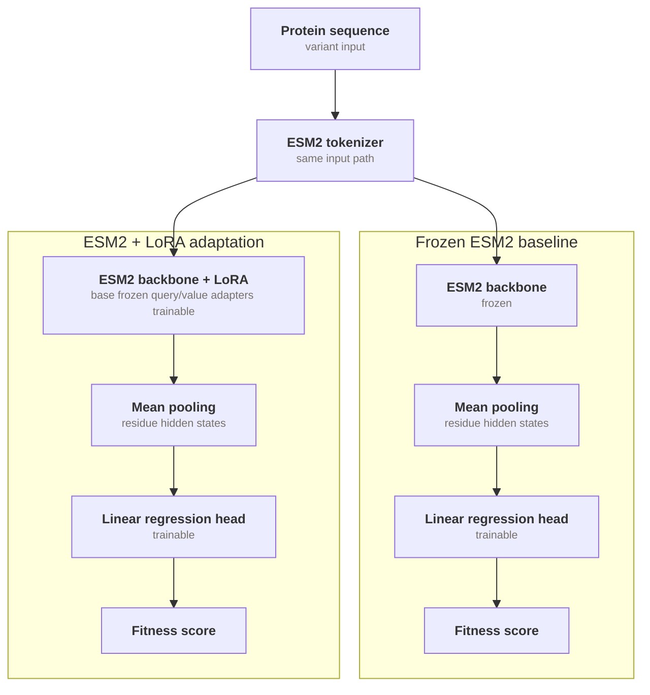

단백질 fitness label은 비싸다. 변이를 만들고, assay를 돌리고, 그 결과를 다시 모델에 넣는 과정에는 시간과 비용이 든다. 그래서 실제 protein engineering에서는 수만 개의 라벨보다 수십 개에서 수백 개 라벨로 다음 후보를 고르는 일이 더 현실적인 문제에 가깝다.

이 실험은 그 상황에서 아주 단순한 질문을 던진다.

> 라벨이 적을 때 pretrained ESM2를 그냥 얼려서 embedding만 써도 충분할까? 아니면 LoRA adapter를 붙여서 target task에 맞게 조금이라도 적응시키는 편이 나을까?

짧게 말하면, 답은 이렇게 정리된다. **frozen ESM2는 먼저 확인할 만한 baseline이다. 하지만 ESM2-35M LoRA는 조건이 맞으면 그 baseline을 넘는다.** 최종 main comparison에서는 ESM2-35M LoRA batch8 recipe와 같은 seed grid의 frozen baseline을 비교했고, GB1[^gb1]과 AAV[^aav] 모두에서 LoRA 평균 Spearman이 더 높았다. 다만 GB1의 추가 ablation에서는 label budget 128/192에서 보이던 이득이 사라지는 조건도 있었기 때문에, LoRA를 "항상 켜면 좋은 옵션"으로 읽으면 안 된다. 이득은 label budget, dataset, optimization protocol을 같이 탄다.

[^gb1]: GB1은 streptococcal protein G의 B1 domain 변이 fitness benchmark다. 이 글에서는 FLIP의 GB1 split을 사용해 variant sequence로 fitness ranking을 예측한다 <a class="citation-ref" href="#ref-flip" aria-label="Reference 1">[1]</a>.
[^aav]: AAV는 adeno-associated virus capsid protein 변이 fitness benchmark다. 이 글에서는 FLIP의 `two_vs_many` split을 sequence-only setting에 맞게 정리해 사용한다 <a class="citation-ref" href="#ref-flip" aria-label="Reference 1">[1]</a>.

## 요약

- Frozen ESM2 mean embedding은 low-label protein fitness ranking에서 먼저 확인할 만한 baseline이다.
- ESM2-8M LoRA는 GB1 초기 3-seed run의 tested budget 전반에서 frozen보다 낮았다.
- ESM2-35M LoRA는 main batch8 balanced comparison에서 GB1/AAV 모두 frozen보다 높았다.
- GB1에서는 label budget 256에서 LoRA 이득이 가장 안정적으로 남았다.
- AAV에서는 label budget 128/192/256 모두에서 LoRA 평균이 frozen보다 높았다.

## 실험 설계

**ESM2 representation**

ESM2는 대규모 단백질 sequence로 학습된 protein language model이다 <a class="citation-ref" href="#ref-esm2" aria-label="Reference 2">[2]</a>. 자연어 모델이 문맥 속 단어 표현을 학습하듯, ESM2는 amino-acid sequence 안의 residue pattern과 evolutionary signal을 embedding으로 압축한다. 그래서 downstream label이 적을 때도, backbone을 얼린 뒤 sequence embedding만 꺼내 regression head를 얹는 방식이 꽤 좋은 baseline이 될 수 있다.

이 글에서는 ESM2를 두 방식으로 쓴다. 하나는 backbone을 고정한 frozen embedding baseline이고, 다른 하나는 attention projection 일부에 LoRA adapter를 붙여 low-label task에 맞게 조금만 조정하는 방식이다.



**모델 구조**

두 방식은 입력 sequence, tokenizer, pooling, regression head는 거의 같다. 차이는 ESM2 backbone을 그대로 얼려 둘지, attention projection 중 `query`와 `value`에 작은 trainable LoRA adapter를 넣을지에 있다.

<figure class="media-figure" markdown="1">



  <figcaption><strong>Figure 2.</strong> Frozen baseline은 ESM2 representation을 고정하고 linear head만 학습한다. LoRA 조건은 ESM2 backbone의 <code>query/value</code> projection 안에 trainable adapter를 넣고, 같은 mean pooling과 linear head를 사용한다.</figcaption>
</figure>

**비교 조건**

비교 대상은 네 가지다.

<figure class="table-figure table-figure--comparison">
  <div class="table-shell">
    <table class="comparison-table">
      <thead>
        <tr>
          <th>Condition</th>
          <th>Backbone</th>
          <th>Trainable part</th>
        </tr>
      </thead>
      <tbody>
        <tr>
          <td>8M frozen</td>
          <td>ESM2-8M</td>
          <td>linear regression head</td>
        </tr>
        <tr>
          <td>8M LoRA</td>
          <td>ESM2-8M</td>
          <td>LoRA query/value + linear head</td>
        </tr>
        <tr>
          <td>35M frozen</td>
          <td>ESM2-35M</td>
          <td>linear regression head</td>
        </tr>
        <tr>
          <td>35M LoRA</td>
          <td>ESM2-35M</td>
          <td>LoRA query/value + linear head</td>
        </tr>
      </tbody>
    </table>
  </div>
  <figcaption><strong>Table 1.</strong> 비교한 네 조건이다. frozen 조건은 regression head만 학습하고, LoRA 조건은 ESM2 attention의 query/value adapter와 regression head를 함께 학습한다.</figcaption>
</figure>

frozen 조건에서는 ESM2 backbone을 전부 얼린다. 단백질 sequence를 tokenize하고, 마지막 hidden state를 amino-acid token 기준으로 mean pooling한 뒤, 작은 linear regression head만 학습한다.

LoRA 조건에서는 attention projection 중 `query`, `value`에 LoRA adapter를 넣는다 <a class="citation-ref" href="#ref-lora" aria-label="Reference 3">[3]</a>. LoRA rank는 `8`, alpha는 `16`, dropout은 `0.05`로 두었다. pooling, split, label budget, test set은 frozen과 최대한 맞췄다. optimizer와 epoch/patience는 조건별 recipe를 사용했으므로, 이 비교는 representation만 바꾼 순수 ablation보다는 training recipe 비교에 가깝다.

**평가 지표**

primary metric은 fixed test set의 **Spearman correlation**이다. 여기서는 absolute fitness 값을 얼마나 잘 맞추는지보다, 변이 후보의 순위를 얼마나 잘 세우는지가 중요하다. 그래서 이 결과는 "fitness 값 calibration"보다 "variant ranking / prioritization"으로 읽는 편이 맞다.

**Label budget**

이 실험에서 budget은 train만 뜻하지 않는다. validation도 budget 안에 포함했다.

<figure class="table-figure table-figure--metrics table-figure--budget-split">
  <div class="table-shell">
    <table class="metrics-table metrics-table--numeric-columns metrics-table--budget-split">
      <colgroup>
        <col class="budget-split__budget">
        <col class="budget-split__train">
        <col class="budget-split__validation">
      </colgroup>
      <thead>
        <tr>
          <th>Budget</th>
          <th>Train</th>
          <th>Validation</th>
        </tr>
      </thead>
      <tbody>
        <tr>
          <td>32</td>
          <td>25</td>
          <td>7</td>
        </tr>
        <tr>
          <td>64</td>
          <td>51</td>
          <td>13</td>
        </tr>
        <tr>
          <td>128</td>
          <td>102</td>
          <td>26</td>
        </tr>
        <tr>
          <td>192</td>
          <td>153</td>
          <td>39</td>
        </tr>
        <tr>
          <td>256</td>
          <td>204</td>
          <td>52</td>
        </tr>
      </tbody>
    </table>
  </div>
  <figcaption><strong>Table 2.</strong> 이 글의 label budget 정의다. budget은 train label과 validation label을 합친 값이며, validation set도 low-label budget을 소비하는 것으로 계산했다.</figcaption>
</figure>

즉 `budget 256`은 train 256개가 아니라, train 204개와 validation 52개를 합친 256개다. validation set을 공짜로 따로 두면 low-label 설정이 덜 엄격해지기 때문에, 이 실험에서는 validation도 label budget을 소비하는 것으로 보았다. 아래에서는 표와 figure를 짧게 읽기 위해 label budget 128/192/256을 각각 `b128`, `b192`, `b256`으로 줄여 쓴다.

**Seed protocol**

초기 run들은 `budget_seed == training_seed`인 paired-seed protocol로 돌았다. 이 방식은 간단하지만 reported std에 subset sampling과 training randomness가 섞인다. 그래서 최종 비교에서는 budget seed 3개와 training seed 3개를 교차한 balanced seed grid를 사용했다.

<figure class="media-figure">
  
  <figcaption><strong>Figure 3.</strong> balanced seed grid는 budget seed 3개와 training seed 3개를 교차해 budget마다 9개 run을 만든다. 그래서 mean, std, wins를 단일 paired seed보다 덜 우연적인 기준으로 읽을 수 있다.</figcaption>
</figure>

본문의 main comparison과 batch-size ablation은 이 balanced seed grid를 중심으로 읽는다. `wins`는 같은 matched seed pair 안에서 LoRA가 frozen보다 높았던 횟수이며, paired-seed run과 one-factor seed probe는 초기 신호와 민감도 확인용으로만 둔다.

**Dataset split**

GB1은 FLIP benchmark의 `two_vs_rest` split을 사용했다 <a class="citation-ref" href="#ref-flip" aria-label="Reference 1">[1]</a>. GB1 원 데이터는 Wu et al.의 fitness landscape assay에서 온다 <a class="citation-ref" href="#ref-gb1-assay" aria-label="Reference 4">[4]</a>.

<details>
  <summary>GB1 sample sequence 보기</summary>
  <div class="details-content">
    <ul>
      <li>source row: <code>two_vs_rest.csv</code>의 train split 예시</li>
      <li>input length: 265 amino acids</li>
      <li>target: <code>1.0000</code></li>
    </ul>
    <figure class="media-figure">
      
      <figcaption><strong>구조 참고 이미지.</strong> PDB <a href="https://www.rcsb.org/structure/1PGA" target="_blank" rel="noopener noreferrer">1PGA</a>의 Protein G B1 domain 구조다 <a class="citation-ref" href="#ref-gb1-structure" aria-label="Reference 5">[5]</a>. 이 이미지는 GB1 domain을 이해하기 위한 참고 구조이며, 처리된 FLIP row별 3D 구조 예측은 아니다.</figcaption>
    </figure>
    <p>GB1은 benchmark 이름으로는 B1 domain 변이 문제를 가리키지만, 이 processed split에서 모델에 들어가는 <code>sequence</code> column은 아래처럼 전체 입력 construct 형태로 들어간다. ESM2는 이 문자열 전체를 tokenize하고, residue hidden state를 mean pooling한 뒤 fitness score를 예측한다.</p>
    <pre><code>MQYKLILNGKTLKGETTTEAVDAATAEKVFKQYANDNGVDGEWTYDDATKTFTVTELEVLFQGPLDPNSM
ATYEVLCEVARKLGTDDREVVLFLLNVFIPQPTLAQLIGALRALKEEGRLTFPLLAECLFRAGRRDLLRD
LLHLDPRFLERHLAGTMSYFSPYQLTVLHVDGELCARDIRSLIFLSKDTIGSRSTPQTFLHWVYCMENLD
LLGPTDVDALMSMLRSLSRVDLQRQVQTLMGLHLSGPSHSQHYRHTPLEHHHHHH</code></pre>
  </div>
</details>

AAV는 FLIP의 `two_vs_many` split을 사용하되 <a class="citation-ref" href="#ref-flip" aria-label="Reference 1">[1]</a>, sequence-only model에 맞게 중복 sequence를 평균 target으로 묶고 train/test에 같은 sequence가 동시에 들어가는 경우 train 쪽에서 제거했다. 그래서 AAV 숫자는 canonicalized sequence-only setting 내부 비교로 읽는다. AAV 원 데이터는 Bryant et al.의 capsid engineering dataset에 기반한다 <a class="citation-ref" href="#ref-aav-dataset" aria-label="Reference 6">[6]</a>.

<details>
  <summary>AAV sample sequence 보기</summary>
  <div class="details-content">
    <ul>
      <li>source row: <code>two_vs_many.csv</code>의 train split 예시</li>
      <li>sample input length: 735 amino acids</li>
      <li>target: <code>-6.8248</code></li>
    </ul>
    <figure class="media-figure">
      
      <figcaption><strong>구조 참고 이미지.</strong> PDB <a href="https://www.rcsb.org/structure/1LP3" target="_blank" rel="noopener noreferrer">1LP3</a>의 AAV-2 capsid protein fragment 구조다 <a class="citation-ref" href="#ref-aav-structure" aria-label="Reference 7">[7]</a>. 이 이미지는 AAV benchmark를 이해하기 위한 구조적 맥락이며, 실험 자체는 variant별 3D 구조가 아니라 sequence만 사용했다.</figcaption>
    </figure>
    <p>AAV는 capsid protein sequence가 길어서 본문에는 앞/뒤 일부만 적었다. 이 예시 row는 735 aa였지만, canonicalized AAV split 전체의 sequence 길이는 734-750 aa 범위였다. 실제 학습과 평가는 각 row의 전체 sequence를 truncation 없이 사용하고, label budget만 128/192/256처럼 작게 제한한다.</p>
    <pre><code>MAADGYLPDWLEDTLSEGIRQWWKLKPGPPPPKPAERHKDDSRGLVLPGYKYLGPFNGLDKGEPVNEAD
AAALEHDKAYDRQLDSGDNPYLKYNHA
...
KHPPPQILIKNTPVPANPSTTFSAAKFASFITQYSTGQVSVEIEWELQKENSKRWNPEIQYTSNYNKSV
NVDFTVDTNGVYSEPRPIGTRYLTRNL</code></pre>
  </div>
</details>

## 전체 결과: LoRA와 frozen baseline

최종 판단에는 paired-seed run보다 main comparison을 더 우선했다. 이 비교에서 LoRA는 train batch size 8 recipe를 사용했고, frozen baseline은 Appendix의 frozen head recipe를 사용했다. 아래 표의 `wins`는 같은 matched seed pair 안에서 LoRA가 frozen보다 몇 번 높았는지를 보여주는 보조 지표다.

<figure class="table-figure table-figure--metrics table-figure--main-comparison">
  <div class="table-shell">
    <table class="metrics-table metrics-table--numeric-columns metrics-table--main-comparison">
      <colgroup>
        <col class="main-comparison__dataset">
        <col class="main-comparison__budget">
        <col class="main-comparison__score">
        <col class="main-comparison__score">
        <col class="main-comparison__delta">
        <col class="main-comparison__wins">
      </colgroup>
      <thead>
        <tr>
          <th>Dataset</th>
          <th>Budget</th>
          <th>LoRA</th>
          <th>Frozen</th>
          <th>Delta</th>
          <th>Wins</th>
        </tr>
      </thead>
      <tbody>
        <tr>
          <td><strong>GB1</strong></td>
          <td>128</td>
          <td class="is-better">0.4722</td>
          <td>0.4255</td>
          <td>+0.0467</td>
          <td>5/9</td>
        </tr>
        <tr>
          <td><strong>GB1</strong></td>
          <td>192</td>
          <td class="is-better">0.5477</td>
          <td>0.4731</td>
          <td>+0.0746</td>
          <td>6/9</td>
        </tr>
        <tr>
          <td><strong>GB1</strong></td>
          <td>256</td>
          <td class="is-better">0.6247</td>
          <td>0.4843</td>
          <td class="is-better">+0.1404</td>
          <td class="is-better">8/9</td>
        </tr>
        <tr>
          <td><strong>AAV</strong></td>
          <td>128</td>
          <td class="is-better">0.2472</td>
          <td>0.0617</td>
          <td>+0.1855</td>
          <td>8/9</td>
        </tr>
        <tr>
          <td><strong>AAV</strong></td>
          <td>192</td>
          <td class="is-better">0.3364</td>
          <td>0.0012</td>
          <td>+0.3352</td>
          <td>8/9</td>
        </tr>
        <tr>
          <td><strong>AAV</strong></td>
          <td>256</td>
          <td class="is-better">0.4036</td>
          <td>0.0589</td>
          <td class="is-better">+0.3447</td>
          <td class="is-better">9/9</td>
        </tr>
      </tbody>
    </table>
  </div>
  <figcaption><strong>Table 3.</strong> 최종 main comparison의 test Spearman 평균이다. 각 budget은 balanced seed grid의 9개 run 평균이며, <code>wins</code>는 같은 matched seed pair에서 LoRA가 frozen보다 높았던 횟수다. LoRA는 train batch size 8 recipe를 사용했고, frozen baseline은 Appendix의 frozen head recipe를 사용했다.</figcaption>
</figure>

이 결과는 단순히 "LoRA가 이겼다"로 끝내기보다, 세 포인트로 읽는 편이 좋다.

<figure class="table-figure table-figure--comparison">
  <div class="table-shell">
    <table class="comparison-table">
      <thead>
        <tr>
          <th>해석 축</th>
          <th>읽는 법</th>
        </tr>
      </thead>
      <tbody>
        <tr>
          <td>방향성</td>
          <td>최종 비교에서는 GB1/AAV 모두 LoRA 평균이 frozen보다 높다.</td>
        </tr>
        <tr>
          <td>크기</td>
          <td>GB1은 budget이 커질수록 delta가 커지고, AAV는 frozen baseline이 낮아 delta가 크게 보인다.</td>
        </tr>
        <tr>
          <td>안정성</td>
          <td>GB1 b256과 AAV b256은 가장 깔끔하고, GB1 b128/b192와 AAV b128은 조금 더 흔들린다.</td>
        </tr>
      </tbody>
    </table>
  </div>
  <figcaption><strong>Table 4.</strong> Table 3의 main comparison을 읽는 세 축이다. 평균 차이만 보지 않고 방향성, delta 크기, seed-grid 안정성을 함께 본다.</figcaption>
</figure>

두 dataset의 신호는 다르게 읽힌다. GB1은 frozen baseline이 높아 LoRA 이득이 budget과 protocol을 탔고, AAV는 frozen estimate가 낮아 LoRA 보정 신호가 더 크게 나타났다.

## GB1: budget과 protocol

GB1에서는 frozen baseline이 먼저 눈에 띄었다. ESM2-8M frozen은 128, 256 budget에서 35M frozen과 비슷한 범위에 있었고, 8M LoRA는 tested budget 전반에서 8M frozen을 넘지 못했다.

<figure class="table-figure table-figure--metrics">
  <div class="table-shell">
    <table class="metrics-table metrics-table--mixed">
      <thead>
        <tr>
          <th>Budget</th>
          <th>Condition</th>
          <th>Spearman mean ± std</th>
          <th>해석</th>
        </tr>
      </thead>
      <tbody>
        <tr>
          <td><strong>32</strong></td>
          <td>8M frozen</td>
          <td class="is-better">0.410 ± 0.050</td>
          <td>작은 frozen baseline</td>
        </tr>
        <tr>
          <td><strong>32</strong></td>
          <td>8M LoRA</td>
          <td>0.046 ± 0.103</td>
          <td>frozen보다 낮음</td>
        </tr>
        <tr>
          <td><strong>64</strong></td>
          <td>8M frozen</td>
          <td class="is-better">0.468 ± 0.066</td>
          <td>8M LoRA보다 높음</td>
        </tr>
        <tr>
          <td><strong>64</strong></td>
          <td>8M LoRA</td>
          <td>0.138 ± 0.212</td>
          <td>변동이 큼</td>
        </tr>
        <tr>
          <td><strong>128</strong></td>
          <td>8M frozen</td>
          <td class="is-better">0.440 ± 0.064</td>
          <td>35M frozen과 비슷한 범위</td>
        </tr>
        <tr>
          <td><strong>128</strong></td>
          <td>35M frozen</td>
          <td>0.417 ± 0.047</td>
          <td>8M frozen보다 뚜렷하게 높지는 않음</td>
        </tr>
        <tr>
          <td><strong>128</strong></td>
          <td>8M LoRA</td>
          <td>0.260 ± 0.101</td>
          <td>8M frozen보다 낮음</td>
        </tr>
        <tr>
          <td><strong>256</strong></td>
          <td>8M frozen</td>
          <td>0.452 ± 0.021</td>
          <td>안정적인 frozen baseline</td>
        </tr>
        <tr>
          <td><strong>256</strong></td>
          <td>35M frozen</td>
          <td class="is-better">0.486 ± 0.006</td>
          <td>가장 높은 frozen 지점</td>
        </tr>
        <tr>
          <td><strong>256</strong></td>
          <td>8M LoRA</td>
          <td>0.368 ± 0.036</td>
          <td>여전히 frozen보다 낮음</td>
        </tr>
      </tbody>
    </table>
  </div>
  <figcaption><strong>Table 5.</strong> GB1 초기 3-seed 결과의 핵심은 8M frozen 설정만으로도 baseline이 꽤 높고, 8M LoRA는 tested budget 전반에서 frozen을 넘지 못했다는 점이다. 각 값은 3 seeds 평균과 표준편차다.</figcaption>
</figure>

의미 있는 LoRA 신호는 ESM2-35M에서 나왔다. main batch8 비교에서는 b128, b192, b256 모두에서 LoRA가 frozen보다 높았고, b256은 mean delta `+0.1404`, matched seed win `8/9`로 가장 안정적이었다. batch size 32 ablation에서는 b128과 b192가 사실상 tie 또는 frozen-favoring으로 바뀌고, b256만 LoRA 이득이 남았다.

<figure class="table-figure table-figure--metrics">
  <div class="table-shell">
    <table class="metrics-table metrics-table--numeric-first metrics-table--gb1-batch-ablation">
      <thead>
        <tr>
          <th>LoRA batch</th>
          <th>Budget</th>
          <th>LoRA</th>
          <th>Frozen</th>
          <th>Delta</th>
          <th>Wins</th>
        </tr>
      </thead>
      <tbody>
        <tr>
          <td><strong>8</strong></td>
          <td>128</td>
          <td class="is-better">0.4722</td>
          <td>0.4255</td>
          <td>+0.0467</td>
          <td>5/9</td>
        </tr>
        <tr>
          <td><strong>8</strong></td>
          <td>192</td>
          <td class="is-better">0.5477</td>
          <td>0.4731</td>
          <td>+0.0746</td>
          <td>6/9</td>
        </tr>
        <tr>
          <td><strong>8</strong></td>
          <td>256</td>
          <td class="is-better">0.6247</td>
          <td>0.4843</td>
          <td class="is-better">+0.1404</td>
          <td class="is-better">8/9</td>
        </tr>
        <tr>
          <td><strong>32</strong></td>
          <td>128</td>
          <td>0.4171</td>
          <td class="is-better">0.4255</td>
          <td>-0.0085</td>
          <td>4/9</td>
        </tr>
        <tr>
          <td><strong>32</strong></td>
          <td>192</td>
          <td>0.4643</td>
          <td class="is-better">0.4731</td>
          <td>-0.0088</td>
          <td>4/9</td>
        </tr>
        <tr>
          <td><strong>32</strong></td>
          <td>256</td>
          <td class="is-better">0.5509</td>
          <td>0.4843</td>
          <td>+0.0666</td>
          <td>6/9</td>
        </tr>
      </tbody>
    </table>
  </div>
  <figcaption><strong>Table 6.</strong> GB1에서 LoRA train batch size를 바꿨을 때의 ablation이다. 두 batch 조건 모두 balanced seed grid로 비교했다. b256은 두 조건에서 모두 양수지만, b128/b192는 LoRA batch size 8에서만 양수로 남는다.</figcaption>
</figure>

<figure class="media-figure">
  
  <figcaption><strong>Figure 4.</strong> GB1에서는 b128/b192를 LoRA crossover처럼 읽기 어렵다. LoRA batch size 8에서는 양수지만 batch size 32에서는 거의 0 아래로 내려가고, b256만 두 protocol에서 모두 양수로 남는다.</figcaption>
</figure>

그래서 GB1의 핵심 메시지는 둘로 나뉜다. **LoRA 이득은 최종 비교에서 b128부터 보이지만, 가장 안정적으로 남은 지점은 b256이다.** Frozen representation이 이미 좋은 ranking axis를 제공하는 상황에서는, LoRA의 추가 이득이 작고 protocol에 더 민감하게 보인다.

## AAV: 신호와 variance

AAV는 최종 main batch8 comparison에서 b128부터 LoRA 평균이 frozen보다 높았고, b192와 b256으로 갈수록 delta도 커졌다. 여기서는 balanced seed grid 안의 b128/b192/b256 결과를 중심으로 읽는다.

<figure class="table-figure table-figure--metrics">
  <div class="table-shell">
    <table class="metrics-table metrics-table--numeric-first">
      <thead>
        <tr>
          <th>Budget</th>
          <th>LoRA mean ± std</th>
          <th>Frozen mean ± std</th>
          <th>Delta</th>
          <th>Wins</th>
        </tr>
      </thead>
      <tbody>
        <tr>
          <td><strong>128</strong></td>
          <td class="is-better">0.2472 ± 0.2787</td>
          <td>0.0617 ± 0.2680</td>
          <td>+0.1855</td>
          <td>8/9</td>
        </tr>
        <tr>
          <td><strong>192</strong></td>
          <td class="is-better">0.3364 ± 0.0841</td>
          <td>0.0012 ± 0.2740</td>
          <td>+0.3352</td>
          <td>8/9</td>
        </tr>
        <tr>
          <td><strong>256</strong></td>
          <td class="is-better">0.4036 ± 0.1308</td>
          <td>0.0589 ± 0.2640</td>
          <td class="is-better">+0.3447</td>
          <td class="is-better">9/9</td>
        </tr>
      </tbody>
    </table>
  </div>
  <figcaption><strong>Table 7.</strong> AAV 35M LoRA와 frozen baseline의 main comparison 결과다. 각 budget은 balanced seed grid의 9개 run 평균이며, matched seed <code>wins</code>를 함께 적었다.</figcaption>
</figure>

<figure class="media-figure">
  
  <figcaption><strong>Figure 5.</strong> AAV는 세 tested budget 모두에서 LoRA 평균이 frozen보다 높다. y축의 128/192/256은 label budget이며, 작은 점은 9개 seed-pair run, 큰 점은 평균, 가로선은 seed-pair min-max 범위다. 가장 깔끔한 근거는 9/9 matched wins가 나온 b256이다.</figcaption>
</figure>

이 결과는 AAV에서 LoRA가 더 높은 방향의 신호가 balanced seed grid 안에서 반복됐다는 뜻이다. 특히 b256은 모든 matched seed pair에서 LoRA가 frozen을 이겼고, paired delta도 모든 seed pair에서 양수였다.

AAV에서는 frozen ESM2 representation이 이 ranking task의 신호를 충분히 포착하지 못했을 수 있다. `query/value` projection에 들어간 LoRA adapter가 task-specific ranking axis를 조금 보정했을 가능성이 있다.

AAV 결과는 variance와 같이 읽어야 한다. AAV frozen estimate는 낮고 변동이 크며, b128도 LoRA mean delta는 크지만 std가 크다. 이 실험에서 가장 깔끔하게 말할 수 있는 부분은 이 정도다. **canonicalized FLIP AAV `two_vs_many`의 이 low-label setting에서는 ESM2-35M LoRA가 frozen보다 유리했고, 가장 믿고 볼 만한 AAV 근거는 b256에 있다.**

## 해석

지금까지의 결과는 단순한 승패표보다 판단 기준을 보여준다.

<figure class="table-figure table-figure--comparison">
  <div class="table-shell">
    <table class="comparison-table">
      <thead>
        <tr>
          <th>상황</th>
          <th>해석</th>
        </tr>
      </thead>
      <tbody>
        <tr>
          <td>라벨이 너무 적거나 backbone이 작을 때</td>
          <td>frozen ESM2를 baseline으로 먼저 확인하는 편이 좋다.</td>
        </tr>
        <tr>
          <td>ESM2-8M에 LoRA를 붙였을 때</td>
          <td>GB1 초기 3-seed run에서는 tested budget 전반에서 frozen보다 낮았다.</td>
        </tr>
        <tr>
          <td>ESM2-35M LoRA를 쓸 때</td>
          <td>main batch8 balanced comparison에서는 GB1과 AAV 모두 frozen보다 높았다.</td>
        </tr>
        <tr>
          <td>GB1에서 가장 믿고 볼 만한 지점</td>
          <td>budget 256이다.</td>
        </tr>
        <tr>
          <td>AAV에서의 tested budget</td>
          <td>batch8 balanced grid에서는 128/192/256 모두 LoRA 평균이 높았고, b256이 가장 안정적이었다.</td>
        </tr>
      </tbody>
    </table>
  </div>
  <figcaption><strong>Table 8.</strong> 이 실험 결과를 읽을 때의 기준이다. frozen ESM2를 baseline으로 먼저 잡고, 35M LoRA는 label budget과 dataset 조건이 맞을 때 추가로 시도하는 쪽에 가깝다.</figcaption>
</figure>

이 결과는 이렇게 읽는 편이 좋다. 먼저 frozen ESM2 embedding으로 baseline을 잡고, 그 성능이 충분하면 거기서 멈춘다. ranking 품질을 더 끌어올려야 하고 label budget이 192-256 근처까지 확보된다면, ESM2-35M LoRA를 시도할 만하다.

이 실험의 한 문장 결론은 이렇다.

> Low-label protein fitness prediction에서는 frozen ESM2로 baseline을 먼저 잡는 것이 좋고, ESM2-35M LoRA는 조건이 맞을 때 그 baseline을 넘는다. 가장 믿고 볼 만한 LoRA 이득은 GB1 b256과 AAV main batch8 comparison 결과에서 보인다.

## 한계

- 이 실험은 SOTA 주장이 아니라, constrained label budget에서 small protein language model을 비교한 것이다. ranking 성능을 봤고, runtime/VRAM 효율은 별도로 비교하지 않았다.
- Balanced seed grid도 budget당 9 seed pair이므로, `wins`는 seed별 승리 횟수로만 읽는다. paired-seed 결과와 balanced seed grid 결과는 같은 estimate로 pooling하지 않는다.
- GB1 b128/b192의 LoRA 이득은 LoRA batch size 8에서는 양수지만 batch size 32에서는 유지되지 않았다.
- AAV frozen estimate는 낮고 noisy하므로, 큰 delta는 seed-pair 분포와 함께 읽어야 한다. LoRA가 왜 유리했는지도 이 실험만으로는 확정할 수 없다.
- AAV 결과는 canonicalized sequence-only split 내부 비교이며, FLIP leaderboard와 직접 비교하는 수치는 아니다.

## Appendix: 재현 조건과 protocol family

GB1 b192에서 LoRA는 fixed subset training-seed sweep std `0.1093`을 보였다. frozen b192의 training-seed sweep std `0.0240`보다 컸기 때문에, protocol family를 섞어 평균 내지 않았다. 최종 해석은 balanced seed grid를 중심으로 읽고, paired-seed run과 one-factor probe는 초기 신호와 민감도 확인용으로만 둔다.

<figure class="table-figure table-figure--comparison">
  <div class="table-shell">
    <table class="comparison-table">
      <thead>
        <tr>
          <th>Setting</th>
          <th>Value</th>
        </tr>
      </thead>
      <tbody>
        <tr>
          <td>Primary metric</td>
          <td>fixed test set Spearman correlation</td>
        </tr>
        <tr>
          <td>Label budget</td>
          <td>train labels + validation labels; test labels are excluded</td>
        </tr>
        <tr>
          <td>Dataset splits</td>
          <td>GB1 <code>two_vs_rest</code>; canonicalized AAV <code>two_vs_many</code></td>
        </tr>
        <tr>
          <td>AAV canonicalization</td>
          <td>duplicate sequence targets averaged<br>train/test sequence overlap removed from train</td>
        </tr>
        <tr>
          <td>Pooling</td>
          <td>mean pooling over non-special, non-padding residue token states</td>
        </tr>
        <tr>
          <td>LoRA target modules</td>
          <td><code>query,value</code></td>
        </tr>
        <tr>
          <td>LoRA adapter config</td>
          <td>rank 8, alpha 16, dropout 0.05</td>
        </tr>
        <tr>
          <td>LoRA optimization</td>
          <td>LR 1e-4; head LR 1e-3 when set<br>weight decay 0.01; max epochs 80; patience 10</td>
        </tr>
        <tr>
          <td>Frozen head optimization</td>
          <td>LR 1e-3; weight decay 1e-4<br>max epochs 200; patience 20<br>GB1 default head batch 32; AAV balanced head batch 64</td>
        </tr>
      </tbody>
    </table>
  </div>
  <figcaption><strong>Appendix Table 1.</strong> 재현에 필요한 주요 조건이다. AAV는 sequence-only 평가에 맞게 canonicalized <code>two_vs_many</code> split을 사용했다.</figcaption>
</figure>

<figure class="table-figure table-figure--comparison">
  <div class="table-shell">
    <table class="comparison-table">
      <thead>
        <tr>
          <th>Protocol family</th>
          <th>읽는 법</th>
        </tr>
      </thead>
      <tbody>
        <tr>
          <td>Main balanced seeds</td>
          <td>budget seeds <code>0,1,2</code> x training seeds <code>0,1,2</code></td>
        </tr>
        <tr>
          <td>GB1 LoRA batch8</td>
          <td>GB1 LoRA의 main comparison family이며, 같은 seed grid의 frozen baseline과 비교한다.</td>
        </tr>
        <tr>
          <td>GB1 LoRA batch32</td>
          <td>optimization sensitivity ablation이며, batch8 결과와 pooling하지 않는다.</td>
        </tr>
        <tr>
          <td>AAV LoRA batch8</td>
          <td>AAV LoRA의 main comparison family이며, 같은 seed grid의 frozen baseline과 비교한다.</td>
        </tr>
        <tr>
          <td>paired-seed runs</td>
          <td>초기 신호 확인용이며, balanced seed grid estimate와 합치지 않는다.</td>
        </tr>
      </tbody>
    </table>
  </div>
  <figcaption><strong>Appendix Table 2.</strong> 이 글에서 분리해서 읽는 protocol family다. Batch8과 batch32 LoRA는 서로 다른 family로 보고, paired-seed 결과와 balanced seed grid 결과도 같은 estimate로 합치지 않는다.</figcaption>
</figure>

## References

<div class="reference-list" markdown="1">

<ol>
  <li id="ref-flip">Dallago, C. et al. <strong>FLIP: Benchmark tasks in fitness landscape inference for proteins</strong>. NeurIPS Datasets and Benchmarks 2021.<br>
    <a href="https://doi.org/10.1101/2021.11.09.467890">Preprint DOI</a>
  </li>
  <li id="ref-esm2">Lin, Z. et al. <strong>Evolutionary-scale prediction of atomic-level protein structure with a language model</strong>. <em>Science</em>, 2023.<br>
    <a href="https://doi.org/10.1126/science.ade2574">Paper / DOI</a>
  </li>
  <li id="ref-lora">Hu, E. J. et al. <strong>LoRA: Low-Rank Adaptation of Large Language Models</strong>. ICLR 2022.<br>
    <a href="https://arxiv.org/abs/2106.09685">arXiv</a>
  </li>
  <li id="ref-gb1-assay">Wu, N. C. et al. <strong>Adaptation in protein fitness landscapes is facilitated by indirect paths</strong>. <em>eLife</em>, 2016.<br>
    <a href="https://doi.org/10.7554/eLife.16965">Paper / DOI</a>
  </li>
  <li id="ref-gb1-structure">Gallagher, T. et al. <strong>Two crystal structures of the B1 immunoglobulin-binding domain of streptococcal protein G and comparison with NMR</strong>. <em>Biochemistry</em>, 1994.<br>
    <a href="https://www.rcsb.org/structure/1PGA">PDB 1PGA</a> · <a href="https://doi.org/10.1021/bi00181a032">Paper / DOI</a>
  </li>
  <li id="ref-aav-dataset">Bryant, D. H. et al. <strong>Deep diversification of an AAV capsid protein by machine learning</strong>. <em>Nature Biotechnology</em>, 2021.<br>
    <a href="https://doi.org/10.1038/s41587-020-00793-4">Paper / DOI</a>
  </li>
  <li id="ref-aav-structure">Xie, Q. et al. <strong>The atomic structure of adeno-associated virus (AAV-2), a vector for human gene therapy</strong>. <em>PNAS</em>, 2002.<br>
    <a href="https://www.rcsb.org/structure/1LP3">PDB 1LP3</a> · <a href="https://doi.org/10.1073/pnas.162250899">Paper / DOI</a>
  </li>
</ol>

</div>

## Experiment Resources

<div class="reference-list" markdown="1">

- FLIP benchmark repository and split documentation used for this experiment.  
  [FLIP GitHub](https://github.com/J-SNACKKB/FLIP) ·
  [GB1 splits](https://github.com/J-SNACKKB/FLIP/blob/main/splits/gb1/README.md) · [AAV splits](https://github.com/J-SNACKKB/FLIP/blob/main/splits/aav/README.md)

</div>

## Citation

이 글을 인용할 때는 아래 형식을 사용할 수 있다.

```text
Ilho Ahn, "Low-label Protein Fitness 실험: Frozen ESM2와 LoRA의 label budget 비교", Mini Research, Apr 17, 2026.
```

또는 BibTeX 형식으로는 다음처럼 적을 수 있다.

```bibtex
@article{ahn2026frozenesm2lora,
  author = {Ilho Ahn},
  title = {Low-label Protein Fitness 실험: Frozen ESM2와 LoRA의 label budget 비교},
  journal = {Mini Research},
  year = {2026},
  month = apr,
  url = {https://muted-color.github.io/research/2026/04/17/frozen-esm2-lora-low-label-protein-fitness/}
}
```
