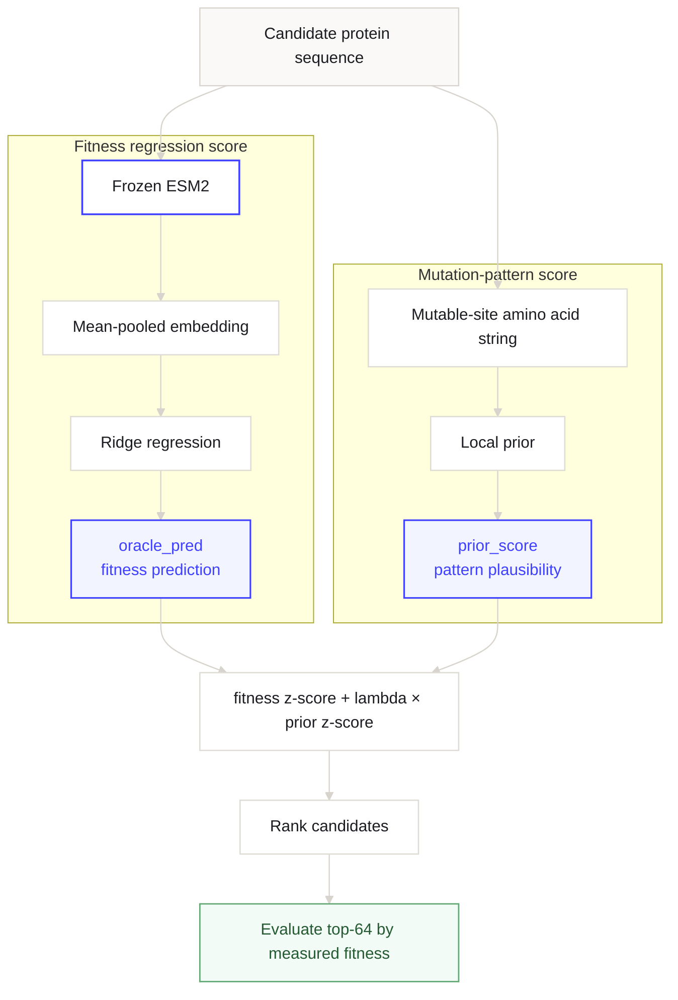

Protein engineering에서는 fitness label이 충분하지 않은 경우가 많다. 변이 단백질을 만들고 기능이나 활성을 실험으로 측정하는 데 비용이 들기 때문에, 수십 개에서 수백 개 label만 보고 다음 후보를 골라야 하는 상황이 자주 생긴다.

평가 질문은 **적은 label로 학습한 ESM2/Ridge fitness 예측 점수에, mutation-site local prior를 보조 신호로 더했을 때 상위 후보 선택이 좋아지는지**다.

> **Oracle**: 여기서 oracle은 wet-lab ground truth가 아니라, 적은 fitness label로 학습한 `frozen ESM2 embedding + Ridge regression` 예측 점수다.
>
> **평가 관점**: 모델 출력은 연속적인 fitness 예측값이지만, 평가는 그 예측값으로 후보를 정렬했을 때 실제 high-fitness 후보가 상위권에 들어오는지를 본다.

평가는 regression 값을 그대로 비교하지 않고, 예측 fitness가 높은 후보를 고르는 방식으로 했다. 이미 측정된 TrpB 후보 라이브러리에 `oracle_pred`를 매기고, 상위 64개 안에 실제 fitness 상위 후보가 얼마나 들어오는지 본다.

여기서 mutation-site local prior는 fitness label을 보지 않고, 관찰된 mutable-site amino acid pattern의 그럴듯함을 점수화하는 보조 점수다.



## 요약

- ESM2/Ridge oracle은 적은 fitness label로 학습한 regression 점수다.
- mutation-site local prior는 fitness 기준이 아니라 mutation pattern 기준의 보조 점수다.
- 평가는 예측값 자체보다, 예측 점수로 고른 상위 64개 후보의 실제 fitness를 본다.
- 전체 후보 풀에서 prior를 더하면 `Hit@64`가 세 label budget 모두에서 낮아졌다.
- 음수 lambda에서 개선처럼 나타난 결과는 prior의 직접 효과라기보다, 순위가 특정 mutation count 후보 쪽으로 이동한 효과에 가까웠다.
- `≤4-mutation` 후보만 남기면 학습된 prior `+0.25`가 평균 `Hit@64`를 `+0.012` 올렸지만, 효과로 주장하기 어려운 크기였다.

## 문제와 가설

Low-label protein fitness 예측에서는 적은 수의 measured fitness label만으로 다음 후보를 골라야 한다. 여기서는 `64 / 128 / 256`개 train label로 ESM2/Ridge를 학습하고, 전체 test candidate library에 score를 매긴 뒤 상위 64개 후보를 선택하는 ranking 문제로 본다. ESM2/Ridge regression 점수는 fitness를 직접 예측하지만, label 수가 적으면 상위 후보 순위가 불안정해질 수 있다.

여기서 ESM2/Ridge는 단백질 서열을 frozen ESM2 embedding으로 바꾼 뒤, 그 embedding 위에 Ridge regression을 학습해 fitness를 예측하는 기준 모델이다.

이 기준 모델만으로 후보를 고르면, 적은 label에서 높게 예측된 후보로 순위가 치우칠 수 있다. 그래서 mutation-site local prior를 ranking 보정 항으로 더해, mutable-site amino acid pattern 안에서 그럴듯한 후보가 상위 선택을 보정하는지 확인했다. local prior는 fitness를 직접 맞히는 대신, 관찰된 mutation-site pattern 안에서 후보가 얼마나 그럴듯한지를 점수화한다.

가설은 mutation pattern을 학습한 local prior가 ESM2/Ridge 순위를 보조할 수 있다는 것이었다. fitness를 직접 예측하는 점수와 mutation pattern의 그럴듯함을 보는 점수를 섞어 단일 ranking score를 만들면, regression 점수만으로 고른 top-64 후보 선택이 나아질 수 있다고 봤다.

<figure class="media-figure" markdown="1">



  <figcaption><strong>Figure 1.</strong> baseline fitness regression score와 mutation-pattern prior를 함께 쓰는 후보 정렬 흐름이다. ESM2/Ridge는 sequence에서 fitness 예측값을 만들고, local prior는 mutable-site pattern의 그럴듯함을 점수화한다. 두 점수는 후보 풀 안에서 표준화된 뒤 최종 순위에 사용된다.</figcaption>
</figure>

### 평가 설계

평가에서는 fitness를 예측하는 점수와 mutation pattern을 보는 점수를 분리해서 읽는다. 이후 결과 해석에서도 prior 점수, mutation count, 후보 풀의 범위를 함께 확인했다.

읽는 기준은 세 가지다.

- `prior_score`는 fitness 예측값이 아니라 mutation pattern 적합도다.
- `Hit@64` 변화는 후보 풀의 mutation count 분포가 바뀌어도 크게 움직일 수 있다.
- validation으로 고른 prior weight와 test 후보 선택 평가는 분리해서 봐야 한다.

평가는 FLIP2 TrpB `two-to-many`의 test candidate library를 기준으로 했다. 각 후보에 ESM2/Ridge fitness 예측 점수와 local prior score를 매기고, 점수 조합이 실제 fitness 상위 후보를 더 잘 올리는지 비교했다.

FLIP2의 TrpB `two-to-many` split은 0/1/2-mutation 후보로 학습하고 higher-order 후보에서 일반화를 평가한다. 모델 출력은 fitness regression 값이지만, protein engineering에서 직접 필요한 것은 다음 round에서 먼저 만들고 측정할 후보를 고르는 일이다. 그래서 이 실험에서는 regression 값을 후보 선택 점수로 사용하고, 예측 점수로 정렬했을 때 실제 high-fitness 후보가 top-64에 얼마나 들어오는지 `Hit@64`로 본다.

<figure class="table-figure table-figure--comparison">
  <div class="table-shell">
    <table class="comparison-table">
      <thead>
        <tr>
          <th>항목</th>
          <th>설정</th>
        </tr>
      </thead>
      <tbody>
        <tr>
          <td>데이터셋</td>
          <td>FLIP2 TrpB <code>two-to-many</code></td>
        </tr>
        <tr>
          <td>평가 과제</td>
          <td>0/1/2-mutation train label로 fitness를 regression하고, higher-order test 후보의 상위 선택을 평가</td>
        </tr>
        <tr>
          <td>전체 후보 variants</td>
          <td><code>228,298</code></td>
        </tr>
        <tr>
          <td>테스트 후보</td>
          <td><code>217,507</code></td>
        </tr>
        <tr>
          <td><code>≤4-mutation</code> 후보</td>
          <td><code>129,518</code></td>
        </tr>
        <tr>
          <td>train label budget</td>
          <td><code>64 / 128 / 256</code></td>
        </tr>
        <tr>
          <td>주 지표</td>
          <td><code>Hit@64</code>: 상위 64개로 고른 후보 중 measured fitness 상위 5% 후보 비율</td>
        </tr>
      </tbody>
    </table>
  </div>
  <figcaption><strong>Table 1.</strong> 평가 범위 요약이다. 이 평가는 이미 fitness label이 있는 FLIP2 TrpB test candidate library 안에서 fitness regression 점수로 후보를 고르는 문제다.</figcaption>
</figure>

<details>
  <summary>TrpB 소개: tryptophan synthase beta subunit</summary>
  <div class="details-content">
    <p><strong>TrpB</strong>는 tryptophan synthase complex의 beta subunit이다. 생화학적으로는 indole과 L-serine을 결합해 L-tryptophan을 만드는 beta reaction에 관여하는 효소 subunit으로 볼 수 있다 <a class="citation-ref" href="#ref-trpb-review" aria-label="Reference 1">[1]</a>.</p>
    <p>대표 구조 예시로는 PDB 5E0K의 tryptophan synthase complex를 참고할 수 있다 <a class="citation-ref" href="#ref-trpb-structure" aria-label="Reference 2">[2]</a>. 여기서는 TrpB의 구조나 반응 메커니즘 자체를 예측하지 않는다. FLIP2 TrpB <code>two-to-many</code> split에서 이미 측정된 variant fitness를 이용해, 적은 label로 학습한 sequence-only regression 모델이 higher-order mutant 후보를 얼마나 잘 고르는지 본다 <a class="citation-ref" href="#ref-flip2" aria-label="Reference 3">[3]</a>.</p>
    <ul>
      <li><strong>생물학적 맥락:</strong> tryptophan synthase complex에서 L-tryptophan 생성 반응을 맡는 beta subunit.</li>
      <li><strong>벤치마크 역할:</strong> 0/1/2-mutation label로 fitness를 regression하고 higher-order mutant 후보 선택을 평가하는 과제.</li>
    </ul>
  </div>
</details>

### Fitness 예측과 후보 정렬

중심 모델은 fitness regression이다. 이미 있는 TrpB 후보 라이브러리에 대해 두 점수를 계산했다. 하나는 fitness label로 학습한 `oracle_pred`이고, 다른 하나는 mutation pattern을 학습한 `prior_score`다. 마지막에는 두 점수를 섞어 후보 순서를 매기고, 상위 후보의 실제 fitness를 평가했다.

`oracle_pred`는 frozen ESM2-35M embedding 위에 Ridge regression을 얹어 만든 fitness 예측값이다. ESM2는 학습하지 않고, 서열을 mean-pooled embedding으로 바꾼다. 그 위에서 label budget별 train label로 Ridge를 학습했다. validation label은 Ridge의 alpha와 최종 ranking 조합의 lambda 선택에만 썼고, test label은 최종 평가에만 사용했다.

`prior_score`는 fitness 값을 맞히도록 학습하지 않는다. 후보가 관찰된 mutable-site amino acid pattern과 얼마나 잘 맞는지만 본다. 첫 비교에서는 위치별 amino acid 빈도를 세는 empirical local prior를 썼다. 이후 비교에서는 mutable-site string 일부를 mask하고 원래 amino acid를 맞히도록 학습한 작은 Transformer encoder prior를 썼다.

$$
s_{\mathrm{rank}}(x)
= z_{\mathcal{C}}\!\left(o(x)\right)
+ \lambda z_{\mathcal{C}}\!\left(\pi(x)\right),
\quad
o(x)=\mathrm{oracle\_pred}(x),\quad
\pi(x)=\mathrm{prior\_score}(x)
$$

$$
\pi(x)=\sum_{j=1}^{m}\log p_{\theta}\!\left(a_j \mid a_{\setminus j}\right)
$$

> $\mathcal{C}$는 같은 label budget과 seed에서 비교하는 후보 풀이고, $z_{\mathcal{C}}$는 그 후보 풀 안에서의 z-score 표준화다.
>
> $\lambda$는 prior 모델의 학습 파라미터가 아니라, 미리 정한 grid에서 validation 성능으로 고른 후보 정렬 weight다.
>
> 학습된 prior의 $\pi(x)$는 mutable-site string의 각 위치를 하나씩 가렸을 때 원래 amino acid를 얼마나 잘 복원하는지 더한 pseudo-log-likelihood다.

<figure class="table-figure table-figure--comparison">
  <div class="table-shell">
    <table class="comparison-table">
      <colgroup>
        <col style="width: 28%;">
        <col style="width: 32%;">
        <col style="width: 40%;">
      </colgroup>
      <thead>
        <tr>
          <th>구성</th>
          <th>설계</th>
          <th>역할</th>
        </tr>
      </thead>
      <tbody>
        <tr>
          <td>Empirical local prior</td>
          <td>Mutable position별 amino acid 빈도 기반<br><span class="table-note-inline">log-probability</span></td>
          <td>관찰된 mutable-site amino acid pattern에 가까운 후보를 높게 본다.</td>
        </tr>
        <tr>
          <td>Learned local prior</td>
          <td>20 amino acids + mask token<br><span class="table-note-inline">4-layer, 4-head Transformer encoder</span></td>
          <td>25% mask denoising으로 mutable-site string의 pseudo-log-likelihood를 계산한다.</td>
        </tr>
      </tbody>
    </table>
  </div>
  <figcaption><strong>Table 2.</strong> 후보 정렬에 보조 신호로 더한 local prior 구성이다. 두 prior 모두 fitness 기준이 아니라 mutable-site amino acid pattern 기준의 점수다.</figcaption>
</figure>

이 설계에서 `lambda > 0`은 prior가 높게 본 후보를 ESM2/Ridge 순위 위로 더 올리는 설정이다. 반대로 `lambda < 0`은 prior가 낮게 본 후보를 올리는 진단 설정이다.

기본 점수와 정답 기준은 아래처럼 읽는다.

<figure class="table-figure table-figure--comparison">
  <div class="table-shell">
    <table class="comparison-table comparison-table--score-terms">
      <colgroup>
        <col style="width: 42%;">
        <col style="width: 58%;">
      </colgroup>
      <thead>
        <tr>
          <th>용어</th>
          <th>읽는 법</th>
        </tr>
      </thead>
      <tbody>
        <tr>
          <td><code>target(x)</code> / fitness 상위 후보</td>
          <td>FLIP2가 이미 제공하는 measured fitness label이다. 여기서 fitness 상위 후보는 test 후보 중 <code>target</code> 상위 5%에 들어가는 sequence를 뜻한다.</td>
        </tr>
        <tr>
          <td><code>oracle_pred(x)</code></td>
          <td>적은 train label로 학습하고 validation label로 alpha를 고른 frozen ESM2/Ridge의 fitness prediction이다. 실제 measurement가 아니라 후보 순위에 쓰는 model score다.</td>
        </tr>
        <tr>
          <td><code>prior_score(x)</code></td>
          <td>fitness label로 학습하지 않고 후보 sequence가 mutable position별 amino acid pattern과 얼마나 잘 맞는지 score화한 값이다. 첫 empirical local prior는 각 mutable position에서 자주 관찰된 amino acid 조합에 더 높은 log-probability를 준다.</td>
        </tr>
      </tbody>
    </table>
  </div>
  <figcaption><strong>Table 3.</strong> 비교한 score와 target 기준이다. <code>target</code>은 evaluation용 measured label이고, <code>oracle_pred</code>는 fitness regression score, <code>prior_score</code>는 후보 정렬을 보정하기 위한 보조 score다.</figcaption>
</figure>

평가 가설은 mutation pattern을 학습한 local prior가 regression 점수만으로 만든 후보 순위를 보정하고, fitness 상위 후보를 더 안정적으로 올릴 수 있다는 것이었다. 하지만 TrpB에서는 이 가설이 그대로 맞지 않았다.

## 결과

판정은 다음과 같다. 전체 후보 풀에서 local prior를 보정 항처럼 더하는 방식은 prior 없는 ESM2/Ridge ranking보다 낮았다. 기준선은 `oracle_pred`만으로 후보를 정렬한 조건이며, `oracle_pred + local prior`의 `Hit@64`가 이보다 낮으면 prior 보정 실패로 읽는다.

음수 lambda의 표면상 개선도 prior가 유효한 보정 신호라는 증거로 보기 어렵다. 이 숫자는 mutation pattern likelihood와 fitness ranking의 반대 방향 신호, 그리고 4-mutation 후보로의 순위 이동을 함께 포함한 결과로 읽어야 한다.

후보 공간을 `≤4-mutation`으로 제한해도 평균 변화는 `Hit@64 +0.012`에 그쳤다. 이 크기는 효과로 보기 어렵고, 후보 선택 규칙을 바꿀 근거도 되지 않는다.

첫 판정은 Table 4에서 나온다. 전체 후보 풀에서 ESM2/Ridge 기준 ranking과 empirical local prior를 더한 ranking의 원 지표값을 비교한다.

<figure class="table-figure table-figure--metrics">
  <div class="table-shell">
    <table class="metrics-table metrics-table--numeric-columns">
      <thead>
        <tr>
          <th>label budget</th>
          <th>ESM2/Ridge 기준</th>
          <th>ESM2/Ridge + empirical local prior</th>
          <th>Hit@64 변화</th>
        </tr>
      </thead>
      <tbody>
        <tr>
          <td>64</td>
          <td>0.203</td>
          <td>0.167</td>
          <td>-0.036</td>
        </tr>
        <tr>
          <td>128</td>
          <td>0.188</td>
          <td>0.031</td>
          <td>-0.156</td>
        </tr>
        <tr>
          <td>256</td>
          <td>0.865</td>
          <td>0.672</td>
          <td>-0.193</td>
        </tr>
      </tbody>
    </table>
  </div>
  <figcaption><strong>Table 4.</strong> 전체 후보 풀에서 prior를 넣지 않은 ESM2/Ridge 기준 ranking과 empirical local prior를 더한 조건의 <code>Hit@64</code> 비교다. 세 label budget 모두에서 prior를 더한 조건이 기준 ranking보다 낮았다.</figcaption>
</figure>

### 전체 후보 풀: pattern likelihood 불일치

Table 4의 비교는 전체 TrpB test 후보 풀에서 **prior를 넣지 않은 `oracle_pred` 정렬**과 **`oracle_pred`에 empirical local prior를 더한 정렬**의 차이다. 즉 이 표는 learned prior가 아니라, 가장 단순한 empirical prior를 먼저 더했을 때의 결과다.

> **Empirical local prior**: fitness label로 학습한 모델이 아니다.
> 관찰된 mutable position별 amino acid 빈도를 세어, 자주 보인 조합에 더 높은 log-prob를 주는 경험적 점수다.

가설상 prior는 low-label ESM2/Ridge가 높게 예측한 후보 중 mutation pattern 기준으로 불안정한 후보를 낮추고, 관찰된 pattern과 더 잘 맞는 후보를 올려야 했다. 실제로는 Table 4처럼 세 label budget 모두에서 ESM2/Ridge 기준보다 낮았다.

이 결과는 mutation이 fitness와 무관하다는 뜻이 아니다. TrpB 후보의 fitness는 mutation에 의해 달라질 수 있다. 다만 이 local prior가 학습한 것은 fitness를 높이는 mutation 규칙이 아니라, 관찰된 mutable-site amino acid pattern의 그럴듯함이다. 이번 평가에서는 그 pattern likelihood가 high-fitness 후보를 안정적으로 위로 올리는 대리 신호가 되지 못했다.

<figure class="media-figure">
  
  <figcaption><strong>Figure 2.</strong> Table 4의 <code>Hit@64</code> 변화를 delta로 요약한 plot이다. 세 label budget 모두에서 delta가 0보다 작았고, 이 설정에서는 prior 보정이 ESM2/Ridge 기준 ranking보다 낮은 순위를 만들었다.</figcaption>
</figure>

**핵심은 세 label budget 모두에서 방향이 같았다는 점이다.** Figure 2와 Table 4처럼 `64 / 128 / 256` 모두 delta가 0 아래에 있다. 후속 learned local prior 비교에서도 validation은 positive prior weight가 아니라 `lambda=0.0`을 선택했다.

이는 validation 기준에서 학습된 prior를 ESM2/Ridge score에 더할 이유가 없었다는 뜻이다.

따라서 **TrpB 전체 후보 풀에서 local prior를 fitness regression 점수에 바로 더하는 방식은 지지되지 않았다.** 깨진 가정은 `mutation pattern이 그럴듯한 후보 = fitness 상위 후보`라는 단순 대응이다.

### 음수 lambda: mutation count 효과

음수 lambda는 앞의 실패 원인을 확인하기 위한 진단 설정이다. ranking score에서 prior 항의 부호를 반대로 쓰기 때문에, 원래는 prior score가 높은 후보에 보상을 주지만 `lambda < 0`에서는 prior score가 낮은 후보가 상대적으로 위로 올라간다. 이 설정은 low-label 조건에서 큰 증가처럼 보였다.

> **음수 lambda**: positive prior 보정의 반대 방향에서 순위가 어떻게 움직이는지 보기 위한 진단 비교다. 좋은 선택 규칙을 제안하기보다, prior score와 후보 풀 구조가 어떻게 얽혀 있는지 확인하는 역할이다.

<figure class="table-figure table-figure--metrics">
  <div class="table-shell">
    <table class="metrics-table metrics-table--numeric-columns">
      <thead>
        <tr>
          <th>label budget</th>
          <th>ESM2/Ridge 기준</th>
          <th>음수 prior 보정</th>
          <th>Hit@64 변화</th>
        </tr>
      </thead>
      <tbody>
        <tr>
          <td>64</td>
          <td>0.203</td>
          <td>0.542</td>
          <td>+0.339</td>
        </tr>
        <tr>
          <td>128</td>
          <td>0.188</td>
          <td>0.604</td>
          <td>+0.417</td>
        </tr>
        <tr>
          <td>256</td>
          <td>0.865</td>
          <td>0.859</td>
          <td>-0.005</td>
        </tr>
      </tbody>
    </table>
  </div>
  <figcaption><strong>Table 5.</strong> 음수 lambda를 적용했을 때의 <code>Hit@64</code> 변화다. 64/128 label에서는 표면상 큰 증가가 나타났고, 이후 분석은 이 숫자의 원인을 분해하는 데 맞췄다.</figcaption>
</figure>

여기서 mutation count는 기준 서열에서 달라진 mutable-site 수를 뜻한다. 전체 후보 풀에서는 prior score가 높은 후보가 실제 fitness도 높다는 보장이 없었다. 오히려 반대로 움직이는 구간이 보였다. **음수 lambda에서 개선처럼 보인 결과는 단순히 prior를 뒤집어서 찾은 high-fitness 후보라기보다, 순위가 4-mutation 후보 쪽으로 이동한 효과를 크게 포함하고 있었다.**

가능한 해석과 관찰에 맞는 설명을 분리하면 아래와 같다.

<figure class="table-figure table-figure--comparison">
  <div class="table-shell">
    <table class="comparison-table">
      <thead>
        <tr>
          <th>가능한 해석</th>
          <th>관찰에 맞는 설명</th>
        </tr>
      </thead>
      <tbody>
        <tr>
          <td>음수 lambda가 fitness 상위 후보를 직접 찾았다.</td>
          <td>순위가 4-mutation 후보 쪽으로 이동한 효과가 컸다.</td>
        </tr>
        <tr>
          <td>prior를 뒤집으면 유효한 보정 신호가 된다.</td>
          <td>전체 후보 풀에서 prior score와 measured fitness가 반대로 움직였다.</td>
        </tr>
      </tbody>
    </table>
  </div>
  <figcaption><strong>Table 6.</strong> 음수 lambda 결과를 다시 읽는 표다. Table 5의 개선에는 mutation count 효과가 크게 섞여 있었다.</figcaption>
</figure>

여기서 중요한 것은 음수 lambda 자체가 좋은 선택 규칙이라는 결론이 아니다. 전체 후보 풀에서는 prior score와 mutation count가 얽혀 있었고, 그 얽힘이 큰 성능 증가처럼 보이는 숫자를 만들었다. mutation count가 함께 변하는 후보 풀에서는 ranking metric을 후보 풀 구조와 함께 읽어야 한다.

### mutation count 제한: 효과로 보기 어려운 양의 변화

mutation count를 통제하면 prior 보정의 남는 효과는 작았다. `≤4-mutation` 후보만 남기면 prior가 mutation count 분포를 바꾸는 효과를 줄이고, 같은 후보 공간 안에서의 순위 보정만 볼 수 있다.

Table 7은 후보를 `≤4-mutation`으로 제한한 뒤, 고정된 ESM2/Ridge 예측 점수와 학습된 prior `+0.25` 조건을 비교한 결과다. 30개 seed와 label budget `64 / 128 / 256`을 합친 `90`개 budget-seed 조합의 평균이다.

<figure class="table-figure table-figure--metrics">
  <div class="table-shell">
    <table class="metrics-table metrics-table--numeric-columns">
      <thead>
        <tr>
          <th>조건</th>
          <th>Hit@64</th>
          <th>MeanTrue@64</th>
          <th>Spearman</th>
          <th>NDCG@64</th>
        </tr>
      </thead>
      <tbody>
        <tr>
          <td><code>≤4-mutation</code> ESM2/Ridge</td>
          <td>0.602</td>
          <td>0.281</td>
          <td>0.078</td>
          <td>0.297</td>
        </tr>
        <tr>
          <td><code>≤4-mutation</code> ESM2/Ridge<br><span class="table-note-inline">learned prior λ=+0.25</span></td>
          <td>0.614</td>
          <td>0.308</td>
          <td>0.092</td>
          <td>0.310</td>
        </tr>
        <tr>
          <td>변화(비반올림 기준)</td>
          <td>+0.012</td>
          <td>+0.026</td>
          <td>+0.014</td>
          <td>+0.014</td>
        </tr>
      </tbody>
    </table>
  </div>
  <figcaption><strong>Table 7.</strong> <code>≤4-mutation</code> 후보 안에서 30개 seed로 확인한 평균 결과다. 학습된 prior +0.25를 더한 조건의 평균값이 조금 높았지만, 핵심 지표인 <code>Hit@64</code> 변화는 <code>+0.012</code>에 그쳤다.</figcaption>
</figure>

### prior 보정 평가의 점검 항목

이 결과는 prior 보정 실험에서 먼저 분리해야 할 세 조건을 남긴다.

<figure class="table-figure table-figure--comparison">
  <div class="table-shell">
    <table class="comparison-table">
      <colgroup>
        <col style="width: 30%;">
        <col style="width: 34%;">
        <col style="width: 36%;">
      </colgroup>
      <thead>
        <tr>
          <th>점검할 가정</th>
          <th>관찰</th>
          <th>일반화 가능한 점검</th>
        </tr>
      </thead>
      <tbody>
        <tr>
          <td>prior score와 fitness 방향성</td>
          <td>전체 후보 풀에서는 같은 방향으로 움직이지 않았다.</td>
          <td>mutation pattern 기준 prior는 fitness 보정 점수와 역할이 다르다.</td>
        </tr>
        <tr>
          <td>개선 숫자와 후보 풀 구조의 분리</td>
          <td>음수 lambda 이득에는 mutation count 이동 효과가 크게 섞였다.</td>
          <td>ranking metric 개선은 mutation count 같은 후보 구성 요인과 함께 움직일 수 있다.</td>
        </tr>
        <tr>
          <td>후보 공간 통제 후 효과 크기</td>
          <td><code>≤4-mutation</code>에서도 평균 변화는 <code>+0.012</code>에 그쳤다.</td>
          <td>후보 공간을 맞춘 뒤에도 prior 효과를 주장하기에는 크기가 작았다.</td>
        </tr>
      </tbody>
    </table>
  </div>
  <figcaption><strong>Table 8.</strong> prior 보정 결과를 일반화하기 전에 분리해서 확인할 항목이다. 왼쪽 열은 검증한 가정, 가운데 열은 TrpB 결과, 오른쪽 열은 후속 실험에서 확인할 조건을 정리한다.</figcaption>
</figure>

## 결론과 후속 검증

### 결론 및 한계

현재 단계의 결론은 local prior 채택이 아니라 기각에 가깝다. 전체 후보 풀에서 prior를 보정 항처럼 더하는 방식은 prior 없는 ESM2/Ridge ranking보다 낮았고, `≤4-mutation`으로 후보 공간을 고정해도 학습된 prior `+0.25`의 평균 변화는 `Hit@64 +0.012`에 그쳤다. 현재 기준에서는 `≤4-mutation` 후보에서 ESM2/Ridge 기준 점수만 쓰는 조건이 가장 안정적인 비교 기준으로 남는다.

이 실패는 mutation과 fitness가 무관하다는 뜻이 아니다. local prior가 학습한 mutation pattern likelihood가 high-fitness 후보를 올리는 fitness ranking 대리 신호로 충분하지 않았고, 전체 후보 풀에서는 prior score가 mutation count 구조와도 얽혀 있었다. 따라서 후속 실험은 prior를 더 정교하게 붙이기보다, pattern likelihood와 fitness ranking의 방향성이 후보 공간을 맞춘 뒤에도 유지되는지 먼저 확인해야 한다.

### 후속 검증 과제

후속 검증은 아래 항목으로 좁힌다.

- mutation count를 맞춘 후보 공간에서도 pattern likelihood와 fitness ranking이 같은 방향으로 움직이는지 다른 seed split과 다른 TrpB split에서 확인한다.
- pattern-only prior를 계속 쓴다면, fitness-aware signal이나 uncertainty baseline과 비교해 어떤 역할을 맡길 수 있는지 분리한다.
- prior weight를 선택 규칙으로 쓰려면 validation grid search를 nested split이나 cross-fitting으로 다시 검증한다.

## Appendix: 지표 주의점

- `Hit@64`는 상위 64개 후보 중 measured fitness 상위 5% 후보의 비율이다. 후보 공간이 바뀌면 같은 score라도 값이 크게 달라질 수 있다.
- `MeanTrue@64`는 선택된 상위 64개 후보의 실제 fitness 평균이다. hit 비율과 달리 상위 5% 밖 후보의 fitness 변화도 반영한다.
- `Spearman`은 전체 순위 방향성을 보지만, 상위 후보 선택 품질과 항상 같지는 않다.
- `NDCG@64`는 상위권 정렬 품질을 보지만, 후보 공간 제한 조건과 함께 읽어야 한다.

## References

<div class="reference-list" markdown="1">

<ol>
  <li id="ref-trpb-review">Watkins-Dulaney, E., Straathof, S., & Arnold, F. <strong>Tryptophan Synthase: Biocatalyst Extraordinaire</strong>. <em>ChemBioChem</em>, 2021.<br>
    <a href="https://pmc.ncbi.nlm.nih.gov/articles/PMC7935429/">PMC full text</a>
  </li>
  <li id="ref-trpb-structure">Buller, A. R. et al. <strong>Directed evolution of the tryptophan synthase beta-subunit for stand-alone function recapitulates allosteric activation</strong>. <em>PNAS</em>, 2015.<br>
    <a href="https://www.rcsb.org/structure/5E0K">PDB 5E0K</a> · <a href="https://doi.org/10.1073/pnas.1516401112">Paper / DOI</a>
  </li>
  <li id="ref-flip2">Didi, K. et al. <strong>FLIP2: Expanding Protein Fitness Landscape Benchmarks for Real-World Machine Learning Applications</strong>. 2026.<br>
    <a href="https://flip.protein.properties/">Project page</a>
  </li>
  <li id="ref-flip">Dallago, C. et al. <strong>FLIP: Benchmark tasks in fitness landscape inference for proteins</strong>. NeurIPS Datasets and Benchmarks, 2021.<br>
    <a href="https://doi.org/10.1101/2021.11.09.467890">Preprint DOI</a>
  </li>
  <li id="ref-esm2">Lin, Z. et al. <strong>Evolutionary-scale prediction of atomic-level protein structure with a language model</strong>. <em>Science</em>, 2023.<br>
    <a href="https://doi.org/10.1126/science.ade2574">Paper / DOI</a>
  </li>
  <li id="ref-guided-protein-generation">Yang, J. et al. <strong>Steering Generative Models with Experimental Data for Protein Fitness Optimization</strong>. NeurIPS 2025 poster.<br>
    <a href="https://openreview.net/forum?id=Ice2BHIumz">OpenReview</a>
  </li>
</ol>

</div>

## Citation

이 글을 인용할 때는 아래 형식을 사용할 수 있다.

```text
Ilho Ahn, "TrpB low-label fitness 예측에서 mutation-site local prior가 실패한 이유", Mini Research, Apr 19, 2026.
```

또는 BibTeX 형식으로는 다음처럼 적을 수 있다.

```bibtex
@article{ahn2026trpbmutationsitelocalprior,
  author = {Ilho Ahn},
  title = {TrpB low-label fitness 예측에서 mutation-site local prior가 실패한 이유},
  journal = {Mini Research},
  year = {2026},
  month = apr,
  url = {https://muted-color.github.io/research/2026/04/19/trpb-local-fitness-diffusion-prior-reranking/}
}
```
