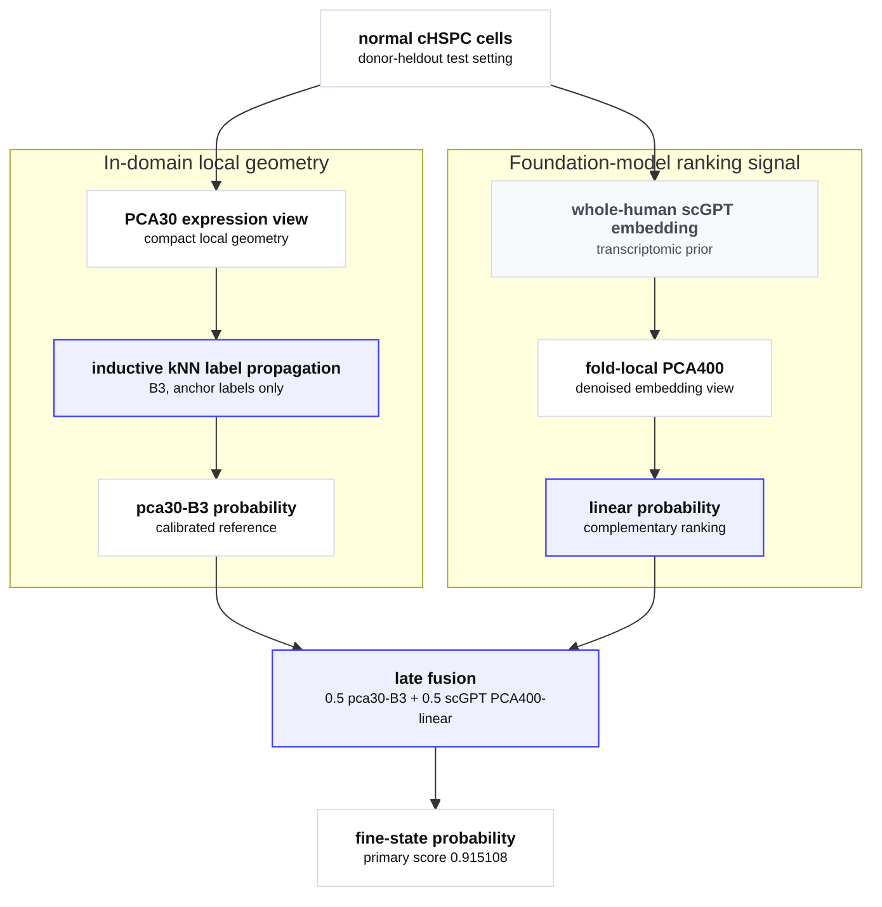

Rare-cell 분류 문제를 다루기 위해서는 먼저 방법을 실제로 적용해볼 수 있는 task 환경이 필요하다. 여기서 benchmark는 데이터셋 선택만이 아니라 세포 집단, 라벨 구조, donor split, label budget을 함께 고정한 평가 환경을 뜻한다. baseline만으로 바로 포화되거나 metadata shortcut이 강한 설정에서는 방법을 적용해도 개선의 의미를 해석하기 어렵다.

분석 대상은 normal circulating hematopoietic stem and progenitor cells (cHSPC) 안의 `HSPC (hematopoietic stem and progenitor cells) hierarchy`를 donor-heldout low-anchor fine-state 복원 benchmark로 구성한 설정이다. 초점은 새로운 모델 제안이 아니라, rare-cell classification을 너무 쉽지도 불가능하지도 않은 실질적인 task 환경으로 고정한 뒤, 여러 방법을 적용하면서 무엇이 어려웠고 어떤 신호가 개선에 기여했는지 정리하는 데 있다.

> **HSPC**
>
> HSPC는 혈액 세포 계열로 분화할 수 있는 stem/progenitor population을 가리킨다. 이 글에서는 normal cHSPC 안의 가까운 progenitor state를 구분하는 문제로 사용했다.

<aside class="research-question" aria-label="실험 초점">
  <p class="research-question__label">Experiment Focus</p>
  <p>normal cHSPC 안의 <code>HSPC hierarchy</code>를 donor-heldout low-anchor fine-state recovery task로 고정하고, local expression geometry, 표현학습 latent, single-cell foundation model signal, late fusion을 적용하면서 rare-cell classification에서 어떤 신호가 실제로 도움이 되고 어떤 한계가 남는지 확인한다.</p>
</aside>



> **cHSPC CELLxGENE collection**
>
> 이 benchmark는 public CELLxGENE collection의 circulating HSPC 데이터에서 normal cHSPC subset을 사용해 구성했다. 핵심은 collection 전체를 평가하는 것이 아니라, donor-heldout low-anchor 조건에서 fine-state recovery가 가능한 task 환경을 고정하는 데 있다.

## 요약

- HSPC hierarchy benchmark는 가까운 progenitor state, donor-heldout split, low-anchor 조건을 함께 묶어 새 donor에서도 fine state를 구분해야 하는 실질적인 rare-cell classification task로 구성했다.
- 초기 가능성 점검에서는 metadata shortcut이 강하지 않았고, cheap classifier가 centroid를 충분히 넘었다. 이 결과가 본 평가로 진행할 근거가 됐다.
- 본 평가에서는 inductive kNN label propagation이 anchor prior, nearest centroid, cheap linear classifier를 넘었다. 이 결과는 rare-cell classification에서 단순 marker 유무보다 local neighborhood 구조를 쓰는 방식이 중요하다는 신호로 읽었다.
- 30차원 PCA 표현 위에서 label propagation을 적용한 `pca30-B3`는 primary score `0.902323`, mean ECE `0.023626`으로 가장 안정적인 calibrated reference였다.
- fast scVI, blood/continual scGPT, scGPT embedding 위의 direct label propagation은 이 reference를 넘지 못했다. 더 복잡한 표현이나 foundation-model embedding이 바로 좋은 rare-cell decision geometry가 되지는 않았다.
- scGPT 기반 probability는 단독으로는 reference보다 낮았지만, local geometry 기반 reference와 late fusion했을 때 primary score가 `0.915108`로 증가했다. 다만 ECE는 `0.093359`로 나빠져, 결론은 primary score를 높인 fusion 조합과 calibration이 안정적인 reference를 나누어 해석한다.

## HSPC hierarchy benchmark

### 설계 배경

rare-cell 분류 문제의 방법론 비교에는 안정적으로 정의된 benchmark가 필요하다. 여기서 benchmark는 단순히 데이터셋 하나를 고르는 일이 아니라, 어떤 세포 집단을 대상으로 삼고, 어떤 라벨 구조를 가리고 복원하게 하며, 어떤 split과 label budget에서 일반화를 볼 것인지 정해 **방법을 적용할 수 있는 task 환경**을 만드는 일에 가깝다.

너무 쉬운 과제에서는 baseline만으로도 성능이 빨리 포화되고, shortcut이 강한 과제에서는 새 방법이 무엇을 배운 것인지 해석하기 어렵다. 따라서 이 단계의 기준은 특정 방법의 즉시 성능 개선이 아니라, **rare-cell 분류 방법을 적용했을 때 개선과 한계를 해석할 수 있는 task 환경의 성립 여부**였다.

HSPC hierarchy는 이 기준에 맞춰 구성하기 좋은 설정이었다. 같은 큰 세포 집단 안에 biologically 가까운 progenitor state들이 있고, donor 수가 충분해 donor-heldout split을 만들 수 있으며, 상위 라벨만 남긴 뒤 세부 라벨을 복원하는 parent-label collapse 설정을 만들 수 있었다. 즉, 단순히 데이터가 있었기 때문이 아니라 **데이터, 라벨 구조, split 조건이 함께 benchmark 난이도를 만들 수 있었기 때문에** 이 설정을 사용했다. 이 선택의 기준은 Table 1에 정리했다.

<figure class="table-figure table-figure--comparison">
  <div class="table-shell">
    <table class="comparison-table">
      <thead>
        <tr>
          <th>조건</th>
          <th>중요한 이유</th>
        </tr>
      </thead>
      <tbody>
        <tr>
          <td>hierarchy가 명확함</td>
          <td><code>parent-label collapse</code>, 즉 세부 라벨 일부를 가리고 더 큰 상위 라벨만 남기는 benchmark를 설계하기 좋았다</td>
        </tr>
        <tr>
          <td>sibling state가 biologically 가까움</td>
          <td>서로 비슷한 세포 상태라서 실제로 어려운 구분 문제가 된다</td>
        </tr>
        <tr>
          <td>donor 수가 충분함</td>
          <td><code>donor-heldout</code> split을 안정적으로 구성할 수 있었다</td>
        </tr>
        <tr>
          <td>shortcut을 점검할 수 있음</td>
          <td>metadata나 donor shortcut이 강한 문제인지 먼저 확인할 수 있었다</td>
        </tr>
        <tr>
          <td>feasibility를 먼저 점검할 수 있음</td>
          <td>복잡한 방법을 적용하기 전에 이 task가 너무 쉽거나 불가능한 설정이 아닌지 확인할 수 있었다</td>
        </tr>
      </tbody>
    </table>
  </div>
  <figcaption><strong>Table 1.</strong> HSPC hierarchy를 rare-cell classification task 환경으로 구성할 때 중요했던 설계 조건과 해석상 역할.</figcaption>
</figure>

따라서 HSPC hierarchy는 단순한 데이터셋 선택이 아니라, rare-cell classification 방법을 실제로 적용하고 해석하기 위해 설계한 task 환경이었다. 이후 실험은 이 task를 풀면서 어떤 접근이 실제로 효과가 있었고, 어떤 어려움이 구조적으로 남는지 확인하는 과정에 가깝다.

### 평가 설계

이 task의 입력은 cell-by-gene expression matrix에서 나온 single-cell expression vector다. 각 값은 해당 cell에서 특정 gene의 mRNA가 얼마나 관측됐는지를 나타내며, DNA 서열 자체가 아니라 cell state를 반영하는 transcriptome signal로 해석한다.

이 benchmark는 아래 네 가지 축을 함께 묻도록 구성했다.

- 가까운 sibling state를 실제로 구분해야 한다.
- 같은 donor를 다시 맞히지 않고 새 donor에서도 일반화돼야 한다.
- 라벨이 충분하지 않은 low-anchor 조건을 견뎌야 한다.
- 테스트 셀을 학습 때 직접 보지 않는 inductive setting이어야 한다.

실제 평가 contract는 아래처럼 고정했다.

- dataset: `cHSPC Illumina`
- condition: `diagnosis == normal`
- population: `hematopoietic precursor cell`
- fine labels: `MEBEMP-L`, `CLP`, `ERYP`, `BEMP`, `GMP-L`, `NKTDP`
- split: `donor-heldout`
- mode: `inductive-only`
- primary budget: `20 anchors per class`

여기서 `donor-heldout`은 같은 donor의 셀이 train과 test에 동시에 들어가지 않게 막는 설정이다. 다시 말해, 같은 사람 안에서 비슷한 셀을 다시 맞히는 문제가 아니라 **새 donor에서도 같은 패턴이 유지되는지**를 보는 더 엄격한 평가다. `anchor`는 학습할 때 정답 라벨이 공개된 소수의 셀이고, `inductive`는 테스트용 셀을 학습 때 직접 보지 않고 예측하는 방식이다.

이 조합이 task 환경의 핵심 조건이다. biologically 가까운 sibling state를 새 donor 일반화 조건과 low-anchor 조건 아래에서 묻도록 구성했기 때문에, 단순한 shortcut보다 실제 분류 난이도와 남아 있는 차이를 더 직접적으로 볼 수 있다.

### Task 환경의 성립 조건

초기 가능성 점검은 최종 기준을 고르는 단계가 아니라, **이 설정이 실질적인 rare-cell classification task 환경으로 성립하는지** 확인하는 단계였다. Table 2는 이때 사용한 데이터 규모와 기본 조건을 요약한다.

<figure class="table-figure table-figure--comparison">
  <div class="table-shell">
    <table class="comparison-table">
      <thead>
        <tr>
          <th>항목</th>
          <th>값</th>
        </tr>
      </thead>
      <tbody>
        <tr>
          <td>primary dataset</td>
          <td><code>human cHSPCs - Illumina</code></td>
        </tr>
        <tr>
          <td>scale</td>
          <td><code>495,763</code> cells, <code>132</code> donors, <code>28,968</code> genes</td>
        </tr>
        <tr>
          <td>primary fine labels</td>
          <td><code>6</code></td>
        </tr>
        <tr>
          <td>metadata-only donor-heldout max AUC</td>
          <td><code>0.582</code></td>
        </tr>
        <tr>
          <td>primary budgets</td>
          <td><code>20 / 50 / 100 anchors per class</code></td>
        </tr>
      </tbody>
    </table>
  </div>
  <figcaption><strong>Table 2.</strong> 초기 가능성 점검에서 사용한 cHSPC 데이터 규모와 task 구성 조건.</figcaption>
</figure>

Table 3에서는 사용한 정보의 수준이 서로 다른 세 가지 baseline을 비교했다.

- `(a) anchor prior`: label 비율만 보는 prior baseline
- `(b) centroid`: 공개된 셀 평균에 가장 가까운 라벨을 주는 baseline
- `(c) cheap classifier`: expression만 쓰는 간단한 linear classifier

<figure class="table-figure table-figure--metrics">
  <div class="table-shell">
    <table class="metrics-table">
      <thead>
        <tr>
          <th>anchors per class</th>
          <th class="align-right">(a) anchor prior</th>
          <th class="align-right">(b) centroid</th>
          <th class="align-right">(c) cheap classifier</th>
          <th class="align-right">(c) - (b)</th>
        </tr>
      </thead>
      <tbody>
        <tr>
          <td><code>20</code></td>
          <td class="align-right"><code>0.1667</code></td>
          <td class="align-right"><code>0.3227</code></td>
          <td class="align-right"><code>0.7814</code></td>
          <td class="align-right"><code>+0.4587</code></td>
        </tr>
        <tr>
          <td><code>50</code></td>
          <td class="align-right"><code>0.1667</code></td>
          <td class="align-right"><code>0.3259</code></td>
          <td class="align-right"><code>0.8534</code></td>
          <td class="align-right"><code>+0.5275</code></td>
        </tr>
        <tr>
          <td><code>100</code></td>
          <td class="align-right"><code>0.1667</code></td>
          <td class="align-right"><code>0.3257</code></td>
          <td class="align-right"><code>0.8838</code></td>
          <td class="align-right"><code>+0.5581</code></td>
        </tr>
      </tbody>
    </table>
  </div>
  <figcaption><strong>Table 3.</strong> 초기 가능성 점검에서 anchor 수에 따라 <code>anchor prior</code>, <code>centroid</code>, <code>cheap classifier</code>가 보인 성능 차이. 마지막 열은 expression 기반 classifier와 centroid baseline의 차이다.</figcaption>
</figure>

추가 확인에서도 방향은 유지됐다. Budget을 바꾸거나 Ultima cross-platform 조건으로 확인해도 expression 기반 classifier는 prior나 centroid baseline보다 높았다. 이 결과는 이 설정이 단순한 metadata shortcut이나 한 platform의 우연한 분리만으로 성립한 문제가 아니라는 점을 보강한다.

이 결과는 뒤에서 나오는 본 평가의 `nearest centroid`, `cheap linear classifier`와 직접 줄세우기보다, benchmark를 본 비교로 가져갈 수 있는지 확인한 사전 점검으로 해석한다. 이 단계에서 본 기준은 다음 세 가지였다.

- metadata shortcut은 강하지 않았다.
- low-anchor regime에서도 expression 기반 classifier와 baseline 사이의 차이가 컸다.
- cross-platform 확인에서도 방향이 유지됐다.

이 조건들이 함께 확인되었기 때문에, HSPC hierarchy 설정을 본 비교로 가져갈 수 있는 rare-cell classification task 환경으로 판단했다.

마지막으로, 사전 점검을 통과한 설정을 고정된 donor-heldout benchmark sample로 다시 평가했다. 평가 sample은 `26,681` cells, `90` donors, `6` fine labels였고, primary budget은 `20 anchors per class`였다. Table 4의 `B0`-`B5`는 같은 조건에서 비교한 baseline과 semi-supervised method shorthand다.

<figure class="table-figure table-figure--metrics">
  <div class="table-shell">
    <table class="metrics-table">
      <thead>
        <tr>
          <th>method</th>
          <th>short name</th>
          <th class="align-right">primary score</th>
        </tr>
      </thead>
      <tbody>
        <tr>
          <td>anchor prior</td>
          <td><code>B0</code></td>
          <td class="align-right"><code>0.1667</code></td>
        </tr>
        <tr>
          <td>nearest centroid</td>
          <td><code>B1</code></td>
          <td class="align-right"><code>0.8787</code></td>
        </tr>
        <tr>
          <td>cheap linear classifier</td>
          <td><code>B2</code></td>
          <td class="align-right"><code>0.8217</code></td>
        </tr>
        <tr>
          <td>inductive kNN label propagation</td>
          <td><code>B3</code></td>
          <td class="align-right"><code>0.8967</code></td>
        </tr>
        <tr>
          <td>inductive graph SSL</td>
          <td><code>B4</code></td>
          <td class="align-right"><code>0.8694</code></td>
        </tr>
        <tr>
          <td>calibrated pseudo-labeling</td>
          <td><code>B5</code></td>
          <td class="align-right"><code>0.8291</code></td>
        </tr>
      </tbody>
    </table>
  </div>
  <figcaption><strong>Table 4.</strong> 본 평가의 <code>20 anchors per class</code> 조건에서 baseline과 semi-supervised method를 비교한 primary score.</figcaption>
</figure>

Table 4의 대표값만으로는 split별 변동을 충분히 볼 수 없기 때문에, 판단에는 split별 gain을 직접 비교한 paired gain을 함께 사용했다. 결과는 Table 5에 정리했다.

<figure class="table-figure table-figure--metrics">
  <div class="table-shell">
    <table class="metrics-table">
      <thead>
        <tr>
          <th>비교</th>
          <th class="align-right">값</th>
        </tr>
      </thead>
      <tbody>
        <tr>
          <td>inductive kNN label propagation<br><span class="table-note-inline">vs strongest baseline, point estimate</span></td>
          <td class="align-right"><code>+0.0255</code></td>
        </tr>
        <tr>
          <td><code>95% CI</code></td>
          <td class="align-right"><code>(+0.0096, +0.0314)</code></td>
        </tr>
      </tbody>
    </table>
  </div>
  <figcaption><strong>Table 5.</strong> Split별 gain을 직접 비교해 계산한 inductive kNN label propagation의 paired gain. 비교 기준은 anchor prior, nearest centroid, cheap linear classifier 중 가장 강한 baseline이다.</figcaption>
</figure>

이 결과는 benchmark가 단순히 성립했다는 수준을 넘어, 같은 평가 조건 안에서 방법 간 차이를 비교할 여지가 남아 있음을 보여준다. 다만 성능 차이가 확인된 이후에도 `MEBEMP-L`과 `ERYP` 사이의 confusion은 반복적으로 남아, 이후 결과를 해석할 때 중요한 한계로 다뤘다.

## Rare-cell classification

### Baseline이 드러낸 task 성격

이후 해석의 초점은 점수 순위보다, 각 방법이 어떤 가정을 두고 실패하거나 개선됐는지에 있다. 같은 donor-heldout low-anchor 조건에서 baseline과 semi-supervised method를 비교하면, 가까운 HSPC state를 분류할 때 남는 어려움이 조금 더 분리되어 보인다.

먼저 `nearest centroid` (`B1`)는 공개된 anchor의 평균 위치만으로 fine state를 복원할 수 있는지 보는 가장 단순한 출발점이었다. 이 방법이 충분했다면 HSPC hierarchy는 각 state가 하나의 대표점으로 잘 요약되는 prototype matching 문제에 가까웠을 것이다. 그러나 donor-heldout low-anchor 조건에서는 이 방식만으로 충분하지 않았다.

`cheap linear classifier` (`B2`)는 marker signal이 실제로 남아 있는지 확인하는 역할을 했다. 초기 가능성 점검에서 `cheap classifier`가 강했다는 것은 라벨이 완전히 뒤섞인 문제가 아니라는 뜻이다. expression 안에는 fine state를 구분할 신호가 남아 있었다. 다만 본 평가에서는 `nearest centroid`도 강한 비교 기준이 됐고, 단순한 선형 경계만으로 task가 닫히지는 않았다.

`inductive kNN label propagation` (`B3`)은 local neighborhood를 쓰는 방향이었다. HSPC sibling state가 완전히 분리된 섬이라기보다 local expression manifold 위에서 이어져 있다면, 적은 anchor만으로도 주변 구조를 이용할 수 있어야 한다. 실제로 이 방법은 `anchor prior`, `nearest centroid`, `cheap linear classifier` 중 가장 강한 baseline을 넘었다. 이 결과는 rare-cell classification의 어려움이 단순 marker 유무가 아니라, **가까운 세포들의 구조를 어떻게 쓰는지**와 연결되어 있음을 보여준다.

### Local geometry를 활용한 개선

그다음 개선은 모델 계열을 바꾸는 것보다 표현 공간을 조정할 때 나왔다. 여기서 `pca50`과 `pca30`은 expression matrix를 각각 50차원 또는 30차원 PCA 표현으로 줄인 뒤, 그 공간에서 label propagation을 적용한 설정이다. 같은 label propagation이라도 `pca50` 대신 `pca30` 위에서 local neighborhood를 만들었을 때 primary score와 pair confusion이 함께 개선됐다. Table 6은 이 차이를 요약한다. 남은 병목은 단순히 더 복잡한 classifier 부족이 아니라, 어떤 표현 공간에서 가까운 이웃을 정의할 것인지와 관련되어 있었다.

<figure class="table-figure table-figure--metrics">
  <div class="table-shell">
    <table class="metrics-table">
      <thead>
        <tr>
          <th>condition</th>
          <th class="align-right">primary score</th>
          <th class="align-right">mean macro AUPRC</th>
          <th class="align-right">mean ECE</th>
          <th class="align-right">mean Brier</th>
          <th class="align-right"><code>MEBEMP-L &lt;-&gt; ERYP</code> pair confusion</th>
        </tr>
      </thead>
      <tbody>
        <tr>
          <td><code>pca50-B3</code></td>
          <td class="align-right"><code>0.896652</code></td>
          <td class="align-right"><code>0.895621</code></td>
          <td class="align-right"><code>0.027164</code></td>
          <td class="align-right"><code>0.226867</code></td>
          <td class="align-right"><code>0.278660</code></td>
        </tr>
        <tr>
          <td><code>pca30-B3</code></td>
          <td class="align-right"><code>0.902323</code></td>
          <td class="align-right"><code>0.899463</code></td>
          <td class="align-right"><code>0.023626</code></td>
          <td class="align-right"><code>0.220972</code></td>
          <td class="align-right"><code>0.266080</code></td>
        </tr>
      </tbody>
    </table>
  </div>
  <figcaption><strong>Table 6.</strong> <code>pca50-B3</code>와 <code>pca30-B3</code>의 primary score, calibration, 핵심 pair confusion 비교.</figcaption>
</figure>

Figure 1은 같은 비교를 세 지표의 방향성으로 다시 보여준다. `pca30-B3`는 primary score를 올리는 동시에 ECE와 `MEBEMP-L <-> ERYP` pair confusion을 낮췄다.

<figure class="media-figure">
  
  <figcaption><strong>Figure 1.</strong> 같은 label propagation이라도 local neighborhood를 정의하는 PCA 공간에 따라 primary score, calibration, 주요 sibling-boundary confusion이 함께 달라졌다. <code>pca30-B3</code>는 점수만 높은 설정이 아니라 calibrated in-domain reference로 남을 조건을 함께 만족했다.</figcaption>
</figure>

핵심 비교는 아래와 같다.

- `pca30` vs `pca50` primary score median gain: `+0.0097`
- bootstrap `95% CI = (+0.0044, +0.0155)`
- pair confusion delta: `-0.0219`
- pair bootstrap `95% CI = (-0.0337, -0.0120)`

이 결과는 compact PCA view가 고차원 noise를 줄이고, HSPC lineage와 관련된 local geometry를 더 안정적으로 보존했을 가능성을 시사한다. 이 때문에 `pca30-B3`는 단순히 점수가 높은 설정이 아니라, 이후 비교에서 기준으로 삼을 calibrated in-domain reference가 됐다. 참고로 `macro AUPRC`는 각 클래스를 고르게 보고 평균낸 성능 점수이고, `ECE`는 confidence와 실제 정답률의 정합성을 보는 calibration 지표다.

추가 safety / sensitivity도 같은 방향을 지지했다.

- donor leakage AUC: `0.559952`
- all-diagnosis gain: `+0.030604`
- Ultima gain: `+0.025175`
- 두 sensitivity 모두 calibration은 `cheap linear classifier`보다 나빠지지 않았다

### 표현학습 모델의 적용과 한계

성능을 갱신하지 못한 시도들도 task의 성격을 이해하는 데 필요했다. 먼저 같은 `pca30-B3` 안에서 `k`, `alpha`, pair-local rescue를 바꿔도 의미 있는 gain은 거의 없었다. 이는 남은 오류가 단순한 propagation hyperparameter 문제가 아니라는 뜻이다.

이후에는 표현학습 모델을 적용했다. `scVI`는 batch나 noise를 줄인 generative latent가 rare-cell classification에 도움이 되는지 확인하기 위한 선택이었다. 이 가정이 맞았다면 `scVI latent + label propagation`이 reference를 넘어야 했다. 그러나 성능, calibration, `MEBEMP-L <-> ERYP` boundary 모두에서 `pca30-B3`보다 불리했다. 더 매끄러운 latent가 항상 더 좋은 decision geometry를 만드는 것은 아니었다.

> **scGPT**
>
> scGPT는 single-cell transcriptomic data를 대상으로 학습된 foundation model이다. 여기서는 scGPT 자체를 새로 학습하거나 일반 성능을 평가한 것이 아니라, scGPT embedding과 PCA400-linear probability가 `pca30-B3` reference를 보완하는지 확인했다.

초기 `scGPT` 결과도 같은 방향이었다. foundation-model embedding은 더 넓은 transcriptomic prior를 줄 수 있지만, 그것이 곧바로 이 task의 local propagation graph가 되지는 않았다. 특히 raw scGPT embedding에 label propagation을 붙인 결과가 낮았다는 점은, scGPT 공간이 label ranking signal을 일부 갖고 있더라도 이 방법이 요구하는 local neighborhood geometry와는 맞지 않을 수 있음을 보여준다. reference를 넘지 못한 적용 결과는 Table 7에 모았다.

<figure class="table-figure table-figure--comparison">
  <div class="table-shell">
    <table class="comparison-table">
      <thead>
        <tr>
          <th>비교 항목</th>
          <th>핵심 결과</th>
          <th>읽는 법</th>
        </tr>
      </thead>
      <tbody>
        <tr>
          <td>같은 설정 안의 <code>pca30-B3</code> hyperparameter sweep</td>
          <td>가장 높은 simple variant의 seed-median primary gain <code>+0.0008</code>, <code>95% CI = (+0.0002, +0.0013)</code></td>
          <td>방향성은 있으나 reference를 바꿀 수준은 아님</td>
        </tr>
        <tr>
          <td>fast <code>scVI</code> latent + label propagation</td>
          <td><code>primary score = 0.893955</code>, <code>mean ECE = 0.069573</code>, <code>pair confusion = 0.275425</code></td>
          <td><code>pca30-B3</code>보다 성능, calibration, pair boundary 모두 불리</td>
        </tr>
        <tr>
          <td>original blood <code>scGPT</code> + linear</td>
          <td><code>0.837242</code></td>
          <td>reference보다 낮음</td>
        </tr>
        <tr>
          <td>original blood <code>scGPT</code> + prototype</td>
          <td><code>0.698214</code></td>
          <td>nearest-prototype assumption이 크게 깨짐</td>
        </tr>
        <tr>
          <td>original blood <code>scGPT</code> + label propagation</td>
          <td><code>0.838096</code></td>
          <td>raw embedding을 propagation graph로 쓰기 어려움</td>
        </tr>
        <tr>
          <td>continual <code>scGPT</code> + linear / label propagation</td>
          <td><code>0.850564</code> / <code>0.846002</code></td>
          <td>blood checkpoint보다는 낫지만 reference와 차이가 큼</td>
        </tr>
        <tr>
          <td><code>whole-human scGPT</code> raw linear / raw label propagation</td>
          <td><code>0.880685</code> / <code>0.874831</code></td>
          <td>checkpoint는 나아졌지만 단독으로는 reference 미달</td>
        </tr>
      </tbody>
    </table>
  </div>
  <figcaption><strong>Table 7.</strong> <code>pca30-B3</code> reference를 대체하지 못한 tuning, scVI, scGPT 계열 적용 결과와 해석.</figcaption>
</figure>

이 결과들은 더 복잡한 방법이 reference를 넘지 못했다는 기록에 그치지 않는다. rare-cell classification에서 실제로 맞닿게 되는 어려움이 무엇인지 분리해 보여준다.

- 복잡한 모델 계열이라고 자동으로 좋아지지 않았다.
- foundation-model embedding이라고 자동으로 reference를 대체하지 않았다.
- 같은 설정 안의 미세 튜닝은 남은 오류를 크게 줄이지 못했다.

따라서 이 task에서 남은 병목은 단순한 local hyperparameter 부족이라기보다, **representation / decision geometry / label ranking signal의 조합 문제**에 더 가깝다.

### 보완적 ranking signal의 결합

`whole-human scGPT`를 추가하면서 개선 방향이 바뀌었다. 단독 `scGPT`나 `scGPT` embedding 위의 direct label propagation은 reference를 넘지 못했지만, fold-local PCA400으로 denoise한 뒤 linear probability를 만들면 `pca30-B3`와 다른 오류 구조가 나타났다. 즉, `scGPT`가 reference를 대체한 것이 아니라, `pca30-B3`가 약한 일부 label ranking에서 보완 신호를 제공한 것으로 읽는 편이 맞다.

마지막 비교는 embedding을 교체하는 방식이 아니라 probability를 결합하는 방식이었다. `pca30-B3`는 in-domain local manifold signal을 제공하고, `whole-human scGPT PCA400-linear`는 complementary ranking signal을 제공한다. Table 8처럼 둘을 `w=0.5`로 late fusion하자 primary score는 `0.915108`까지 올라갔다.

이 조합은 아래 식처럼 두 probability source를 같은 weight로 합치는 구조다. `pca30-B3`는 calibrated reference로 남기고, `whole-human scGPT PCA400-linear`는 ranking 보완 신호로만 결합했다.

<div class="metric-formulas">
  <div class="metric-formula">
    <span class="metric-formula__label">Reference branch</span>
    <span class="metric-formula__body">\(p_{\mathrm{ref}} = p(\mathrm{pca30\text{-}B3})\)</span>
  </div>
  <div class="metric-formula">
    <span class="metric-formula__label">scGPT branch</span>
    <span class="metric-formula__body">\(p_{\mathrm{scGPT}} = p(\mathrm{whole\text{-}human\ scGPT\ PCA400\text{-}linear})\)</span>
  </div>
  <div class="metric-formula">
    <span class="metric-formula__label">Final probability</span>
    <span class="metric-formula__body">\(p_{\mathrm{final}} = 0.5\,p_{\mathrm{ref}} + 0.5\,p_{\mathrm{scGPT}}\)</span>
  </div>
</div>

Figure 2는 이 결합식을 두 branch 구조로 풀어낸 것이다. 왼쪽 branch는 in-domain local geometry를, 오른쪽 branch는 foundation-model ranking signal을 담당한다.

<figure class="media-figure" markdown="1">



  <figcaption><strong>Figure 2.</strong> In-domain local geometry에서 나온 calibrated reference probability와 <code>whole-human scGPT PCA400-linear</code>의 ranking probability를 같은 weight로 late fusion한 구조.</figcaption>
</figure>

<figure class="table-figure table-figure--metrics">
  <div class="table-shell">
    <table class="metrics-table">
      <thead>
        <tr>
          <th>setting</th>
          <th class="align-right">primary score</th>
          <th class="align-right">mean macro AUPRC</th>
          <th class="align-right">mean ECE</th>
          <th class="align-right">mean Brier</th>
        </tr>
      </thead>
      <tbody>
        <tr>
          <td><code>pca30-B3</code></td>
          <td class="align-right"><code>0.902323</code></td>
          <td class="align-right"><code>0.899463</code></td>
          <td class="align-right"><code>0.023626</code></td>
          <td class="align-right"><code>0.220972</code></td>
        </tr>
        <tr>
          <td><code>whole-human scGPT PCA400-linear</code></td>
          <td class="align-right"><code>0.894952</code></td>
          <td class="align-right"><code>0.892713</code></td>
          <td class="align-right"><code>0.071926</code></td>
          <td class="align-right"><code>0.315177</code></td>
        </tr>
        <tr>
          <td><code>pca30-B3</code><br><span class="table-note-inline">+ <code>whole-human scGPT PCA400-linear</code><br>fusion <code>w0.5</code></span></td>
          <td class="align-right"><code>0.915108</code></td>
          <td class="align-right"><code>0.916052</code></td>
          <td class="align-right"><code>0.093359</code></td>
          <td class="align-right"><code>0.226904</code></td>
        </tr>
      </tbody>
    </table>
  </div>
  <figcaption><strong>Table 8.</strong> <code>pca30-B3</code> reference, <code>whole-human scGPT PCA400-linear</code> 단독, late fusion 조합의 성능 비교.</figcaption>
</figure>

세 결과의 역할은 분리해서 해석했다. `pca30-B3`는 calibration이 안정적인 reference이고, `whole-human scGPT PCA400-linear`는 단독으로는 reference보다 낮지만 보완적인 ranking signal을 제공했다. Late fusion 조합은 primary score 기준으로 가장 높았지만, ECE는 나빠졌다. 따라서 이 단계의 결론은 calibrated reference와 primary-score fusion 조합을 분리해서 보는 것이다.

fusion weight도 제한적으로 해석한다. Table 9는 `whole-human scGPT PCA400-linear` probability weight를 바꿨을 때의 primary score 변화를 보여준다.

<figure class="table-figure table-figure--metrics table-figure--compact-metrics">
  <div class="table-shell">
    <table class="metrics-table metrics-table--compact-two-col">
      <thead>
        <tr>
          <th class="align-right">fusion weight</th>
          <th class="align-right">primary score</th>
        </tr>
      </thead>
      <tbody>
        <tr>
          <td class="align-right"><code>0.0</code></td>
          <td class="align-right"><code>0.902323</code></td>
        </tr>
        <tr>
          <td class="align-right"><code>0.3</code></td>
          <td class="align-right"><code>0.913787</code></td>
        </tr>
        <tr>
          <td class="align-right"><code>0.4</code></td>
          <td class="align-right"><code>0.914720</code></td>
        </tr>
        <tr>
          <td class="align-right"><code>0.5</code></td>
          <td class="align-right"><code>0.915108</code></td>
        </tr>
        <tr>
          <td class="align-right"><code>0.55</code></td>
          <td class="align-right"><code>0.915041</code></td>
        </tr>
        <tr>
          <td class="align-right"><code>0.6</code></td>
          <td class="align-right"><code>0.914702</code></td>
        </tr>
        <tr>
          <td class="align-right"><code>1.0</code></td>
          <td class="align-right"><code>0.894952</code></td>
        </tr>
      </tbody>
    </table>
  </div>
  <figcaption><strong>Table 9.</strong> <code>whole-human scGPT PCA400-linear</code> probability의 late-fusion weight에 따른 primary score 변화.</figcaption>
</figure>

Figure 3은 같은 결과를 curve로 나타낸 것이다. 중간 weight에서는 reference를 넘지만, `w=1.0`의 `whole-human scGPT PCA400-linear` 단독은 다시 낮아진다.

<figure class="media-figure">
  
  <figcaption><strong>Figure 3.</strong> <code>whole-human scGPT PCA400-linear</code> probability의 fusion weight에 따른 primary score 변화다. 중간 weight에서 reference를 넘지만, 단독 결과는 reference보다 낮다. 따라서 이 결과는 foundation model 단독 승리보다 complementary ranking signal의 결합으로 읽는 편이 맞다.</figcaption>
</figure>

`w=0.0`은 `pca30-B3` reference 재현이고, `w=1.0`은 `whole-human scGPT PCA400-linear` 단독이다. `w=0.3~0.6` 구간에서 reference를 안정적으로 넘었고 그중 primary median 기준 최고가 `w=0.5`였다. 다만 이 weight는 최종 평가 grid 위에서 관측한 값이므로, 일반화된 고정 fusion 규칙이라고 주장하려면 train-only 또는 nested 방식의 weight selection rule을 따로 검증해야 한다.

### 남은 경계: `MEBEMP-L <-> ERYP`

남은 주요 오류 경계는 비교적 명확했다.

- `MEBEMP-L`은 성격이 조금 섞여 보이는 전구세포 쪽 상태였고, `ERYP`는 적혈구 계열 신호가 더 강한 상태였다.
- 전체 score가 개선되는 동안에도 `MEBEMP-L <-> ERYP`는 주요 오류 경계로 남았다.
- 오류 분석에서는 일부 donor-label slice에서 `pca30-B3`가 `cheap linear classifier`보다 더 높은 confidence로 틀리는 패턴이 남았다.
- 그런데 anchor 분포 확인에서는 pair-anchor donor coverage가 대체로 균형적이었다.
- 분리 가능성 확인에서는 donor-heldout pairwise separability가 높았다: mean pair AP `0.9233`, mean pair AUC `0.9177`.

여기서 `pair AP`와 `pair AUC`는 이 두 상태만 따로 놓고 봤을 때 얼마나 잘 구분되는지를 보는 점수다. 이 경계가 어렵기는 해도 완전히 뒤섞인 것은 아니라는 뜻이다.

이 pair는 아래처럼 해석한다.

- 완전히 분리 불가능한 경계는 아니다.
- 단순 anchor imbalance 문제도 아니다.
- marker structure는 여전히 남아 있다.
- 현재 평가 설정에서는 **표현의 한계가 남아 있지만 완전히 뒤섞인 경계는 아닌 상태**에 가깝다.

fusion은 이 경계를 일부 줄였다. Table 10처럼 label별로 보면 `MEBEMP-L`과 `ERYP`에서 `whole-human scGPT PCA400-linear` signal이 reference를 보완했다.

<figure class="table-figure table-figure--metrics">
  <div class="table-shell">
    <table class="metrics-table">
      <thead>
        <tr>
          <th>label</th>
          <th class="align-right"><code>pca30-B3</code> AP</th>
          <th class="align-right">fusion <code>w0.5</code> AP</th>
          <th class="align-right">gain</th>
        </tr>
      </thead>
      <tbody>
        <tr>
          <td><code>MEBEMP-L</code></td>
          <td class="align-right"><code>0.731729</code></td>
          <td class="align-right"><code>0.763169</code></td>
          <td class="align-right"><code>+0.031440</code></td>
        </tr>
        <tr>
          <td><code>ERYP</code></td>
          <td class="align-right"><code>0.759149</code></td>
          <td class="align-right"><code>0.800668</code></td>
          <td class="align-right"><code>+0.041519</code></td>
        </tr>
      </tbody>
    </table>
  </div>
  <figcaption><strong>Table 10.</strong> <code>MEBEMP-L</code>과 <code>ERYP</code>에서 <code>pca30-B3</code> 대비 fusion <code>w0.5</code>가 만든 label별 AP gain.</figcaption>
</figure>

따라서 이 boundary는 task 환경 자체를 무효화하는 제약이라기보다, fusion 조합이 실제 개선 여지를 보인 핵심 경계로 남는다. 다만 이 결과만으로 문제가 해결됐다고 볼 수는 없다. fusion은 primary score와 일부 ranking을 개선했지만 calibration은 `pca30-B3`보다 나빠졌다.

## 결론

**HSPC hierarchy benchmark는 rare-cell classification 방법을 실험하기 위한 task 환경으로 성립했다.** 핵심은 데이터셋 하나를 고르는 것이 아니라, 가까운 progenitor state, donor-heldout split, low-anchor label budget, inductive prediction 조건을 함께 고정한 데 있었다. 이 조건에서는 단순 metadata shortcut만으로 문제가 닫히지 않았고, 같은 평가 조건 안에서 방법 간 성능 차이를 비교할 여지도 남아 있었다.

모델 적용에서 얻은 일반화 가능한 신호는 세 가지였다.

1. 가까운 rare-cell state를 구분할 때는 marker signal의 존재만으로 충분하지 않고, **어떤 표현 공간에서 local neighborhood를 정의하는지가 성능과 calibration을 함께 좌우했다.**
2. 표현학습 latent나 foundation-model embedding은 더 넓은 prior를 담고 있더라도, **그 공간이 바로 좋은 decision geometry가 되지는 않았다.**
3. foundation-model signal은 단독 대체보다 기존 local geometry reference가 놓치는 ranking 오류를 보완할 때 더 유효했다.

Figure 4는 이 흐름을 대표 설정의 primary score 기준으로 다시 묶은 것이다. 낮은 outlier와 반복 checkpoint 변형은 제외하고, baseline, local geometry, 표현학습 모델, scGPT signal, fusion 조합이 어떤 위치에 놓이는지 비교했다. 방법 계열을 넓혀도 `pca30-B3` reference를 안정적으로 넘기는 설정은 많지 않았고, late fusion 조합만 primary score를 분명히 갱신했다.

<figure class="media-figure">
  
  <figcaption><strong>Figure 4.</strong> 같은 benchmark에서 대표 baseline, 표현학습 모델, scGPT signal, reference, late fusion 조합의 primary score를 비교했다. Local geometry 기반 reference가 강하게 남았고, scGPT signal은 단독 대체보다 late fusion에서 가장 큰 개선을 보였다.</figcaption>
</figure>

다만 scGPT signal이 완전히 무효였던 것은 아니다. Whole-human scGPT embedding을 fold-local PCA400으로 정리한 뒤 만든 linear probability는 단독으로는 reference보다 낮았지만, `pca30-B3`와 late fusion했을 때 primary score를 갱신했다. 이 결과는 foundation model의 단독 대체보다, **in-domain local geometry와 foundation-model ranking signal의 보완적 결합**으로 해석하는 편이 맞다.

따라서 이 단계의 결론은 단일 winner가 아니라 역할 분리다. **`pca30-B3`는 calibration이 안정적인 in-domain reference로 남았고, `pca30-B3 + whole-human scGPT PCA400-linear fusion w0.5`는 primary score 기준 조합이었다.** 남은 과제는 이 결합을 train-only 또는 nested weight selection으로 고정하고, fusion 이후 calibration을 보정하며, `MEBEMP-L <-> ERYP` 경계를 더 안전하게 줄이는 것이다.

## Appendix: 평가 조건

본문에는 결과 해석에 필요한 수치만 남겼다. 재현과 해석에 필요한 조건은 아래처럼 benchmark contract, 방법명, metric 정의로 나누어 정리한다.

<figure class="table-figure table-figure--comparison">
  <div class="table-shell">
    <table class="comparison-table">
      <thead>
        <tr>
          <th>항목</th>
          <th>조건</th>
        </tr>
      </thead>
      <tbody>
        <tr>
          <td><strong>대상 데이터</strong></td>
          <td>normal cHSPC 안의 hematopoietic precursor cell population</td>
        </tr>
        <tr>
          <td><strong>분류 대상 라벨</strong></td>
          <td><code>MEBEMP-L</code>, <code>CLP</code>, <code>ERYP</code>, <code>BEMP</code>, <code>GMP-L</code>, <code>NKTDP</code></td>
        </tr>
        <tr>
          <td><strong>평가 split</strong></td>
          <td><code>donor-heldout</code>. 같은 donor의 cell이 train과 test에 동시에 들어가지 않도록 분리했다.</td>
        </tr>
        <tr>
          <td><strong>라벨 조건</strong></td>
          <td><code>20 anchors per class</code>를 primary budget으로 사용했다. Anchor는 학습 시 정답 라벨이 공개된 소수 cell을 뜻한다.</td>
        </tr>
        <tr>
          <td><strong>예측 조건</strong></td>
          <td><code>inductive-only</code>. test cell은 학습 때 직접 보지 않고 예측한다.</td>
        </tr>
      </tbody>
    </table>
  </div>
  <figcaption><strong>Appendix Table 1.</strong> 본문 결과를 해석할 때 고정한 HSPC hierarchy benchmark contract.</figcaption>
</figure>

<figure class="table-figure table-figure--comparison">
  <div class="table-shell">
    <table class="comparison-table">
      <thead>
        <tr>
          <th>이름</th>
          <th>본문에서의 역할</th>
        </tr>
      </thead>
      <tbody>
        <tr>
          <td><code>anchor prior</code></td>
          <td>anchor label 비율만 사용하는 prior baseline이다.</td>
        </tr>
        <tr>
          <td><code>nearest centroid</code></td>
          <td>anchor 평균 위치에 가장 가까운 라벨을 주는 prototype matching baseline이다.</td>
        </tr>
        <tr>
          <td><code>cheap classifier</code></td>
          <td>초기 가능성 점검에서 사용한 간단한 expression classifier다.</td>
        </tr>
        <tr>
          <td><code>cheap linear classifier</code></td>
          <td>본 분류 task에서 marker signal이 남아 있는지 확인한 linear baseline이다.</td>
        </tr>
        <tr>
          <td><code>pca30-B3</code></td>
          <td>30차원 PCA 공간에서 inductive kNN label propagation을 적용한 calibrated in-domain reference다.</td>
        </tr>
        <tr>
          <td><code>whole-human scGPT PCA400-linear</code></td>
          <td>whole-human scGPT embedding을 fold-local PCA400으로 줄인 뒤 linear probability를 만든 보완 신호다.</td>
        </tr>
      </tbody>
    </table>
  </div>
  <figcaption><strong>Appendix Table 2.</strong> 본문과 표에서 반복해서 쓰는 방법명과 역할.</figcaption>
</figure>

<figure class="table-figure table-figure--comparison">
  <div class="table-shell">
    <table class="comparison-table">
      <thead>
        <tr>
          <th>지표 또는 분석</th>
          <th>해석</th>
        </tr>
      </thead>
      <tbody>
        <tr>
          <td><code>primary score</code></td>
          <td>본문에서 방법 간 순위를 비교할 때 사용한 중심 성능 지표다.</td>
        </tr>
        <tr>
          <td><code>macro AUPRC</code></td>
          <td>각 class를 고르게 본 뒤 평균낸 ranking 성능이다. rare label이 섞인 설정에서 class별 성능을 함께 보기 위해 사용했다.</td>
        </tr>
        <tr>
          <td><code>ECE</code>, <code>Brier</code></td>
          <td>prediction confidence와 실제 정답률의 정합성을 보는 calibration 지표다. Fusion은 primary score를 올렸지만 이 축에서는 불리했다.</td>
        </tr>
        <tr>
          <td><code>MEBEMP-L &lt;-&gt; ERYP</code> pair confusion</td>
          <td>본문에서 반복적으로 남은 sibling-boundary 오류다. 이 경계는 완전히 뒤섞인 문제라기보다 표현과 ranking 신호가 더 필요한 개선 여지로 해석했다.</td>
        </tr>
        <tr>
          <td>fusion weight</td>
          <td>최종 평가 grid 위에서 관측한 weight다. 일반화된 고정 규칙으로 쓰려면 train-only 또는 nested weight selection이 따로 필요하다.</td>
        </tr>
      </tbody>
    </table>
  </div>
  <figcaption><strong>Appendix Table 3.</strong> 본문 수치를 읽을 때 필요한 metric과 caveat.</figcaption>
</figure>

## References

<div class="reference-list" markdown="1">

<ol>
  <li id="ref-chspc-collection">Human circulating hematopoietic stem and progenitor cells in aging, cytopenia and MDS. <em>CELLxGENE collection</em>. DOI: <a href="https://doi.org/10.1038/s41591-025-03716-5">10.1038/s41591-025-03716-5</a></li>
  <li id="ref-label-propagation">Zhu, X. & Ghahramani, Z. <strong>Learning from labeled and unlabeled data with label propagation</strong>. Technical Report CMU-CALD-02-107 (2002).</li>
  <li id="ref-calibration">Guo, C. et al. <strong>On Calibration of Modern Neural Networks</strong>. <em>Proceedings of ICML</em> (2017).</li>
  <li id="ref-scvi">Lopez, R. et al. <strong>Deep generative modeling for single-cell transcriptomics</strong>. <em>Nature Methods</em> 15, 1053-1058 (2018). DOI: <a href="https://doi.org/10.1038/s41592-018-0229-2">10.1038/s41592-018-0229-2</a></li>
  <li id="ref-scgpt">Cui, H. et al. <strong>scGPT: toward building a foundation model for single-cell multi-omics using generative AI</strong>. <em>Nature Methods</em> (2024). DOI: <a href="https://doi.org/10.1038/s41592-024-02201-0">10.1038/s41592-024-02201-0</a></li>
</ol>

</div>

## Citation

이 글을 인용할 때는 아래 형식을 사용할 수 있다.

```text
Ilho Ahn, "HSPC hierarchy benchmark 설계와 rare-cell classification 적용", Mini Research, Apr 21, 2026.
```

또는 BibTeX 형식으로는 다음처럼 적을 수 있다.

```bibtex
@article{ahn2026hspchierarchylineage,
  author = {Ilho Ahn},
  title = {HSPC hierarchy benchmark 설계와 rare-cell classification 적용},
  journal = {Mini Research},
  year = {2026},
  month = apr,
  url = {https://muted-color.github.io/research/2026/04/21/hspc-hierarchy-benchmark-lineage/}
}
```
