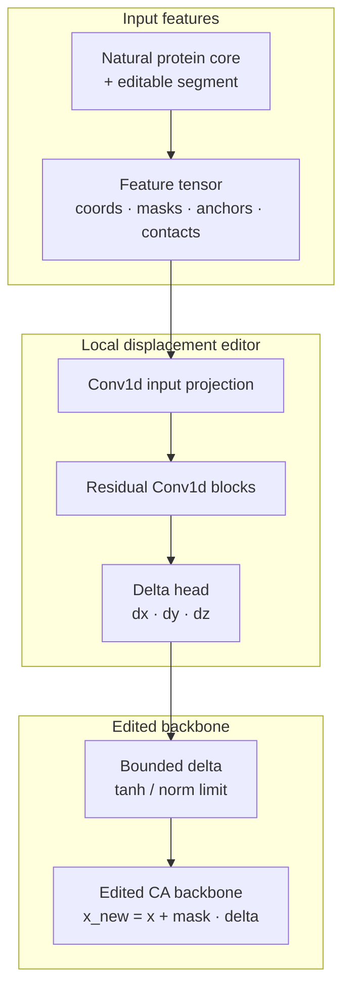

작은 backbone 생성/편집 모델에서 designability가 나타나려면 어느 수준의 구조 단서가 필요한지 비교했다. 평가는 CA-only ProteinMPNN으로 sequence를 설계하고, ESMFold로 다시 접히는지 확인하는 절차로 고정했다 <a class="citation-ref" href="#ref-proteinmpnn" aria-label="Reference 1">[1]</a><a class="citation-ref" href="#ref-esmfold" aria-label="Reference 2">[2]</a>.

여기서 designable backbone은 sequence를 붙였을 때 ESMFold가 원래 의도한 backbone과 비슷한 구조로 다시 접는 경우를 뜻한다. 따라서 평가는 chain의 국소 기하 개선이 아니라, ProteinMPNN이 설계한 sequence가 ESMFold에서 같은 fold로 돌아오는지까지 포함한다.

핵심 관찰은 구조 단서 수준에 따라 판정 결과가 갈렸다는 점이다. 각도 기반 국소 diffusion, 연속 거리 지도 생성, 거리 구간 분류 계열은 compactness나 contact 같은 간접 지표를 일부 개선했지만 designability 기준을 통과하지 못했다. 반대로 자연 단백질에서 관찰되는 topology나 전체 backbone 구조, 또는 자연 단백질 구조 core 근처에서 일부 segment만 부드럽게 바꾼 조건에서는 기준을 통과한 후보가 나왔다.

균형 비교 세트에서 자연 단백질 구조 core를 고정하고 주변 segment를 제한된 범위 안에서 부드럽게 바꾼 조건은 6/8 moderate, 5/8 strict를 기록했다. 이 결과는 단일 방법의 우열보다, 작은 모델 설정에서 designability가 유지되는 구조 단서의 범위를 좁히는 근거로 둔다.

> **자연 단백질 구조**는 PDB/CATH 같은 자연 단백질 구조 데이터에서 관찰되는 backbone 형태와 topology를 가리킨다. 여기에는 자연 단백질의 전체 backbone을 그대로 쓰는 조건뿐 아니라, 실제 자연 단백질 topology, 고정된 자연 구조 core, 자연 구조 근처에서의 제한된 segment 편집처럼 이미 sequence-compatible한 구조 근방의 정보를 생성/편집 과정에 넣는 조건이 포함된다.

<aside class="research-question" aria-label="평가 초점">
  <p class="research-question__label">Experiment Focus</p>
  <p>국소 기하 정보, 약한 topology 단서, 자연 단백질 구조 core 조건을 같은 ProteinMPNN + ESMFold 절차로 비교해, 설계된 sequence가 원 backbone과 비슷한 구조로 돌아오려면 어느 수준의 구조 단서가 필요한지 평가한다.</p>
</aside>



## 요약

- 평가 질문은 작은 backbone 생성/편집 모델에서 designability가 나타나기 위해 필요한 구조 단서 수준이다.
- 국소 기하 diffusion과 약한 topology 생성은 CA-CA 거리, contact, compactness 같은 간접 지표를 일부 개선했지만, 주요 조건은 0/8에 머물렀다.
- 자연 단백질 구조 단서가 들어간 조건에서는 결과가 달라졌다. 자연 단백질의 전체 backbone 구조는 20개 중 10개가 moderate, 8개가 strict 기준을 통과했다.
- 균형 비교 세트에서 자연 구조 core를 고정하고 segment를 부드럽게 제한해 바꾼 조건은 6/8 moderate, 5/8 strict를 기록했다. 같은 core를 쓰더라도 양 끝점 직선 보간은 0/8, fragment 삽입은 1/8 moderate였다.
- 현재 결론은 diffusion 기반 전체 생성보다, 자연 구조 core 근처의 editable segment만 제한적으로 바꾸는 local editor 방향을 후속 학습 모델의 설계 기준으로 두는 편이 낫다는 것이다. 다만 평가는 CA trace 기반 ProteinMPNN과 ESMFold 조합에 한정된다.

## 평가 설정

### 평가 절차와 판정 기준

Designability는 wet-lab 기능, 발현 가능성, 실험적 안정성을 의미하지 않는다. 평가 범위는 더 좁다. Backbone에 sequence를 설계했을 때 다시 비슷한 구조로 접히는지만 본다.

<aside class="model-flow" aria-label="Designability 평가 절차" markdown="1">
  <p class="metric-detail__eyebrow">평가 절차</p>
<pre class="model-flow__diagram"><code>생성 또는 편집한 backbone
  -> CA-only ProteinMPNN으로 sequence 설계
  -> ESMFold로 구조 복원 확인
  -> 원 backbone과 다시 접힌 구조의 RMSD / TM-score / pLDDT 비교</code></pre>
</aside>

CA-only ProteinMPNN은 N/CA/C/O 전체 backbone이 아니라 CA trace만 보고 sequence를 설계하는 설정이다. 따라서 designability 판정은 ProteinMPNN + ESMFold 평가 절차 안에서의 구조 복원 가능성에 한정된다. “실제로 안정한 단백질인가”가 아니라 “CA-only ProteinMPNN과 ESMFold 조합에서 sequence를 붙였을 때 같은 모양으로 돌아오는가”를 보는 기준이다. AlphaFold2, RoseTTAFold, full-atom ProteinMPNN, wet-lab stability는 아직 포함하지 않았다.

<figure class="table-figure table-figure--comparison table-figure--metrics">
  <div class="table-shell">
    <table class="comparison-table">
      <thead>
        <tr>
          <th>기준</th>
          <th class="align-right">pLDDT</th>
          <th class="align-right">CA RMSD</th>
          <th class="align-right">TM-score</th>
        </tr>
      </thead>
      <tbody>
        <tr>
          <td><code>moderate</code></td>
          <td class="align-right">&ge; 70</td>
          <td class="align-right">&le; 4.0 Å</td>
          <td class="align-right">&ge; 0.5</td>
        </tr>
        <tr>
          <td><code>strict</code></td>
          <td class="align-right">&ge; 80</td>
          <td class="align-right">&le; 2.0 Å</td>
          <td class="align-right">&ge; 0.6</td>
        </tr>
      </tbody>
    </table>
  </div>
  <figcaption><strong>Table 1.</strong> Designability 판정 기준이다. 실험적 안정성을 보장하는 값이 아니라, 같은 평가 절차 아래에서 후보를 일관되게 비교하기 위한 기준이다.</figcaption>
</figure>

### 비교 범위

작은 backbone 생성/편집 모델은 RFdiffusion, Chroma, FrameDiff 같은 대형 backbone 생성 모델과 같은 규모로 비교하지 않았다. 초점은 “어떤 방법이 가장 좋은가”보다 “어느 수준의 구조 단서부터 designability가 보이는가”에 있다.

<figure class="table-figure table-figure--comparison">
  <div class="table-shell">
    <table class="comparison-table">
      <thead>
        <tr>
          <th>구분</th>
          <th>고정한 범위</th>
        </tr>
      </thead>
      <tbody>
        <tr>
          <td>비교 질문</td>
          <td>작은 backbone 생성/편집 모델에서 필요한 구조 단서 수준</td>
        </tr>
        <tr>
          <td>구조 단서</td>
          <td>국소 기하 정보 → 약한 topology 단서 → 자연 구조 core</td>
        </tr>
        <tr>
          <td>구조 크기</td>
          <td>짧은 backbone 조각 중심<br><span class="table-note-inline">주로 길이 56-96 범위</span></td>
        </tr>
        <tr>
          <td>평가 방식</td>
          <td>ProteinMPNN으로 sequence를 설계하고 ESMFold로 다시 접히는지 확인</td>
        </tr>
        <tr>
          <td>표본 규모</td>
          <td>조건별 작은 후보 세트<br><span class="table-note-inline">주 비교는 n=8 단위</span></td>
        </tr>
      </tbody>
    </table>
  </div>
  <figcaption><strong>Table 2.</strong> 비교 범위다. 세부 실행 로그보다 해석 가능한 범위와 일반화하지 않을 대상을 먼저 고정했다.</figcaption>
</figure>

Table 3은 이후 결과를 해석하기 전에, 어떤 모델 계열과 구조 표현을 평가했는지 짧게 정리한다.

<figure class="table-figure table-figure--comparison">
  <div class="table-shell">
    <table class="comparison-table">
      <thead>
        <tr>
          <th>모델 계열</th>
          <th>구조 표현</th>
          <th>역할</th>
          <th>관찰</th>
        </tr>
      </thead>
      <tbody>
        <tr>
          <td>각도 기반<br><span class="table-note-inline">local diffusion/Transformer</span></td>
          <td>내부 각도 sequence</td>
          <td>국소 chain 기하 생성</td>
          <td>간접 기하 지표는 일부 개선됐지만 designability는 0/8</td>
        </tr>
        <tr>
          <td>거리 지도 생성</td>
          <td>CA-CA 거리 지도</td>
          <td>residue pair 거리 구조 생성</td>
          <td>compactness/contact 지표 개선이 기준 통과로 이어지지 않음</td>
        </tr>
        <tr>
          <td>거리 구간 분류</td>
          <td>distance bin / distogram</td>
          <td>topology-like pair structure 생성</td>
          <td>mean TM은 0.1928이었고 moderate/strict 모두 0/8</td>
        </tr>
        <tr>
          <td>복원/투영/refiner</td>
          <td>생성 또는 손상된 거리 구조</td>
          <td>자연 구조에 가깝게 보정</td>
          <td>보정만으로 designability rescue가 되지 않음</td>
        </tr>
      </tbody>
    </table>
  </div>
  <figcaption><strong>Table 3.</strong> 평가에서 시도한 생성/보정 모델 계열 요약이다. 세부 아키텍처 비교가 아니라, 어떤 구조 표현을 시도했고 어느 지점에서 designability 기준을 통과하지 못했는지 설명하기 위한 보조 표다.</figcaption>
</figure>

## 결과

구조 단서 수준, 자연 구조 core 안의 편집 방식, 국소 기하/약한 topology 단서의 한계를 분리해 비교했다. 여기서 구조 단서 수준은 모델이나 편집 과정에 미리 넣는 구조 정보의 강도를 뜻한다.

### 구조 단서 수준별 전체 비교

Figure 1에서는 간접 지표 개선에 머문 조건과 자연 단백질 구조 단서가 들어간 조건의 차이가 가장 크게 나타난다. 국소 기하 정보와 약한 topology 단서 조건은 0/8에 머물렀고, 자연 단백질 구조 단서가 들어간 조건에서 기준을 통과한 후보가 관찰됐다.

<figure class="media-figure media-figure--wide-visual">
  
  <figcaption><strong>Figure 1.</strong> 구조 단서 수준별 moderate 통과율을 압축해 비교했다. 조건별 n이 같지 않으므로, 막대는 전체 순위가 아니라 구조 단서 수준별 판정 차이를 보여주는 요약이다.</figcaption>
</figure>

Table 4는 단일 순위표가 아니라 구조 단서 수준별 판정 결과를 비교하기 위한 요약표다.

<figure class="table-figure table-figure--comparison table-figure--metrics">
  <div class="table-shell">
    <table class="comparison-table metrics-table metrics-table--numeric-columns">
      <thead>
        <tr>
          <th>비교 조건</th>
          <th>구조 단서 수준</th>
          <th class="align-right">n</th>
          <th class="align-right">moderate</th>
          <th class="align-right">strict</th>
          <th class="align-right">mean TM</th>
        </tr>
      </thead>
      <tbody>
        <tr>
          <td>각도 기반 local diffusion</td>
          <td>국소 기하 정보</td>
          <td class="align-right"><code>8</code></td>
          <td class="align-right"><code>0</code></td>
          <td class="align-right"><code>0</code></td>
          <td class="align-right"><code>~0.27</code></td>
        </tr>
        <tr>
          <td>연속 거리 지도<br><span class="table-note-inline">우선 생성</span></td>
          <td>약한 topology 단서<br><span class="table-note-inline">거리 지도 + compactness/contact</span></td>
          <td class="align-right"><code>8</code></td>
          <td class="align-right"><code>0</code></td>
          <td class="align-right"><code>0</code></td>
          <td class="align-right"><code>0.1460</code></td>
        </tr>
        <tr>
          <td>거리 구간<br><span class="table-note-inline">분류 생성</span></td>
          <td>약한 topology 단서<br><span class="table-note-inline">residue 간 거리 구간</span></td>
          <td class="align-right"><code>8</code></td>
          <td class="align-right"><code>0</code></td>
          <td class="align-right"><code>0</code></td>
          <td class="align-right"><code>0.1928</code></td>
        </tr>
        <tr>
          <td>실제 자연 단백질 topology<br><span class="table-note-inline">입력 조건</span></td>
          <td>자연 구조 단서:<br><span class="table-note-inline">topology 입력</span></td>
          <td class="align-right"><code>8</code></td>
          <td class="align-right"><code>4</code></td>
          <td class="align-right"><code>3</code></td>
          <td class="align-right"><code>0.6649</code></td>
        </tr>
        <tr>
          <td>자연 단백질<br><span class="table-note-inline">전체 backbone</span></td>
          <td>자연 구조 단서:<br><span class="table-note-inline">전체 backbone</span></td>
          <td class="align-right"><code>20</code></td>
          <td class="align-right"><code>10</code></td>
          <td class="align-right"><code>8</code></td>
          <td class="align-right"><code>0.7526</code></td>
        </tr>
        <tr>
          <td>부드러운 제한형<br><span class="table-note-inline">segment 편집</span></td>
          <td>자연 구조 단서:<br><span class="table-note-inline">core + 제한된 국소 편집</span></td>
          <td class="align-right"><code>8</code></td>
          <td class="align-right"><code>6</code></td>
          <td class="align-right"><code>5</code></td>
          <td class="align-right"><code>0.7757</code></td>
        </tr>
        <tr>
          <td>양 끝점 직선<br><span class="table-note-inline">보간</span></td>
          <td>자연 구조 단서:<br><span class="table-note-inline">core + 단순 국소 연결</span></td>
          <td class="align-right"><code>8</code></td>
          <td class="align-right"><code>0</code></td>
          <td class="align-right"><code>0</code></td>
          <td class="align-right"><code>0.4616</code></td>
        </tr>
        <tr>
          <td>양 끝점 맞춤<br><span class="table-note-inline">fragment 삽입</span></td>
          <td>자연 구조 단서:<br><span class="table-note-inline">core + fragment 삽입</span></td>
          <td class="align-right"><code>8</code></td>
          <td class="align-right"><code>1</code></td>
          <td class="align-right"><code>0</code></td>
          <td class="align-right"><code>0.4982</code></td>
        </tr>
      </tbody>
    </table>
  </div>
  <figcaption><strong>Table 4.</strong> 구조 단서 수준별 평가 결과를 압축한 표다. Moderate/strict는 n개 중 판정 기준을 통과한 개수이며, mean TM은 전체 구조 복원 정도를 읽기 위한 보조 지표다. 조건별 n과 역할이 다르므로 단일 순위표로 해석하지 않는다.</figcaption>
</figure>

Table 4의 핵심 대비는 국소 기하 정보와 약한 topology 단서 수준에서 멈춘 조건, 그리고 자연 단백질 구조 단서가 직접 들어간 조건 사이의 차이다. 자연 단백질 전체 backbone 조건은 평가 절차의 양성 대조에 가깝고, 부드러운 제한형 segment 편집은 자연 구조 근처의 변경 가능 범위를 확인하기 위한 조건이다.

### 고정된 자연 구조 core와 편집 방식

자연 구조 core를 넣는 것만으로 모든 편집이 통과하는 것은 아니다. Core는 유지할 자연 구조의 중심부이고, 편집 방식은 그 주변 일부를 어떻게 바꾸는지에 해당한다.

균형 비교 세트는 학습에서 분리해 둔 자연 구조 4개와 구조당 16-residue segment 2개를 사용했다. 각 backbone은 주 평가에서 ProteinMPNN sequence 1개로 평가했고, 기준을 통과한 후보만 backbone당 4개 sequence로 다시 확인했다.

<figure class="table-figure table-figure--comparison table-figure--metrics">
  <div class="table-shell">
    <table class="comparison-table metrics-table metrics-table--numeric-columns">
      <thead>
        <tr>
          <th>편집 조건</th>
          <th class="align-right">n</th>
          <th class="align-right">moderate</th>
          <th class="align-right">strict</th>
          <th class="align-right">mean pLDDT</th>
          <th class="align-right">mean RMSD</th>
          <th class="align-right">mean TM</th>
        </tr>
      </thead>
      <tbody>
        <tr>
          <td>부드러운 제한형<br><span class="table-note-inline">segment 편집</span></td>
          <td class="align-right"><code>8</code></td>
          <td class="align-right"><code>6</code></td>
          <td class="align-right"><code>5</code></td>
          <td class="align-right"><code>80.9977</code></td>
          <td class="align-right"><code>2.7397</code></td>
          <td class="align-right"><code>0.7757</code></td>
        </tr>
        <tr>
          <td>양 끝점 직선<br><span class="table-note-inline">보간</span></td>
          <td class="align-right"><code>8</code></td>
          <td class="align-right"><code>0</code></td>
          <td class="align-right"><code>0</code></td>
          <td class="align-right"><code>60.1583</code></td>
          <td class="align-right"><code>11.8289</code></td>
          <td class="align-right"><code>0.4616</code></td>
        </tr>
        <tr>
          <td>양 끝점 맞춤<br><span class="table-note-inline">fragment 삽입</span></td>
          <td class="align-right"><code>8</code></td>
          <td class="align-right"><code>1</code></td>
          <td class="align-right"><code>0</code></td>
          <td class="align-right"><code>59.3582</code></td>
          <td class="align-right"><code>10.8071</code></td>
          <td class="align-right"><code>0.4982</code></td>
        </tr>
      </tbody>
    </table>
  </div>
  <figcaption><strong>Table 5.</strong> 고정된 자연 구조 core 조건에서 세 가지 local 편집 방식을 비교했다. 같은 core를 쓰더라도 segment를 바꾸는 방식에 따라 평가 결과가 분리됐다.</figcaption>
</figure>

표본이 작은 비교이므로 일반화에는 주의가 필요하다. 다만 조건 간 차이는 컸고, 기준을 통과한 후보를 backbone당 4개 sequence로 다시 설계했을 때도 부드러운 제한형 segment 편집의 신호는 유지됐다. 소표본 통계와 재검증 세부 수치는 Appendix에 둔다.

자연 구조별 차이도 남아 있다. 부드러운 제한형 segment 편집은 1A43, 1UBQ, 2FK1에서 기준 통과 후보를 만들었고, 2J6D에서는 만들지 못했다. 2J6D 조건의 원인은 아직 분해하지 않았으므로, 이 차이는 후속 분석 대상으로 남긴다.

### 국소 기하 정보의 경계

국소 기하 정보 조건에서는 backbone을 내부 각도의 sequence로 표현했다. 작은 diffusion/Transformer 계열 모델이 국소 backbone geometry를 생성하도록 학습했고, CA-CA distance, chain break, clash 같은 간접 지표는 일부 개선됐다. 즉 모델이 완전히 무의미한 좌표를 생성한 것은 아니며, protein backbone처럼 보이는 국소 chain 기하는 어느 정도 학습했다.

그러나 sequence를 설계한 뒤 다시 접히는지 보는 designability 기준에는 도달하지 못했다. 각도 기반 local diffusion 조건은 8개 backbone 중 moderate와 strict 모두 0개였고, mean TM은 약 0.27이었다.

국소 기하가 맡는 역할은 제한적이다. 국소 구조가 단백질 사슬처럼 보이는 것은 필요조건일 수 있지만, ProteinMPNN이 sequence를 설계하고 ESMFold가 같은 fold로 다시 접히게 만드는 충분조건은 아니다. Designable backbone은 단순히 local bond-like geometry가 맞는 chain이 아니라, sequence를 붙였을 때 다시 접힐 수 있는 구조 영역에 들어간 chain이다.

### 약한 topology 단서의 경계

약한 topology 단서 조건에서는 contact, residue 간 거리 구간, compactness 목표를 통해 국소 기하보다 더 강한 구조 단서를 넣었다. 연속 CA 거리 지도 diffusion, 거리 구간 분류, 복원/투영/보정 계열을 평가했고, 일부 조건에서는 compactness, contact density, long-range contact fraction 같은 간접 지표가 개선됐다.

학습 모델이 생성한 topology 단서는 designability 기준을 통과하지 못했다. Table 6은 약한 topology 조건을 실제 자연 단백질 topology 입력 대조와 같은 축에 놓는다.

<figure class="table-figure table-figure--comparison table-figure--metrics">
  <div class="table-shell">
    <table class="comparison-table metrics-table metrics-table--numeric-columns">
      <thead>
        <tr>
          <th>비교 조건</th>
          <th class="align-right">n</th>
          <th class="align-right">moderate</th>
          <th class="align-right">strict</th>
          <th class="align-right">mean TM</th>
        </tr>
      </thead>
      <tbody>
        <tr>
          <td>연속 거리 지도<br><span class="table-note-inline">우선 생성</span></td>
          <td class="align-right"><code>8</code></td>
          <td class="align-right"><code>0</code></td>
          <td class="align-right"><code>0</code></td>
          <td class="align-right"><code>0.1460</code></td>
        </tr>
        <tr>
          <td>거리 구간<br><span class="table-note-inline">분류 생성</span></td>
          <td class="align-right"><code>8</code></td>
          <td class="align-right"><code>0</code></td>
          <td class="align-right"><code>0</code></td>
          <td class="align-right"><code>0.1928</code></td>
        </tr>
        <tr>
          <td>compactness<br><span class="table-note-inline">휴리스틱 기준</span></td>
          <td class="align-right"><code>8</code></td>
          <td class="align-right"><code>0</code></td>
          <td class="align-right"><code>0</code></td>
          <td class="align-right"><code>0.2327</code></td>
        </tr>
        <tr>
          <td>무작위 contact-map<br><span class="table-note-inline">대조 조건</span></td>
          <td class="align-right"><code>8</code></td>
          <td class="align-right"><code>0</code></td>
          <td class="align-right"><code>0</code></td>
          <td class="align-right"><code>0.1961</code></td>
        </tr>
        <tr>
          <td>실제 자연 단백질 topology<br><span class="table-note-inline">입력 조건</span></td>
          <td class="align-right"><code>8</code></td>
          <td class="align-right"><code>4</code></td>
          <td class="align-right"><code>3</code></td>
          <td class="align-right"><code>0.6649</code></td>
        </tr>
      </tbody>
    </table>
  </div>
  <figcaption><strong>Table 6.</strong> 약한 topology 조건과 실제 자연 단백질 topology 대조를 함께 둔 진단 표다. 학습 모델이 생성한 topology 단서와 자연 구조에서 온 topology 입력을 같은 평가 절차로 비교한다.</figcaption>
</figure>

Contact density, radius of gyration, long-range contact fraction 같은 전역 지표는 compact한 chain을 만들 수 있다. 하지만 sequence가 붙었을 때 다시 접힐 수 있는 topology를 충분히 지정하지는 못했다. 생성된 topology가 학습 구조와 매우 비슷하지 않다는 사실도 designability를 보장하지 않았다. 연속 거리 지도 우선 생성 조건의 nearest-train TM은 약 0.31-0.34였지만 designability는 0/8이었다.

### 자연 단백질 구조 단서의 보존 범위

자연 단백질 구조 단서를 직접 넣은 조건에서는 결과가 달라졌다. 자연 단백질의 전체 backbone 구조 자체는 20개 구조 패널에서 10/20 moderate, 8/20 strict를 보였고, mean TM은 0.7526이었다. 자연 단백질 구조 수준의 단서가 들어오면 같은 평가 절차에서 기준을 통과한 후보가 나올 수 있는 것으로 해석된다.

원 구조 TM은 편집된 backbone이 출발점이 된 자연 구조와 얼마나 가까운지를 나타낸다. 값이 높을수록 원래 자연 구조 근처에서 조금 바꾼 조건에 가깝다.

Table 7은 자연 구조 근처 편집 범위와 원 구조 TM을 함께 정리한다.

<figure class="table-figure table-figure--comparison table-figure--metrics">
  <div class="table-shell">
    <table class="comparison-table metrics-table metrics-table--numeric-columns">
      <thead>
        <tr>
          <th>비교 조건</th>
          <th class="align-right">n</th>
          <th class="align-right">moderate</th>
          <th class="align-right">strict</th>
          <th class="align-right">mean TM</th>
          <th class="align-right">원 구조 TM</th>
        </tr>
      </thead>
      <tbody>
        <tr>
          <td>자연 단백질 전체 backbone<br><span class="table-note-inline">전역 기준 조건</span></td>
          <td class="align-right"><code>20</code></td>
          <td class="align-right"><code>10</code></td>
          <td class="align-right"><code>8</code></td>
          <td class="align-right"><code>0.7526</code></td>
          <td class="align-right"><code>1.0000</code></td>
        </tr>
        <tr>
          <td>전체 구조를 부드럽게 변형,<br><span class="table-note-inline">큰 변화</span></td>
          <td class="align-right"><code>20</code></td>
          <td class="align-right"><code>6</code></td>
          <td class="align-right"><code>6</code></td>
          <td class="align-right"><code>0.5568</code></td>
          <td class="align-right"><code>0.8814</code></td>
        </tr>
        <tr>
          <td>8-residue 국소 변형,<br><span class="table-note-inline">작은 변화</span></td>
          <td class="align-right"><code>20</code></td>
          <td class="align-right"><code>12</code></td>
          <td class="align-right"><code>7</code></td>
          <td class="align-right"><code>0.7291</code></td>
          <td class="align-right"><code>0.9860</code></td>
        </tr>
        <tr>
          <td>16-residue 국소 변형,<br><span class="table-note-inline">중간 변화</span></td>
          <td class="align-right"><code>20</code></td>
          <td class="align-right"><code>8</code></td>
          <td class="align-right"><code>6</code></td>
          <td class="align-right"><code>0.6342</code></td>
          <td class="align-right"><code>0.9458</code></td>
        </tr>
      </tbody>
    </table>
  </div>
  <figcaption><strong>Table 7.</strong> 자연 구조 근처 편집 범위 표다. 국소 편집과 전체 구조 변형을 나누고, 원 구조 TM으로 편집된 구조가 출발 자연 구조 근처에 얼마나 남아 있는지 표시했다. 원 구조 TM이 높을수록 해당 조건을 자연 구조 근처 편집으로 해석할 근거가 강하다.</figcaption>
</figure>

구조 변화가 커질수록 designability는 감소했지만, 즉시 붕괴하지는 않았다. 자연 구조 근처에서는 일정 범위의 구조 변화에서도 평가 기준을 통과한 후보가 남았다.

이 비교에서는 국소 편집이 전체 구조 변형보다 더 안정적으로 남았다. 자연 구조 core를 유지하고 한 segment만 바꾼 조건, 특히 짧은 국소 편집에서 designability가 잘 보존됐다. 다만 편집 범위와 구조 패널이 제한되어 있으므로, 이 결과는 자연 구조 근처의 변경 가능 범위를 좁히는 근거로 둔다.

## 해석과 결론

작은 모델 설정에서 designability를 만들려면 국소 기하 정보나 약한 topology 간접 지표만으로는 부족했다. Backbone이 단백질 사슬처럼 보이는 것만으로는 충분하지 않았고, 이미 잘 접히는 자연 구조 근처라는 단서가 필요했다.

이 결론은 세 가지 대비에서 나온다. 각도 기반 local diffusion은 국소 chain 기하를 일부 개선했지만 designability는 0/8이었다. Contact, residue 간 거리 구간, compactness 계열은 topology를 닮은 간접 지표를 개선했지만, 학습 모델이 생성한 구조는 여전히 0/8이었다. 반대로 실제 자연 단백질 topology와 자연 구조 core 근처 조건에서는 기준을 통과한 후보가 관찰됐다.

0/8 조건도 결론의 일부다. 작은 생성/편집 모델이 “sequence를 붙였을 때 다시 접힐 만한 구조 영역”에 들어가기 위해 어느 정도 강한 구조 단서가 필요한지를 단계적으로 좁히는 음성 대조로 작동한다.

> 작은 backbone 생성/편집 모델에서 designability가 유지된 조건은 자연 구조 core 근처에서 segment를 부드럽고 제한된 범위로 바꾸는 경우였다. 약한 topology 단서나 단순한 국소 치환만으로는 같은 평가 기준을 통과하지 못했다.

이 결론을 후속 모델의 설계 방향으로 옮기면 backbone 전체를 새로 생성하는 diffusion generator보다, 자연 구조 core를 유지하고 editable segment의 좌표 변화만 제한적으로 예측하는 local editor가 더 적절한 출발점이 된다. Figure 2는 이 편집 구조 후보의 입력 구성과 좌표 편집 부분만 압축한 것이다. Table 5의 수동 제한형 편집 결과를 모델 구조로 옮긴 가설적 설계이며, 별도의 학습 모델 성능으로 해석하지 않는다.

<figure class="media-figure" markdown="1">



  <figcaption><strong>Figure 2.</strong> 후속 학습 모델의 설계 기준으로 둔 local editor 구조 후보다. 자연 구조 core를 둔 상태에서 editable segment에 적용할 bounded coordinate delta를 예측하는 1D coordinate editor로 표현했다. ProteinMPNN + ESMFold 평가는 이 edited backbone에 별도로 적용한다.</figcaption>
</figure>

이 관찰이 학습 가능한 편집 모델의 성능을 바로 보장하지는 않는다. 남는 과제는 이 local editor 구조 후보를 실제 학습 가능한 국소 편집 모델로 옮겼을 때 같은 평가 기준을 통과하는 후보가 유지되는지 확인하는 것이다.

## 한계

- Designability는 CA trace 기반 ProteinMPNN으로 sequence를 설계하고 ESMFold로 다시 접히는지 확인한 결과로 정의했다. 실험적 안정성, 기능, full-atom designability, AlphaFold2/RoseTTAFold 같은 다른 구조 예측기에서의 일관성은 아직 검증하지 않았다.
- RFdiffusion, Chroma, FrameDiff와 같은 대형 생성 모델과 같은 규모로 비교한 결과가 아니다. 결론은 제한된 데이터와 단일 워크스테이션 설정에 한정된다.
- 자연 단백질 구조 단서를 쓴 통과 후보는 출발점이 된 자연 구조와의 TM-score가 높다. 따라서 결론 범위는 자연 구조 근처에서 필요한 구조 단서 수준을 좁히는 데 둔다.
- 학습에서 분리한 자연 구조 기준으로는 직접 복사로 보기 어렵다는 근거가 있지만, 전체 PDB/CATH 대비 새로운 구조인지에 대한 평가는 아직 하지 않았다.
- 균형 비교 세트는 n=8 단위의 작은 패널이다. Fisher exact/Wilson CI는 효과 크기를 보여주는 보조 분석이며, 자연 구조와 편집 위치 일반화에는 더 큰 패널이 필요하다.
- 부드러운 제한형 segment 편집은 안정적이었고, 양 끝점 직선 보간이나 fragment 삽입은 낮은 결과를 보였지만, 그 차이를 만드는 요인은 아직 충분히 분해하지 않았다.
- 현재 가장 강한 통과 조건은 수동으로 지정한 편집에 가깝다. 따라서 Figure 2의 local editor는 후속 학습 모델의 설계 후보이며, 이를 실제 편집 모델로 구현하고 검증하는 일은 남아 있다.

## Appendix: 평가 조건과 보조 분석

<div class="details-content" markdown="1">

평가 조건은 CA-only ProteinMPNN으로 sequence를 설계하고, ESMFold로 다시 접힌 구조를 만든 뒤, 원 backbone과 다시 접힌 구조의 RMSD / TM-score / pLDDT를 비교하는 방식으로 고정했다.

<figure class="table-figure table-figure--comparison">
  <div class="table-shell">
    <table class="comparison-table">
      <thead>
        <tr>
          <th>항목</th>
          <th>설정</th>
          <th>읽는 법</th>
        </tr>
      </thead>
      <tbody>
        <tr>
          <td>균형 비교 세트</td>
          <td>학습에서 분리한 자연 구조 4개 x 16-residue segment 2개 x ProteinMPNN sequence 1개</td>
          <td>Table 5의 세 편집 조건을 같은 작은 패널에서 비교하기 위한 평가 조건이다.</td>
        </tr>
        <tr>
          <td>Segment-local 재검증</td>
          <td>기준 통과 후보 32개 sequence 중 32개 moderate, 28개 strict</td>
          <td>통과 후보가 sequence 재설계에도 유지되는지 확인한 보조 점검이다.</td>
        </tr>
        <tr>
          <td>균형 비교 세트 재검증</td>
          <td>부드러운 제한형 segment 편집 통과 후보 24개 sequence 중 23개 moderate, 22개 strict</td>
          <td>전체 편집 방식의 성공률이 아니라 선별 후보 안정성 점검이다.</td>
        </tr>
      </tbody>
    </table>
  </div>
  <figcaption><strong>Appendix Table 1.</strong> 균형 비교 세트와 재검증 조건이다. 재검증 수치는 통과 후보만 대상으로 한 안정성 점검이므로 전체 성공률로 해석하지 않는다.</figcaption>
</figure>

<figure class="table-figure table-figure--comparison table-figure--metrics">
  <div class="table-shell">
    <table class="comparison-table metrics-table metrics-table--numeric-columns">
      <thead>
        <tr>
          <th>편집 조건</th>
          <th class="align-right">moderate</th>
          <th class="align-right">Wilson 95% CI</th>
          <th>Fisher exact 보조 해석</th>
        </tr>
      </thead>
      <tbody>
        <tr>
          <td>부드러운 제한형<br><span class="table-note-inline">segment 편집</span></td>
          <td class="align-right"><code>6/8</code></td>
          <td class="align-right"><code>0.75 [0.41, 0.93]</code></td>
          <td>양 끝점 직선 보간보다 높았다<br><span class="table-note-inline">two-sided p≈0.007</span></td>
        </tr>
        <tr>
          <td>양 끝점 직선<br><span class="table-note-inline">보간</span></td>
          <td class="align-right"><code>0/8</code></td>
          <td class="align-right"><code>0.00 [0.00, 0.32]</code></td>
          <td>부드러운 제한형 편집과 대비되는 음성 대조다.</td>
        </tr>
        <tr>
          <td>양 끝점 맞춤<br><span class="table-note-inline">fragment 삽입</span></td>
          <td class="align-right"><code>1/8</code></td>
          <td class="align-right"><code>0.125 [0.02, 0.47]</code></td>
          <td>부드러운 제한형 편집과 차이는 보였지만<br><span class="table-note-inline">two-sided p≈0.041, 1/8과 0/8의 차이는 안정적으로 해석하지 않음</span></td>
        </tr>
      </tbody>
    </table>
  </div>
  <figcaption><strong>Appendix Table 2.</strong> Moderate 기준 소표본 보조 분석이다. Wilson CI와 Fisher exact test는 효과 크기를 가늠하기 위한 보조 지표이며, 자연 구조와 편집 위치 일반화에는 더 큰 패널이 필요하다.</figcaption>
</figure>

- 구조별 차이: 부드러운 제한형 segment 편집은 1A43, 1UBQ, 2FK1에서 기준 통과 후보를 만들었고, 2J6D에서는 만들지 못했다. 2J6D 조건의 원인은 아직 분해하지 않았다.
- 새로움의 범위: nearest-train TM은 학습에서 분리한 자연 구조 안에서 직접 복사로 보기 어렵다는 보조 지표이며, 전체 PDB/CATH 대비 새로운 구조인지에 대한 평가는 아직 포함하지 않았다.

</div>

## References

<div class="reference-list" markdown="1">

<ol>
  <li id="ref-proteinmpnn">Dauparas, J. et al. <strong>Robust deep learning-based protein sequence design using ProteinMPNN</strong>. <em>Science</em>, 378(6615), 49-56, 2022. DOI: <a href="https://doi.org/10.1126/science.add2187">10.1126/science.add2187</a>. Code: <a href="https://github.com/dauparas/ProteinMPNN">dauparas/ProteinMPNN</a></li>
  <li id="ref-esmfold">Lin, Z. et al. <strong>Evolutionary-scale prediction of atomic-level protein structure with a language model</strong>. <em>Science</em>, 379(6637), 1123-1130, 2023. DOI: <a href="https://doi.org/10.1126/science.ade2574">10.1126/science.ade2574</a>. Code: <a href="https://github.com/facebookresearch/esm">facebookresearch/esm</a></li>
</ol>

</div>

## Citation

Text citation:

```text
Ilho Ahn, "작은 backbone 생성/편집 모델에서 designability를 만드는 구조 단서 수준", Mini Research, May 14, 2026.
```

BibTeX:

```bibtex
@misc{ahn2026natural_fold_prior_small_backbone_designability,
  author = {Ahn, Ilho},
  title = {작은 backbone 생성/편집 모델에서 designability를 만드는 구조 단서 수준},
  year = {2026},
  month = {May},
  howpublished = {Mini Research},
  url = {https://muted-color.github.io/research/2026/05/14/natural-fold-prior-small-backbone-designability/}
}
```
