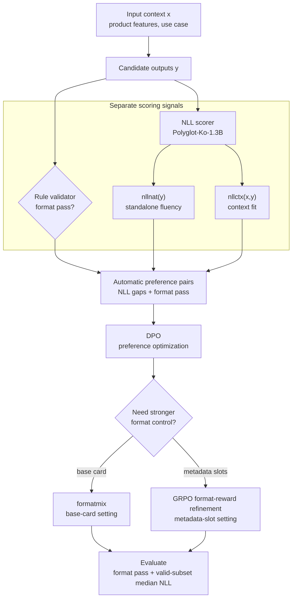

구조화된 추천 카드 문구는 일반적인 자유 생성보다 좁은 실패 조건을 가진다. 출력은 자연스럽고 입력 조건에 맞아야 하지만, 동시에 `reason`, `title`, `subtitle` 같은 필드 규칙과 슬롯 제약을 만족해야 실제 UI에 배치할 수 있다. 본 분석은 이 문제를 단일 품질 최적화보다 **형식 admissibility와 언어 품질 supervision을 분리해 다루는 정렬 문제**로 정의한다.

평가 질문은 두 가지다. 첫째, 대규모 인간 선호 주석이나 LLM judge에 직접 의존하지 않고 한국어 UI 문구의 자연스러움과 문맥 적합성을 자동 선호 쌍 구성에 사용할 수 있는가. 둘째, DPO로 낮아진 NLL 기반 품질 프록시가 SFT의 형식 안정성을 낮출 때 어떤 제어 수단이 절충을 완화하는가.

결과는 과제 구조에 따라 구분된다. 더 단순한 3 문구 기본 카드 설정에서는 `formatmix`가 DPO의 형식 손실을 의미 있게 회복했다 <a class="citation-ref" href="#ref-dpo" aria-label="Reference 3">[3]</a>. 더 강한 슬롯 제약을 갖는 메타 슬롯 확장 카드 설정에서는 형식 전용 DPO보다 형식 보상 기반 GRPO 보정이 더 나은 형식-NLL 절충을 만들었다 <a class="citation-ref" href="#ref-grpo" aria-label="Reference 4">[4]</a>. 핵심 관찰은 **구조 제약 강도에 따라 필요한 형식 제어 방식이 달라진다**는 점이다.

> **nllnat**는 출력 문자열 자체가 참조 언어모델에서 얼마나 자연스럽게 설명되는지를 보는 프록시다.
>
> **nllctx**는 입력 문맥이 주어졌을 때 출력이 얼마나 잘 설명되는지를 보는 프록시다.
>
> 두 값은 낮을수록 좋게 해석하며, 자동 선호 쌍 구성과 설정 비교를 위한 운용 신호로 사용한다.



## 요약

- 두 과제는 한국어 추천 카드 문구 생성이다. 하나는 `reason/title/subtitle`만 갖는 3 문구 기본 카드이고, 다른 하나는 `season/time/place` 같은 슬롯 제약까지 포함하는 메타 슬롯 확장 카드다.
- 형식 검증은 UI 배치 가능성을 가르는 이진 제약으로 두고, `nllnat`와 `nllctx`는 자동 선호 쌍 구성을 위한 judge 비의존 연속 신호로 사용했다.
- 3 문구 기본 카드에서 DPO는 SFT 대비 중앙값 `nllnat`/`nllctx`를 낮췄지만 형식 통과율을 `0.867 -> 0.628`로 떨어뜨렸다. `formatmix 0.25`는 형식 통과율을 `0.760`까지 회복하면서 `nllnat`는 유지하고 `nllctx` 증가는 `0.023`에 그쳤다.
- 메타 슬롯 확장 카드에서 DPO는 형식 통과율을 `0.764 -> 0.376`으로 크게 떨어뜨렸다. 대표 GRPO 보정은 형식 통과율을 `0.623`까지 회복했고, 형식 전용 DPO보다 중앙값 NLL을 덜 악화시켰다.
- strict-valid 부분집합 `N = 1,997`의 보조 인간 평가 비교에서 NLL 프록시는 4개 NAT/CTX 셀 거시 평균 기준 Kendall tau-b `0.1449`, AUROC(0 vs 2) `0.6939`를 보였다. 비교한 judge들보다 AUROC가 높았으며, 학습 데이터 구성과 설정 비교를 위한 보조 정렬 신호로 해석한다.
- 현재 실증 범위는 Gemma3-4B 계열, 한국어 추천 카드, 단일 annotator 보조 평가, training-time control이다. constrained decoding, validator loop, reranking은 별도의 inference-time 비교 축으로 둔다.

## 문제 설정

각 예시는 입력 문맥 $x$와 구조화된 출력 $y$로 구성된다. 3 문구 기본 카드 설정에서 출력은 세 필드다.

```text
reason: 아기 피부를 생각한다면
title: 순한 효소로 부드럽게 씻어내듯
subtitle: 피부에 수분을 공급하는 데 도움을 줘요
```

메타 슬롯 확장 카드 설정은 같은 카드 문구에 추가 슬롯을 붙인다.

```text
reason: 땀 때문에 신경 쓰이는 날
title: 하루 종일 뽀송함을 위해
subtitle: 땀과 땀자국 걱정을 덜어줘요
season: [여름]
time: [아침, 점심, 저녁]
place: [사무실, 학교, 운동]
```

두 설정의 차이는 구조 제약 강도다. 3 문구 기본 카드는 짧은 문구의 자연스러움과 필드별 길이·어미 규칙이 중심이다. 메타 슬롯 확장 카드는 여기에 슬롯 값의 범주 허용성, 빈 값, 구조적 일관성 문제가 추가된다.

<figure class="media-figure" markdown="1">



<figcaption><strong>Figure 2.</strong> 레포트의 공통 파이프라인이다. 형식 검증과 NLL 점수화를 분리한 뒤 선호 쌍으로 합치고, 구조 제약 강도에 따라 <code>formatmix</code> 또는 GRPO 보정을 붙인다.</figcaption>
</figure>

## 방법

형식은 연성 품질 점수와 분리된, 배치 가능성을 가르는 이진 검증기로 둔다. 과제별 validator는 필수 필드 존재, 길이 제한, 허용 어미, 슬롯 범주, 빈 값 등을 검사하고 실패 사유를 반환한다. 본문에서 형식 통과율은 전체 생성 출력 중 이 검증기를 통과한 비율이다.

언어 품질은 참조 언어모델 `EleutherAI/polyglot-ko-1.3b`의 NLL로 분해한다 <a class="citation-ref" href="#ref-polyglot-ko" aria-label="Reference 2">[2]</a>. 우도 기반 점수화는 BARTScore, CTRLEval처럼 생성 품질 평가에서 사용되어 왔고, 본 실험에서는 선호 쌍 구성용 프록시로 운용한다 <a class="citation-ref" href="#ref-bartscore" aria-label="Reference 5">[5]</a> <a class="citation-ref" href="#ref-ctrleval" aria-label="Reference 6">[6]</a>. 출력 자체의 자연스러움과 입력 문맥 조건부 적합성을 분리하기 위해 다음 값을 사용한다.

$$
nll_{nat}(y) = -\frac{1}{|y|} \log p_{ref}(y)
$$

$$
nll_{ctx}(x, y) = -\frac{1}{|y|} \log p_{ref}(y \mid x)
$$

$$
spmi(x, y) = nll_{nat}(y) - nll_{ctx}(x, y)
$$

`spmi`는 입력 덕분에 출력이 얼마나 덜 상투적으로 설명되는지 보는 보조 진단값이다. 주요 pair construction과 정량 보고는 `nllnat`와 `nllctx`를 중심으로 한다. 조건부 점수 계산에서는 입력 토큰을 loss에서 마스킹하고 출력 토큰만 기여하게 했다.

자동 선호 쌍 구성에서는 입력별 후보 여러 개를 생성한 뒤, validator와 NLL 신호를 함께 기록한다. 기본 DPO pair는 형식 통과 후보 중 NLL gap과 cutoff를 만족하는 후보에서 뽑는다. 입력 하나에서 조건을 만족하는 pair가 여러 개 나오면 입력당 best pair 1개만 사용했다. 3 문구 기본 카드의 대표 DPO 기준선은 `CTX p50 / NAT p50` max-NLL filter를 사용했고, 이 설정의 chosen cutoff는 `max_nll_ctx = 3.042969`, `max_nll_nat = 3.574219`였다. 메타 슬롯 확장 카드의 대표 DPO 기준선은 best-gap p50 기준으로 `min_gap_ctx = 1.252930`, `min_gap_nat = 1.296875`를 사용했다.

3 문구 기본 카드의 `formatmix`는 추가적인 합성 format-aware preference pair를 넣는 방식이며, 형식 위반 출력은 rejected 쪽에서만 허용한다. 메타 슬롯 확장 카드에서는 DPO 이후 형식 reward를 직접 최적화하는 GRPO 보정도 비교했다. 분석 초점은 DPO나 GRPO 목적함수의 변형보다, 형식 검증과 NLL 프록시를 후속 정렬 데이터로 연결하는 supervision design에 둔다 <a class="citation-ref" href="#ref-dpo" aria-label="Reference 3">[3]</a> <a class="citation-ref" href="#ref-grpo" aria-label="Reference 4">[4]</a>.

<figure class="table-figure table-figure--comparison table-figure--compact-metrics">
  <div class="table-shell">
    <table class="comparison-table metrics-table">
      <thead>
        <tr>
          <th>구성 요소</th>
          <th>역할</th>
          <th>해석 기준</th>
        </tr>
      </thead>
      <tbody>
        <tr>
          <td>Format validator</td>
          <td>필드·길이·어미·슬롯 규칙 통과 여부 판정</td>
          <td>UI 배치 가능성의 이진 제약</td>
        </tr>
        <tr>
          <td><code>nllnat</code></td>
          <td>출력 단독 문자열의 자연스러움 프록시</td>
          <td>낮을수록 출력 단독 자연스러움이 높은 신호로 해석</td>
        </tr>
        <tr>
          <td><code>nllctx</code></td>
          <td>입력 문맥 조건부 적합성 프록시</td>
          <td>입력 토큰은 loss에서 제외하고 출력 토큰만 점수화</td>
        </tr>
        <tr>
          <td>DPO</td>
          <td>NLL 기반 자동 선호 쌍으로 SFT 이후 정렬</td>
          <td>품질 프록시 개선과 형식 안정성을 함께 확인</td>
        </tr>
        <tr>
          <td>formatmix / GRPO</td>
          <td>형식 손실 완화</td>
          <td>구조 제약 강도에 따라 필요한 제어 방식이 달라짐</td>
        </tr>
      </tbody>
    </table>
  </div>
  <figcaption><strong>Table 1.</strong> 레포트의 핵심 신호와 학습 단계다. 세 축은 같은 의미의 점수가 아니므로 형식 통과율과 NLL 중앙값을 분리해 읽어야 한다.</figcaption>
</figure>

## 실험 설계

모든 보고 결과는 `google/gemma-3-4b-it` 기반 과제별 SFT adapter에서 출발한다 <a class="citation-ref" href="#ref-gemma-3" aria-label="Reference 1">[1]</a>. 이후 DPO와 GRPO 변형은 이 SFT adapter를 시작점으로 사용했다. 평가 지표는 세 가지다.

- **형식 통과율**: 과제별 validator를 만족한 출력 비율이다. 높을수록 좋다.
- **중앙값 `nllnat` / `nllctx`**: 형식 검증을 통과한 출력 부분집합에서 계산한다. 낮을수록 좋다.
- **실패 사유 분포**: 형식 실패가 어떤 필드와 규칙 위반에 집중되는지 본다.

본문의 핵심 정량 표는 validation에서 선택한 고정 설정을 held-out test에서 다시 집계한 결과다. Appendix의 스윕은 대표 설정 선택과 민감도 해석을 보조하는 validation-stage 분석으로 구성된다.

<figure class="table-figure table-figure--comparison table-figure--compact-metrics">
  <div class="table-shell">
    <table class="comparison-table metrics-table metrics-table--numeric-columns">
      <thead>
        <tr>
          <th>항목</th>
          <th>3 문구 기본 카드</th>
          <th>메타 슬롯 확장 카드</th>
        </tr>
      </thead>
      <tbody>
        <tr>
          <td>원본 split</td>
          <td>train 12,681<br><span class="table-note-inline">validation 3,171, test 1,026</span></td>
          <td>train 10,001<br><span class="table-note-inline">validation 2,501, test 1,026</span></td>
        </tr>
        <tr>
          <td>주요 출력 구조</td>
          <td><code>reason/title/subtitle</code></td>
          <td><code>reason/title/subtitle</code><br><span class="table-note-inline"><code>season/time/place</code> 슬롯 포함</span></td>
        </tr>
        <tr>
          <td>대표 DPO pair 규모</td>
          <td>3,499 train pairs<br><span class="table-note-inline">900 validation pairs</span></td>
          <td>4,507 train pairs<br><span class="table-note-inline">1,121 validation pairs</span></td>
        </tr>
        <tr>
          <td>대표 형식 제어</td>
          <td>DPO +<br><span class="table-note-inline">formatmix 0.25</span></td>
          <td>post-DPO GRPO format-reward refinement</td>
        </tr>
      </tbody>
    </table>
  </div>
  <figcaption><strong>Table 2.</strong> 두 과제의 평가 범위다. 두 설정은 같은 추천 카드 문구를 만들지만, 메타 슬롯 확장 카드는 추가 슬롯과 범주 제약 때문에 구조적 타당성 유지가 더 어렵다.</figcaption>
</figure>

## 결과

### 핵심 결과

Held-out test에서 두 과제 모두 DPO는 형식 통과 부분집합의 중앙값 NLL을 낮췄다. 동시에 형식 통과율은 크게 떨어졌다. 이 절충을 완화하는 방식은 두 과제에서 달랐다.

<figure class="table-figure table-figure--comparison table-figure--metrics">
  <div class="table-shell">
    <table class="comparison-table metrics-table metrics-table--numeric-columns">
      <thead>
        <tr>
          <th>과제</th>
          <th>모델</th>
          <th class="align-right">형식 통과율</th>
          <th class="align-right">중앙값 <code>nllnat</code></th>
          <th class="align-right">중앙값 <code>nllctx</code></th>
        </tr>
      </thead>
      <tbody>
        <tr>
          <td>3 문구 기본 카드</td>
          <td>SFT</td>
          <td class="align-right"><code>0.867</code></td>
          <td class="align-right"><code>3.672</code></td>
          <td class="align-right"><code>3.127</code></td>
        </tr>
        <tr>
          <td>3 문구 기본 카드</td>
          <td>DPO<br><span class="table-note-inline">CTX p50 / NAT p50</span></td>
          <td class="align-right"><code>0.628</code></td>
          <td class="align-right"><code>3.096</code></td>
          <td class="align-right"><code>2.715</code></td>
        </tr>
        <tr>
          <td>3 문구 기본 카드</td>
          <td>DPO +<br><span class="table-note-inline">formatmix 0.25</span></td>
          <td class="align-right"><code>0.760</code></td>
          <td class="align-right"><code>3.096</code></td>
          <td class="align-right"><code>2.738</code></td>
        </tr>
        <tr>
          <td>메타 슬롯 확장 카드</td>
          <td>SFT</td>
          <td class="align-right"><code>0.764</code></td>
          <td class="align-right"><code>3.344</code></td>
          <td class="align-right"><code>2.904</code></td>
        </tr>
        <tr>
          <td>메타 슬롯 확장 카드</td>
          <td>DPO<br><span class="table-note-inline">CTX p50 / NAT p50</span></td>
          <td class="align-right"><code>0.376</code></td>
          <td class="align-right"><code>2.871</code></td>
          <td class="align-right"><code>2.621</code></td>
        </tr>
        <tr>
          <td>메타 슬롯 확장 카드</td>
          <td>GRPO format-reward refinement</td>
          <td class="align-right"><code>0.623</code></td>
          <td class="align-right"><code>3.011</code></td>
          <td class="align-right"><code>2.594</code></td>
        </tr>
      </tbody>
    </table>
  </div>
  <figcaption><strong>Table 3.</strong> Held-out test 대표 결과다. 형식 통과율은 출력 단위로 계산했고, NLL 값은 형식 통과 출력 부분집합의 중앙값이다. 형식 통과율은 높을수록, NLL 중앙값은 낮을수록 좋은 값으로 해석한다.</figcaption>
</figure>

3 문구 기본 카드에서는 `formatmix 0.25`가 품질 보존형 절충점이었다. DPO 기준선 대비 형식 통과율을 `0.628 -> 0.760`으로 회복하면서, 중앙값 `nllnat`는 그대로 `3.096`을 유지했다. `nllctx`는 `2.715 -> 2.738`로 소폭 되돌아갔다.

이 결과는 `formatmix`가 DPO가 만든 낮은 NLL 구간을 유지하면서 형식 실패를 줄이는 pair-level augmentation으로 작동했음을 보여준다. `formatmix 0.50`은 형식 통과율을 더 올렸지만 NLL 회귀도 함께 키웠다.

<figure class="table-figure table-figure--comparison table-figure--compact-metrics">
  <div class="table-shell">
    <table class="comparison-table metrics-table metrics-table--numeric-columns">
      <thead>
        <tr>
          <th>3 문구 기본 카드 설정</th>
          <th class="align-right">형식 통과율</th>
          <th class="align-right">중앙값 <code>nllnat</code></th>
          <th class="align-right">중앙값 <code>nllctx</code></th>
        </tr>
      </thead>
      <tbody>
        <tr>
          <td>DPO 기준선</td>
          <td class="align-right"><code>0.628</code></td>
          <td class="align-right"><code>3.096</code></td>
          <td class="align-right"><code>2.715</code></td>
        </tr>
        <tr>
          <td>formatmix 0.20</td>
          <td class="align-right"><code>0.708</code></td>
          <td class="align-right"><code>3.121</code></td>
          <td class="align-right"><code>2.752</code></td>
        </tr>
        <tr>
          <td>formatmix 0.25</td>
          <td class="align-right"><code>0.760</code></td>
          <td class="align-right"><code>3.096</code></td>
          <td class="align-right"><code>2.738</code></td>
        </tr>
        <tr>
          <td>formatmix 0.50</td>
          <td class="align-right"><code>0.828</code></td>
          <td class="align-right"><code>3.151</code></td>
          <td class="align-right"><code>2.787</code></td>
        </tr>
      </tbody>
    </table>
  </div>
  <figcaption><strong>Table 4.</strong> 3 문구 기본 카드의 held-out test formatmix 비교다. `0.25`는 형식 통과율을 의미 있게 회복하면서 DPO의 `nllnat` 구간을 유지한 대표 지점이다. `0.50`은 형식 통과율은 더 높지만 NLL 회귀도 함께 커진다.</figcaption>
</figure>

메타 슬롯 확장 카드에서는 더 강한 형식 pair augmentation만으로 절충이 닫히지 않았다. DPO 기준선은 형식 통과 부분집합의 NLL을 낮췄지만 형식 통과율이 `0.376`까지 떨어졌다. 형식 전용 DPO는 형식 통과율을 회복했지만, 형식 통과 출력의 중앙값 NLL을 크게 악화시켰다.

대표 GRPO 보정은 이보다 나은 절충을 만들었다. DPO 대비 형식 통과율을 `0.376 -> 0.623`으로 올렸고, 중앙값 `nllnat` 증가는 `0.140`에 머물렀다. `nllctx`는 오히려 `2.621 -> 2.594`로 낮아졌다.

<figure class="table-figure table-figure--comparison table-figure--compact-metrics">
  <div class="table-shell">
    <table class="comparison-table metrics-table metrics-table--numeric-columns">
      <thead>
        <tr>
          <th>메타 슬롯 확장 카드 설정</th>
          <th class="align-right">형식 통과율</th>
          <th class="align-right">중앙값 <code>nllnat</code></th>
          <th class="align-right">중앙값 <code>nllctx</code></th>
        </tr>
      </thead>
      <tbody>
        <tr>
          <td>DPO 기준선</td>
          <td class="align-right"><code>0.376</code></td>
          <td class="align-right"><code>2.871</code></td>
          <td class="align-right"><code>2.621</code></td>
        </tr>
        <tr>
          <td>형식 전용 DPO 대조군</td>
          <td class="align-right"><code>0.615</code></td>
          <td class="align-right"><code>3.355</code></td>
          <td class="align-right"><code>2.922</code></td>
        </tr>
        <tr>
          <td>대표 GRPO 변형</td>
          <td class="align-right"><code>0.623</code></td>
          <td class="align-right"><code>3.011</code></td>
          <td class="align-right"><code>2.594</code></td>
        </tr>
      </tbody>
    </table>
  </div>
  <figcaption><strong>Table 5.</strong> 메타 슬롯 확장 카드의 post-DPO refinement 비교다. 형식 전용 DPO는 형식을 일부 회복하지만 NLL 손실이 크고, GRPO 보정은 더 낮은 NLL 손실로 비슷한 형식 회복을 보였다.</figcaption>
</figure>

### 실패 양상

형식 통과율은 구조 붕괴의 양상을 직접 분해하지 않는다. 실패 사유 분포는 두 과제의 차이를 더 분명하게 보여준다.

3 문구 기본 카드에서 SFT의 주된 실패는 `title`과 `reason`의 허용 어미 위반이었다. DPO 기준선으로 가면 `subtitle` 길이 초과가 가장 큰 실패가 되었고, `formatmix 0.25`는 이 쏠림을 일부 줄였다. 메타 슬롯 확장 카드에서는 형식 전용 DPO 대조군이 `place` 빈 값 실패를 크게 늘렸고, 대표 GRPO 변형은 실패를 다시 `title` 허용 어미와 `subtitle/reason` 길이 위반 중심으로 되돌렸다.

<figure class="table-figure table-figure--comparison table-figure--compact-metrics">
  <div class="table-shell">
    <table class="comparison-table metrics-table">
      <thead>
        <tr>
          <th>과제/모델</th>
          <th>대표 실패 유형</th>
          <th>비율</th>
          <th>해석</th>
        </tr>
      </thead>
      <tbody>
        <tr>
          <td>3 문구 DPO</td>
          <td><code>subtitle</code> / 길이 초과</td>
          <td><code>0.534</code></td>
          <td>DPO 이후 긴 문구 쪽 실패가 커짐</td>
        </tr>
        <tr>
          <td>3 문구 formatmix 0.25</td>
          <td><code>subtitle</code> / 길이 초과</td>
          <td><code>0.351</code></td>
          <td>같은 실패가 남지만 쏠림이 완화됨</td>
        </tr>
        <tr>
          <td>메타 형식 전용 DPO</td>
          <td><code>place</code> / 빈 값</td>
          <td><code>0.493</code></td>
          <td>형식 압력이 빈 슬롯 실패를 만들 수 있음</td>
        </tr>
        <tr>
          <td>메타 GRPO</td>
          <td><code>title</code> / 허용 어미 아님</td>
          <td><code>0.503</code></td>
          <td>빈 슬롯 붕괴보다 국소 문구 제약 실패로 이동</td>
        </tr>
      </tbody>
    </table>
  </div>
  <figcaption><strong>Table 6.</strong> Held-out test의 대표 실패 양상이다. 비율은 형식 실패 출력만을 분모로 계산했으며, 하나의 출력이 여러 위반 유형을 가질 수 있다. 따라서 행별 비율은 전체 형식 실패율과 직접 합산하지 않는다.</figcaption>
</figure>

이 결과는 형식 제어 강도와 구조 회복 사이의 관계가 비단조적임을 보여준다. 특히 메타 슬롯 확장 카드에서는 rejected 쪽에 형식 오류를 더 많이 넣는 bank 기반 설계의 효과가 설정별로 갈렸고, 넓은 오류 bank의 일부 설정은 형식 통과율을 더 떨어뜨렸다.

### 보조 인간 평가와 Judge 비교

NLL 신호와 사람 판단의 방향성을 비교하기 위해, 평가가 완료된 strict-valid 부분집합에서 보조 인간 평가와 judge 비교를 수행했다. 비교셋은 두 과제의 NAT/CTX 네 셀로 구성되며, 유효 행 수는 `N = 1,997`이다. NAT는 출력만 보고 자연스러움을, CTX는 입력과 출력을 함께 보고 문맥 적합성을 0/1/2 척도로 평가했다. 평가는 단일 annotator blind 절차로 수행했다.

<figure class="table-figure table-figure--comparison table-figure--compact-metrics">
  <div class="table-shell">
    <table class="comparison-table metrics-table metrics-table--numeric-columns">
      <thead>
        <tr>
          <th>방법</th>
          <th class="align-right">Kendall tau-b</th>
          <th class="align-right">AUROC(0 vs 2)</th>
        </tr>
      </thead>
      <tbody>
        <tr>
          <td>NLL<br><span class="table-note-inline">Polyglot-Ko-1.3B</span></td>
          <td class="align-right"><code>0.1449</code></td>
          <td class="align-right"><code>0.6939</code></td>
        </tr>
        <tr>
          <td>Gemini 2.5 Flash</td>
          <td class="align-right"><code>0.1392</code></td>
          <td class="align-right"><code>0.5824</code></td>
        </tr>
        <tr>
          <td>Gemini 2.5 Pro</td>
          <td class="align-right"><code>0.1105</code></td>
          <td class="align-right"><code>0.5993</code></td>
        </tr>
        <tr>
          <td>GPT-OSS-120B</td>
          <td class="align-right"><code>0.0968</code></td>
          <td class="align-right"><code>0.5644</code></td>
        </tr>
      </tbody>
    </table>
  </div>
  <figcaption><strong>Table 7.</strong> 사람 평가와의 보조 비교다. 값은 두 과제의 NAT/CTX 네 셀에서 계산한 셀 단위 지표의 단순 평균이다. 비교셋은 strict-valid 출력에 한정되며, 단일 annotator blind 절차로 평가했다.</figcaption>
</figure>

NLL은 4개 셀 거시 평균에서 judge 비의존 프록시로 경쟁력 있는 값을 보였다. 특히 AUROC는 비교한 judge보다 높았다. 이 비교는 NLL을 학습 데이터 구성과 설정 비교에 필요한 재현 가능한 정렬 신호로 평가한다. LLM judge는 G-Eval 같은 rubric 기반 평가와 Chatbot Arena 계열 비교에서 강한 기준선이며, 평가 지시문과 순서, 응답 길이에 따른 민감도도 함께 보고되어 왔다 <a class="citation-ref" href="#ref-geval" aria-label="Reference 7">[7]</a> <a class="citation-ref" href="#ref-llm-judge" aria-label="Reference 8">[8]</a>. 일부 NAT 셀에서는 Gemini judge가 더 높은 순위 정합성을 보였고, 비교셋은 형식 통과 후보에 한정되어 있다. 따라서 NLL은 학습 데이터 구성과 설정 비교를 위한 운용 프록시로 해석한다.

## 결론 및 해석

본 실험은 다음 세 가지 결론으로 요약된다. 구조화된 한국어 UI 문구 생성에서는 형식 통과율과 언어 품질 프록시를 한 지표로 합치기보다, UI 배치 가능성을 가르는 이진 형식 검증과 `nllnat`/`nllctx` 기반 연속 신호를 분리하는 방식이 더 해석 가능했다. 두 추천 카드 설정 모두에서 DPO는 형식 통과 부분집합의 중앙값 NLL을 낮췄고, 동시에 전체 출력의 형식 통과율을 낮추는 방향으로 작동했다.

절충을 완화하는 방식은 구조 제약 강도에 따라 달랐다. 3 문구 기본 카드에서는 `formatmix 0.25`가 DPO의 낮은 `nllnat` 구간을 유지하면서 형식 통과율을 회복했다. 메타 슬롯 확장 카드에서는 형식 전용 DPO가 NLL을 크게 악화시켰고, 대표 GRPO 보정이 더 나은 형식-NLL 절충을 보였다. 다음 비교 축은 inference-time constraint, 다중 annotator 인간 평가, 참조 언어모델 교체, 다른 모델 규모에서의 반복 평가다.

세부 해석은 세 항목으로 정리된다.

첫째, 형식 통과율과 NLL 기반 품질 프록시는 측정 대상이 다르다. DPO는 형식 통과 부분집합의 NLL을 낮추는 방향으로 작동했지만 전체 출력의 배치 가능성은 낮아졌다. 반대로 형식 전용 DPO처럼 형식 신호를 강하게 두면 형식 통과율은 오르더라도, 통과한 출력의 언어 품질 프록시는 나빠질 수 있다.

둘째, 구조 제약 강도에 따라 적절한 제어가 다르다. 3 문구 기본 카드에서는 format-aware pair augmentation만으로도 DPO의 형식 손실을 상당 부분 회복했다. 메타 슬롯 확장 카드에서는 슬롯과 범주 제약 때문에 DPO 단독이나 형식 전용 DPO의 절충이 약했고, post-DPO GRPO 보정이 더 나은 절충을 보였다.

셋째, 선호 쌍 구성은 최적화 알고리즘만큼 중요하다. NLL cutoff, pair gap, teacher 선택, formatmix 비율, 오류 bank 구성은 모두 결과를 바꿀 수 있다. 특히 메타 슬롯 확장 카드에서 넓은 오류 bank를 더 많이 섞는 전략은 구조 회복보다 새로운 실패 양상을 크게 만들 수 있었다.

## 한계

- NLL 기반 신호는 인간 선호나 UI 품질 전체가 아니라 학습 데이터 구성과 설정 비교를 위한 운용 프록시다. `spmi`는 보조 진단값으로 사용했다.
- 대표 설정 선택은 train/validation 기반 development-stage 분석에 두고, 본문 핵심 표는 그 고정 설정을 held-out test에서 다시 집계했다. 넓은 ablation은 validation-stage 민감도 분석으로 둔다.
- 인간 평가 비교는 strict-valid 부분집합과 단일 annotator blind 절차로 구성했다. 평가자 간 분산은 다음 평가 설계의 확장 축이다.
- 본문 비교는 SFT/DPO/GRPO와 pair construction 변형 같은 training-time control에 집중했다. constrained decoding, validator loop, reranking 등 inference-time baseline은 별도 비교 축으로 두며, grammar-constrained decoding이나 incremental parsing 기반 제어와의 직접 비교는 해당 축에서 다룬다 <a class="citation-ref" href="#ref-picard" aria-label="Reference 9">[9]</a> <a class="citation-ref" href="#ref-grammar-constrained" aria-label="Reference 10">[10]</a>.
- 실증 범위는 Gemma3-4B 계열과 한국어 추천 카드 설정이다. 다른 모델 크기, 다른 언어, 더 긴 UI 텍스트, 다른 참조 언어모델은 반복 평가 범위에 해당한다.

## Appendix: 보조 집계와 민감도

대표 재학습과 보정 데이터 규모는 아래와 같다. 이 값은 실험의 상대적 규모를 파악하기 위한 요약이며, DPO 행 수는 pair dataset 크기, GRPO 행 수는 refinement stage 입력 크기를 뜻한다.

<figure class="table-figure table-figure--comparison table-figure--compact-metrics">
  <div class="table-shell">
    <table class="comparison-table metrics-table metrics-table--numeric-columns">
      <thead>
        <tr>
          <th>과제</th>
          <th>대표 비교 설정</th>
          <th class="align-right">학습 행 수</th>
          <th class="align-right">검증 행 수</th>
          <th class="align-right">메인 검증 집계 행 수</th>
        </tr>
      </thead>
      <tbody>
        <tr>
          <td>3 문구 기본 카드</td>
          <td>DPO 기준선</td>
          <td class="align-right"><code>3,499</code></td>
          <td class="align-right"><code>900</code></td>
          <td class="align-right"><code>6,307</code></td>
        </tr>
        <tr>
          <td>3 문구 기본 카드</td>
          <td>DPO +<br><span class="table-note-inline">formatmix 0.25</span></td>
          <td class="align-right"><code>3,834</code></td>
          <td class="align-right"><code>985</code></td>
          <td class="align-right"><code>6,143</code></td>
        </tr>
        <tr>
          <td>메타 슬롯 확장 카드</td>
          <td>DPO 기준선</td>
          <td class="align-right"><code>4,507</code></td>
          <td class="align-right"><code>1,121</code></td>
          <td class="align-right"><code>3,431</code></td>
        </tr>
        <tr>
          <td>메타 슬롯 확장 카드</td>
          <td>대표 GRPO 변형</td>
          <td class="align-right"><code>3,605</code></td>
          <td class="align-right"><code>896</code></td>
          <td class="align-right"><code>3,283</code></td>
        </tr>
      </tbody>
    </table>
  </div>
  <figcaption><strong>Appendix Table 1.</strong> 대표 DPO/GRPO 재학습 및 보정 규모다. 학습 행 수는 정렬 단계의 입력 규모를 비교하기 위한 값이며, 본문 핵심 결과의 held-out test 표본 수와는 구분한다.</figcaption>
</figure>

<figure class="table-figure table-figure--comparison table-figure--compact-metrics">
  <div class="table-shell">
    <table class="comparison-table metrics-table">
      <thead>
        <tr>
          <th>구성 요소</th>
          <th>대표 설정</th>
        </tr>
      </thead>
      <tbody>
        <tr>
          <td>후보 생성 수</td>
          <td>입력당 5개 후보</td>
        </tr>
        <tr>
          <td>입력/출력 길이</td>
          <td>prompt text 최대 512<br><span class="table-note-inline">generation 최대 256 new tokens, 1024 total tokens</span></td>
        </tr>
        <tr>
          <td>NLL scorer</td>
          <td><code>EleutherAI/polyglot-ko-1.3b</code></td>
        </tr>
        <tr>
          <td>NLL scoring window</td>
          <td>192 total, 128 output<br><span class="table-note-inline">separator는 <code>\n[추천 제목]\n</code></span></td>
        </tr>
        <tr>
          <td>Pair 선택</td>
          <td>기본값은 format-pass 후보만 사용<br><span class="table-note-inline">gap 조건을 만족하는 pair 중 입력당 best pair 1개 선택</span></td>
        </tr>
        <tr>
          <td>Format-fail 출력 허용</td>
          <td>합성 format-aware pair의 rejected 쪽에만 사용</td>
        </tr>
      </tbody>
    </table>
  </div>
  <figcaption><strong>Appendix Table 2.</strong> 후보 생성, NLL 점수화, pair 선택 규칙 요약이다. 절대 NLL threshold는 참조 언어모델과 scoring window에 묶인 설정값이다.</figcaption>
</figure>

<figure class="table-figure table-figure--comparison table-figure--compact-metrics">
  <div class="table-shell">
    <table class="comparison-table metrics-table">
      <thead>
        <tr>
          <th>설정</th>
          <th>DPO 대표 설정</th>
          <th>GRPO 대표 설정</th>
        </tr>
      </thead>
      <tbody>
        <tr>
          <td>Epoch</td>
          <td><code>1.0</code></td>
          <td><code>1.0</code></td>
        </tr>
        <tr>
          <td>Device batch / grad accum</td>
          <td><code>2 / 8</code></td>
          <td><code>2 / 16</code></td>
        </tr>
        <tr>
          <td>Learning rate / beta</td>
          <td><code>8e-6 / 0.1</code></td>
          <td><code>5e-6 / 0.06</code></td>
        </tr>
        <tr>
          <td>길이 설정</td>
          <td>max length 1024<br><span class="table-note-inline">prompt 512</span></td>
          <td>prompt 768<br><span class="table-note-inline">completion 256</span></td>
        </tr>
        <tr>
          <td>Precision / seed</td>
          <td><code>bf16 / 42</code></td>
          <td><code>bf16 / 42</code></td>
        </tr>
        <tr>
          <td>추가 설정</td>
          <td>weight decay 0.015<br><span class="table-note-inline">grad norm 0.2, warmup 0.1, cosine</span></td>
          <td>generations 4<br><span class="table-note-inline">temperature 0.8, top-p 0.95</span></td>
        </tr>
      </tbody>
    </table>
  </div>
  <figcaption><strong>Appendix Table 3.</strong> 대표 DPO와 GRPO 학습 설정이다. 이 표는 대표 비교를 복원하기 위한 설정 요약이며, 전체 스윕의 모든 설정을 열거하지 않는다.</figcaption>
</figure>

참조 언어모델 민감도 분석에서 Polyglot-Ko-1.3B와 Qwen2.5 기반 점수화 모델의 NLL score correlation은 네 셀에서 Pearson `0.345-0.396`, Spearman `0.338-0.377` 수준이었다. 순위화 방향성은 유지되며, 절대 threshold는 참조 언어모델별로 다시 보정하는 방식이 적절하다.

## References

<div class="reference-list" markdown="1">

1. <span id="ref-gemma-3"></span>Google DeepMind. [Gemma 3 model card](https://huggingface.co/google/gemma-3-4b-it). 2025.
2. <span id="ref-polyglot-ko"></span>Hyunwoong Ko et al. [A Technical Report for Polyglot-Ko: Open-Source Large-Scale Korean Language Models](https://arxiv.org/abs/2306.02254). 2023.
3. <span id="ref-dpo"></span>Rafael Rafailov et al. [Direct Preference Optimization: Your Language Model is Secretly a Reward Model](https://proceedings.neurips.cc/paper_files/paper/2023/hash/a85b405ed65c6477a4fe8302b5e06ce7-Abstract-Conference.html). NeurIPS 2023.
4. <span id="ref-grpo"></span>Zhihong Shao et al. [DeepSeekMath: Pushing the Limits of Mathematical Reasoning in Open Language Models](https://arxiv.org/abs/2402.03300). 2024.
5. <span id="ref-bartscore"></span>Weizhe Yuan, Graham Neubig, and Pengfei Liu. [BARTScore: Evaluating Generated Text as Text Generation](https://papers.nips.cc/paper/2021/hash/e4d2b6e6fdeca3e60e0f1a62fee3d9dd-Abstract.html). NeurIPS 2021.
6. <span id="ref-ctrleval"></span>Pei Ke et al. [CTRLEval: An Unsupervised Reference-Free Metric for Evaluating Controlled Text Generation](https://aclanthology.org/2022.acl-long.164/). ACL 2022.
7. <span id="ref-geval"></span>Yang Liu et al. [G-Eval: NLG Evaluation using GPT-4 with Better Human Alignment](https://aclanthology.org/2023.emnlp-main.153/). EMNLP 2023.
8. <span id="ref-llm-judge"></span>Lianmin Zheng et al. [Judging LLM-as-a-Judge with MT-Bench and Chatbot Arena](https://proceedings.neurips.cc/paper_files/paper/2023/hash/91f18a1287b398d378ef22505bf41832-Abstract-Datasets_and_Benchmarks.html). NeurIPS 2023.
9. <span id="ref-picard"></span>Torsten Scholak, Nathan Schucher, and Dzmitry Bahdanau. [PICARD: Parsing Incrementally for Constrained Auto-Regressive Decoding from Language Models](https://aclanthology.org/2021.emnlp-main.779/). EMNLP 2021.
10. <span id="ref-grammar-constrained"></span>Saibo Geng et al. [Grammar-Constrained Decoding for Structured NLP Tasks without Finetuning](https://aclanthology.org/2023.emnlp-main.674/). EMNLP 2023.

</div>

## Citation

Text citation:

```text
Ahn, I. (2026). 구조화된 한국어 UI 문구 생성에서 NLL 프록시와 정렬 학습. Technical report.
```

BibTeX:

```bibtex
@techreport{ahn2026koreanuinllproxyalignment,
  title = {구조화된 한국어 UI 문구 생성에서 NLL 프록시와 정렬 학습},
  author = {Ahn, Ilho},
  year = {2026},
  institution = {Independent Technical Report},
  howpublished = {Private technical report}
}
```
