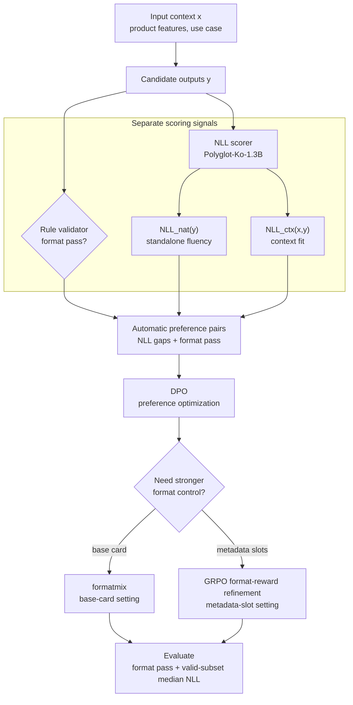

구조화된 추천 카드 콘텐츠는 일반적인 자유 생성보다 실패 판정 기준이 더 구체적이다. 출력은 자연스럽고 입력 조건에 맞아야 하며, UI에 배치 가능한 글자수와 표현 규칙도 지켜야 한다. 동시에 `reason`, `title`, `subtitle` 같은 필드 규칙과 슬롯 제약을 만족해야 실제 UI에 배치할 수 있다. 여기서는 이 문제를 품질과 형식으로 분해하고, 단일 품질 최적화보다 **형식 통과 가능성과 언어 품질 학습 신호를 분리해 다루는 정렬 문제**로 정의한다.

이 설정에서 확인할 지점은 두 가지다. 하나는 대규모 인간 선호 주석이나 LLM judge에 직접 의존하지 않고도 한국어 UI 콘텐츠의 자연스러움과 문맥 적합성을 자동 선호 쌍 구성에 사용할 수 있는지다. 다른 하나는 DPO로 낮아진 NLL 기반 품질 프록시가 SFT의 형식 안정성을 낮출 때, 어떤 제어 수단이 이 절충을 완화하는지다.

이 글은 추론 시점의 제약 디코딩을 먼저 붙이는 대신, 형식 검증과 언어 품질 프록시를 분리해 학습 시점의 신호로 연결했을 때 어떤 절충이 생기는지 확인한다. 따라서 핵심 비교 대상은 단일 모델의 절대 성능보다, 형식 제약이 강해질수록 정렬 데이터 구성과 후속 보정 방식이 어떻게 달라져야 하는지다.

> **NLL<sub>nat</sub>**는 출력 문자열 자체가 참조 언어모델에서 얼마나 자연스럽게 설명되는지를 보는 프록시다.
>
> **NLL<sub>ctx</sub>**는 입력 문맥이 주어졌을 때 출력이 얼마나 잘 설명되는지를 보는 프록시다.
>
> 두 값은 낮을수록 좋게 해석하며, 자동 선호 쌍 구성과 설정 비교를 위한 운용 신호로 사용한다.

## 요약

- 두 과제는 한국어 추천 카드 문구 생성이다. 하나는 `reason/title/subtitle`만 갖는 3 문구 기본 카드이고, 다른 하나는 `season/time/place` 같은 슬롯 제약까지 포함하는 메타 슬롯 확장 카드다.
- 형식 검증은 UI 배치 가능성을 가르는 이진 제약으로 두고, NLL<sub>nat</sub>와 NLL<sub>ctx</sub>는 LLM judge에 직접 의존하지 않는 자동 선호 쌍 구성 신호로 사용했다.
- 3 문구 기본 카드에서 DPO는 SFT 대비 중앙값 NLL<sub>nat</sub>/NLL<sub>ctx</sub>를 낮췄지만 형식 통과율을 `0.867 -> 0.628`로 떨어뜨렸다. `formatmix 0.25`는 형식 통과율을 `0.760`까지 회복하면서 NLL<sub>nat</sub>는 유지하고 NLL<sub>ctx</sub> 증가는 `0.023`에 그쳤다.
- 메타 슬롯 확장 카드에서 DPO는 형식 통과율을 `0.764 -> 0.376`으로 크게 떨어뜨렸다. 검증 세트에서 선택한 GRPO 형식 보상 보정은 형식 통과율을 `0.623`까지 회복했고, 형식 전용 DPO보다 중앙값 NLL을 덜 악화시켰다.
- 형식 통과 부분집합 `N = 1,997`의 보조 인간 평가 비교에서 NLL 프록시는 AUROC(0 vs 2) `0.6939`, Kendall tau-b `0.1449`를 보였다. 두 지표 모두 비교한 judge보다 높았지만 Kendall tau-b 절대값은 약한 순위 신호였으므로, LLM judge 전체를 대체하기보다 학습 데이터 구성과 설정 비교를 위한 보조 정렬 신호로 해석한다.
- 현재 실증 범위는 Gemma3-4B 계열, 한국어 추천 카드, 단일 평가자 4셀 보조 평가와 2명 평가자 pairwise 보조 비교, 학습 시점 제어다. `retry@5`와 `rerank@5`는 보조 점검으로만 두었고, constrained decoding과 validator loop는 별도 비교 축으로 둔다.

> **후속 리포트.** DPO 이후 GRPO 형식 보정이 검증기 쪽으로 기운 구조 아티팩트를 만드는지는 [별도 technical report](/technical-reports/korean-ui-grpo-validator-artifact-evaluation/)에서 공개 검증기, 구조 휴리스틱, LLM judge 표본 편향을 분리해 분석했다.

## 관련 연구

이 글은 새로운 선호 최적화 목적함수를 제안하기보다, 구조화된 UI 콘텐츠 생성에서 어떤 자동 신호를 후속 정렬 데이터로 연결할 수 있는지를 다룬다. DPO는 SFT 이후의 오프라인 선호 최적화 기준선으로 사용하고, GRPO는 형식 보상을 직접 쓰는 DPO 이후 보정 단계로 둔다 <a class="citation-ref" href="#ref-dpo" aria-label="Reference 3">[3]</a> <a class="citation-ref" href="#ref-grpo" aria-label="Reference 4">[4]</a>.

우도 기반 점수화는 생성 품질 평가에서 이미 사용되어 왔다. BARTScore와 CTRLEval은 생성 확률을 평가 신호로 다루는 대표적인 흐름이고, 이 글의 NLL<sub>nat</sub>/NLL<sub>ctx</sub>도 같은 계열의 운용 프록시로 볼 수 있다 <a class="citation-ref" href="#ref-bartscore" aria-label="Reference 5">[5]</a> <a class="citation-ref" href="#ref-ctrleval" aria-label="Reference 6">[6]</a>. 다만 여기서는 NLL을 사람 선호나 UI 품질 전체의 대체 지표로 두지 않고, 자동 선호 쌍 구성과 설정 비교에 쓰는 반복 가능한 신호로 제한한다.

LLM judge는 G-Eval이나 MT-Bench/Chatbot Arena 계열 비교에서 강한 기준선이다 <a class="citation-ref" href="#ref-geval" aria-label="Reference 7">[7]</a> <a class="citation-ref" href="#ref-llm-judge" aria-label="Reference 8">[8]</a>. 이 글의 비교는 judge가 불필요하다는 주장이 아니라, 짧은 한국어 UI 콘텐츠처럼 대량의 후보를 일괄 점수화해야 하는 설정에서 judge 비의존 프록시가 어떤 역할을 할 수 있는지 확인하는 쪽에 가깝다.

구조화 생성의 형식 제어는 constrained decoding과 grammar-aware generation에서도 다루어져 왔다 <a class="citation-ref" href="#ref-picard" aria-label="Reference 11">[11]</a> <a class="citation-ref" href="#ref-grammar-constrained" aria-label="Reference 12">[12]</a>. 본문 비교는 이 추론 시점 제어와의 우열을 닫지 않고, 형식 검증 결과와 언어 품질 프록시를 학습 시점 신호로 연결했을 때 생기는 절충에 초점을 둔다.

## 문제 설정

각 예시는 입력 문맥 $x$와 구조화된 출력 $y$로 구성된다. 여기서 입력 문맥은 상품 상세 페이지의 원문 전체가 아니라, 상품 특징, 사용법, 사용 상황 등을 구조화해 정리한 상품 상세 요약이다. 따라서 이 글에서 말하는 문맥 적합성은 생성 문구가 이 구조화된 상품 정보와 얼마나 잘 맞는지를 뜻한다. 3 문구 기본 카드 과제에서 출력은 세 필드다.

```text
reason: 아기 피부를 생각한다면
title: 순한 효소로 부드럽게 씻어내듯
subtitle: 피부에 수분을 공급하는 데 도움을 줘요
```

메타 슬롯 확장 카드 과제는 같은 카드 문구에 추가 슬롯을 붙인다.

```text
reason: 땀 때문에 신경 쓰이는 날
title: 하루 종일 뽀송함을 위해
subtitle: 땀과 땀자국 걱정을 덜어줘요
season: [여름]
time: [아침, 점심, 저녁]
place: [사무실, 학교, 운동]
```

본문의 예시는 실제 데이터가 아니라 데이터 구조와 평가 조건을 설명하기 위해 재구성한 샘플이다.

두 과제의 차이는 구조 제약 강도다. 3 문구 기본 카드는 짧은 문구의 자연스러움과 필드별 길이·어미 규칙이 중심이다. 메타 슬롯 확장 카드는 여기에 슬롯 값의 범주 허용성, 빈 값, 구조적 일관성 문제가 추가된다.

## 실험 설계

<figure class="media-figure" markdown="1">



  <figcaption><strong>Figure 2.</strong> 형식 검증, NLL 점수화, 선호 쌍 구성, 후속 보정을 연결한 절차 요약이다. 구조 제약 강도에 따라 <code>formatmix</code> 또는 GRPO 보정을 붙인다.</figcaption>
</figure>

### 방법

형식은 자연스러움이나 문맥 적합성 같은 언어 품질 점수와 분리해, UI 배치 가능성을 가르는 이진 검증기로 둔다. 과제별 형식 검증기는 필수 필드 존재, 길이 제한, 허용 어미, 슬롯 범주, 빈 값 등을 검사하고 실패 사유를 반환한다. 본문에서 형식 통과율은 전체 생성 출력 중 이 검증기를 통과한 비율이다.

언어 품질은 참조 언어모델 `EleutherAI/polyglot-ko-1.3b`의 NLL로 분해한다 <a class="citation-ref" href="#ref-polyglot-ko" aria-label="Reference 2">[2]</a>. 여기서 $x$는 입력 문맥, $y$는 생성된 구조화 출력, $p_{ref}$는 참조 언어모델의 확률, $\lvert y \rvert$는 점수화 대상 출력 토큰 수다. 출력 자체의 자연스러움과 입력 문맥 조건부 적합성을 분리하기 위해 다음 값을 사용한다.

$$
NLL_{\mathrm{nat}}(y) = -\frac{1}{|y|} \log p_{ref}(y)
$$

$$
NLL_{\mathrm{ctx}}(x, y) = -\frac{1}{|y|} \log p_{ref}(y \mid x)
$$

주요 선호 쌍 구성과 정량 보고는 NLL<sub>nat</sub>와 NLL<sub>ctx</sub>를 중심으로 한다. 조건부 점수 계산에서는 입력 토큰을 loss에서 제외하고 출력 토큰만 점수화했다.

자동 선호 쌍 구성에서는 입력별 후보 여러 개를 생성한 뒤, 형식 검증 결과와 NLL 신호를 함께 기록한다. 기본 DPO 선호 쌍은 형식 통과 후보 중 검증 세트에서 고정한 최대 NLL 필터와 NLL gap 조건을 만족하는 후보에서 뽑는다. 두 과제의 대표 DPO 기준선은 `CTX p50 / NAT p50` 필터 계열을 사용하고, 그 안에서 gap 기반 best-pair 규칙으로 chosen/rejected를 정했다. 이 분위수 기준은 검증 세트에서 고정한 선호 데이터 추출 규칙이며, 절대적인 품질 경계로 해석하지 않는다. 입력 하나에서 조건을 만족하는 쌍이 여러 개 나오면 입력당 best pair 1개만 유지했다.

3 문구 기본 카드의 `formatmix`는 NLL 기준으로 만든 DPO 선호 쌍 데이터에 형식 인지 합성 선호 쌍을 추가로 섞는 방식이다. 이 합성 pair에서는 형식 위반 출력을 rejected 쪽에서만 허용한다. `formatmix 0.25`는 DPO 선호 쌍에 이러한 형식 인지 합성 pair를 25% 비율로 섞은 설정이다. 메타 슬롯 확장 카드에서는 DPO 이후 형식 reward를 직접 최적화하는 GRPO 보정도 비교했다. 이때 reward는 형식 검증기 통과 여부를 중심으로 구성했다. 분석 초점은 DPO나 GRPO 목적함수의 변형보다, 형식 검증과 NLL 프록시를 후속 정렬 데이터로 연결하는 학습 신호 설계에 둔다 <a class="citation-ref" href="#ref-dpo" aria-label="Reference 3">[3]</a> <a class="citation-ref" href="#ref-grpo" aria-label="Reference 4">[4]</a>.

### 평가 설정

두 과제의 기준 모델은 `google/gemma-3-4b-it`에 과제별 SFT adapter를 붙인 모델이다 <a class="citation-ref" href="#ref-gemma-3" aria-label="Reference 1">[1]</a>. DPO 기준선과 DPO 계열 변형은 이 SFT adapter를 시작점으로 학습했고, 메타 슬롯 확장 카드의 GRPO 형식 보상 보정은 선택된 DPO 기준선을 이어받은 후속 단계다. 평가 지표는 세 가지다.

- **형식 통과율**: 과제별 형식 검증기를 만족한 출력 비율이다. 높을수록 좋다.
- **중앙값 NLL<sub>nat</sub> / NLL<sub>ctx</sub>**: 형식 검증을 통과한 출력 부분집합에서 계산한다. 낮을수록 좋다.
- **실패 사유 분포**: 형식 실패가 어떤 필드와 규칙 위반에 집중되는지 본다.

본문의 핵심 정량 표는 검증 세트에서 선택한 고정 설정을 held-out test에서 다시 집계한 결과다. held-out test는 기존 train/validation과 `goods_no`가 겹치는 상품을 제거한 뒤, 두 과제의 텍스트가 모두 존재하는 1,026개 프롬프트 공통 부분집합으로 구성했다. 이는 상품 단위 누출을 줄이기 위한 엄격 홀드아웃이지만, product-family-disjoint나 category-disjoint 일반화 벤치마크를 의도한 것은 아니다. 추가 민감도 분석은 본문 결론을 보조하는 용도로만 사용했다. 두 과제의 평가 범위와 출력 구조 차이는 Table 1에 요약한다.

<figure class="table-figure table-figure--comparison table-figure--compact-metrics">
  <div class="table-shell">
    <table class="comparison-table metrics-table metrics-table--numeric-columns">
      <thead>
        <tr>
          <th>항목</th>
          <th>3 문구 기본 카드</th>
          <th>메타 슬롯 확장 카드</th>
        </tr>
      </thead>
      <tbody>
        <tr>
          <td>데이터 규모</td>
          <td>train 약 1.3만<br><span class="table-note-inline">validation 약 3천, test 약 1천</span></td>
          <td>train 약 1.0만<br><span class="table-note-inline">validation 약 3천, test 약 1천</span></td>
        </tr>
        <tr>
          <td>주요 출력 구조</td>
          <td><code>reason/title/subtitle</code></td>
          <td><code>reason/title/subtitle</code><br><span class="table-note-inline"><code>season/time/place</code> 슬롯 포함</span></td>
        </tr>
        <tr>
          <td>대표 형식 제어</td>
          <td>DPO +<br><span class="table-note-inline">formatmix 0.25</span></td>
          <td>DPO 이후<br><span class="table-note-inline">GRPO 형식 보상 보정</span></td>
        </tr>
      </tbody>
    </table>
  </div>
  <figcaption><strong>Table 1.</strong> 두 과제의 평가 범위다. 두 과제는 같은 추천 카드 문구를 만들지만, 메타 슬롯 확장 카드는 추가 슬롯과 범주 제약 때문에 구조적 타당성 유지가 더 어렵다.</figcaption>
</figure>

### 대표 설정 선택

대표 설정은 검증 세트에서 먼저 고정한 뒤 held-out test에서 다시 집계했다. 선택 기준은 형식 통과율의 회복과 형식 통과 출력의 중앙값 NLL<sub>nat</sub>/NLL<sub>ctx</sub> 유지 사이의 절충이다. 3 문구 기본 카드에서 사용하는 `formatmix 0.25`는 형식 통과율을 최대화한 설정이 아니라, DPO가 만든 낮은 NLL 구간을 유지하면서 형식 손실을 상당 부분 복구한 대표 지점이다.

메타 슬롯 확장 카드에서는 여러 GRPO 보정 후보 중 검증 세트에서 선택한 형식 보상 보정 설정을 본문 결과로 보고한다. 최고 형식 통과율 설정이 아니라, 낮은 NLL<sub>nat</sub>를 유지하면서 형식 통과율을 크게 회복한 절충점을 선택했다.

## 결과

### 주요 결과

Table 2와 Figure 3은 held-out test에서의 형식-NLL 절충을 요약한다. 두 과제 모두 DPO는 형식 통과 부분집합의 중앙값 NLL을 낮췄지만, 동시에 형식 통과율은 크게 떨어졌다. 이 절충을 완화하는 방식은 두 과제에서 달랐다.

<figure class="table-figure table-figure--comparison table-figure--metrics">
  <div class="table-shell">
    <table class="comparison-table metrics-table metrics-table--numeric-columns">
      <thead>
        <tr>
          <th>과제</th>
          <th>모델</th>
          <th class="align-right">형식 통과율</th>
          <th class="align-right">중앙값 NLL<sub>nat</sub></th>
          <th class="align-right">중앙값 NLL<sub>ctx</sub></th>
        </tr>
      </thead>
      <tbody>
        <tr>
          <td rowspan="3">3 문구 기본 카드</td>
          <td>SFT</td>
          <td class="align-right"><code>0.867</code><br><span class="table-note-inline">[0.852, 0.884]</span></td>
          <td class="align-right"><code>3.672</code><br><span class="table-note-inline">[3.641, 3.703]</span></td>
          <td class="align-right"><code>3.127</code><br><span class="table-note-inline">[3.098, 3.152]</span></td>
        </tr>
        <tr>
          <td>DPO<br><span class="table-note-inline">CTX p50 / NAT p50</span></td>
          <td class="align-right"><code>0.628</code><br><span class="table-note-inline">[0.606, 0.648]</span></td>
          <td class="align-right"><code>3.096</code><br><span class="table-note-inline">[3.074, 3.137]</span></td>
          <td class="align-right"><code>2.715</code><br><span class="table-note-inline">[2.686, 2.734]</span></td>
        </tr>
        <tr>
          <td>DPO +<br><span class="table-note-inline">formatmix 0.25</span></td>
          <td class="align-right"><code>0.760</code><br><span class="table-note-inline">[0.740, 0.778]</span></td>
          <td class="align-right"><code>3.096</code><br><span class="table-note-inline">[3.069, 3.127]</span></td>
          <td class="align-right"><code>2.738</code><br><span class="table-note-inline">[2.717, 2.765]</span></td>
        </tr>
        <tr>
          <td rowspan="3">메타 슬롯 확장 카드</td>
          <td>SFT</td>
          <td class="align-right"><code>0.764</code><br><span class="table-note-inline">[0.737, 0.789]</span></td>
          <td class="align-right"><code>3.344</code><br><span class="table-note-inline">[3.322, 3.383]</span></td>
          <td class="align-right"><code>2.904</code><br><span class="table-note-inline">[2.871, 2.938]</span></td>
        </tr>
        <tr>
          <td>DPO<br><span class="table-note-inline">CTX p50 / NAT p50</span></td>
          <td class="align-right"><code>0.376</code><br><span class="table-note-inline">[0.350, 0.402]</span></td>
          <td class="align-right"><code>2.871</code><br><span class="table-note-inline">[2.836, 2.904]</span></td>
          <td class="align-right"><code>2.621</code><br><span class="table-note-inline">[2.586, 2.652]</span></td>
        </tr>
        <tr>
          <td>GRPO 형식 보상 보정</td>
          <td class="align-right"><code>0.623</code><br><span class="table-note-inline">[0.598, 0.648]</span></td>
          <td class="align-right"><code>3.011</code><br><span class="table-note-inline">[2.982, 3.049]</span></td>
          <td class="align-right"><code>2.594</code><br><span class="table-note-inline">[2.569, 2.620]</span></td>
        </tr>
      </tbody>
    </table>
  </div>
  <figcaption><strong>Table 2.</strong> Held-out test 대표 결과다. 형식 통과율은 출력 단위로 계산했고, NLL 값은 형식 통과 출력 부분집합의 중앙값이다. 대괄호 안은 95% bootstrap CI(B=2000)다. 형식 통과율은 높을수록, NLL 중앙값은 낮을수록 좋은 값으로 해석한다.</figcaption>
</figure>

<figure class="media-figure media-figure--wide-visual">
  
  <figcaption><strong>Figure 3.</strong> Held-out test 대표 결과의 형식-NLL 절충이다. A는 출력 단독 지표인 NLL<sub>nat</sub>, B는 입력 조건부 지표인 NLL<sub>ctx</sub>를 사용한다. 오른쪽으로 갈수록 형식 통과율이 높고, 아래로 갈수록 NLL이 낮다. 각 점의 숫자는 <code>형식 통과율 / 해당 패널의 중앙값 NLL</code>을 뜻한다.</figcaption>
</figure>

3 문구 기본 카드에서는 `formatmix 0.25`가 NLL 손실을 작게 유지한 절충점이었다. DPO 기준선 대비 형식 통과율을 `0.628 -> 0.760`으로 회복하면서, 중앙값 NLL<sub>nat</sub>는 그대로 `3.096`을 유지했다. NLL<sub>ctx</sub>는 `2.715 -> 2.738`로 소폭 되돌아갔다.

이 결과는 `formatmix`가 DPO가 만든 낮은 NLL 구간을 유지하면서 형식 실패를 줄이는 선호 쌍 수준의 증강으로 작동했음을 보여준다. 다만 현재 결과만으로 format-aware signal 자체의 효과와 pair 수 증가 효과를 완전히 분리해 주장할 수는 없다. `formatmix 0.50`은 형식 통과율을 더 올렸지만 NLL 회귀도 함께 키웠다.

<figure class="table-figure table-figure--comparison table-figure--compact-metrics">
  <div class="table-shell">
    <table class="comparison-table metrics-table metrics-table--numeric-columns">
      <thead>
        <tr>
          <th>3 문구 기본 카드 설정</th>
          <th class="align-right">형식 통과율</th>
          <th class="align-right">중앙값 NLL<sub>nat</sub></th>
          <th class="align-right">중앙값 NLL<sub>ctx</sub></th>
        </tr>
      </thead>
      <tbody>
        <tr>
          <td>DPO 기준선</td>
          <td class="align-right"><code>0.628</code></td>
          <td class="align-right"><code>3.096</code></td>
          <td class="align-right"><code>2.715</code></td>
        </tr>
        <tr>
          <td>formatmix 0.20</td>
          <td class="align-right"><code>0.708</code></td>
          <td class="align-right"><code>3.121</code></td>
          <td class="align-right"><code>2.752</code></td>
        </tr>
        <tr>
          <td>formatmix 0.25</td>
          <td class="align-right"><code>0.760</code></td>
          <td class="align-right"><code>3.096</code></td>
          <td class="align-right"><code>2.738</code></td>
        </tr>
        <tr>
          <td>formatmix 0.50</td>
          <td class="align-right"><code>0.828</code></td>
          <td class="align-right"><code>3.151</code></td>
          <td class="align-right"><code>2.787</code></td>
        </tr>
      </tbody>
    </table>
  </div>
  <figcaption><strong>Table 3.</strong> 3 문구 기본 카드의 held-out test formatmix 비교다. `0.25`는 형식 통과율을 `0.628`에서 `0.760`으로 회복하면서 DPO의 NLL<sub>nat</sub> 구간을 유지한 대표 지점이다. `0.50`은 형식 통과율은 더 높지만 NLL 회귀도 함께 커진다.</figcaption>
</figure>

메타 슬롯 확장 카드에서는 더 강한 형식 선호 쌍 증강만으로 절충이 충분히 개선되지 않았다. DPO 기준선은 형식 통과 부분집합의 NLL을 낮췄지만 형식 통과율이 `0.376`까지 떨어졌다. 형식 전용 DPO는 형식 통과율을 회복했지만, 형식 통과 출력의 중앙값 NLL을 크게 악화시켰다.

검증 세트에서 선택한 GRPO 형식 보상 보정은 형식 전용 DPO보다 NLL 손실이 작은 절충을 만들었다. DPO 대비 형식 통과율을 `0.376 -> 0.623`으로 올렸고, 중앙값 NLL<sub>nat</sub> 증가는 `0.140`에 머물렀다. NLL<sub>ctx</sub>는 오히려 `2.621 -> 2.594`로 낮아졌다.

<figure class="table-figure table-figure--comparison table-figure--compact-metrics">
  <div class="table-shell">
    <table class="comparison-table metrics-table metrics-table--numeric-columns">
      <thead>
        <tr>
          <th>메타 슬롯 확장 카드 설정</th>
          <th class="align-right">형식 통과율</th>
          <th class="align-right">중앙값 NLL<sub>nat</sub></th>
          <th class="align-right">중앙값 NLL<sub>ctx</sub></th>
        </tr>
      </thead>
      <tbody>
        <tr>
          <td>DPO 기준선</td>
          <td class="align-right"><code>0.376</code></td>
          <td class="align-right"><code>2.871</code></td>
          <td class="align-right"><code>2.621</code></td>
        </tr>
        <tr>
          <td>형식 전용 DPO 대조군</td>
          <td class="align-right"><code>0.615</code></td>
          <td class="align-right"><code>3.355</code></td>
          <td class="align-right"><code>2.922</code></td>
        </tr>
        <tr>
          <td>GRPO 형식 보상 보정</td>
          <td class="align-right"><code>0.623</code></td>
          <td class="align-right"><code>3.011</code></td>
          <td class="align-right"><code>2.594</code></td>
        </tr>
      </tbody>
    </table>
  </div>
  <figcaption><strong>Table 4.</strong> 메타 슬롯 확장 카드의 DPO 이후 보정 비교다. 형식 전용 DPO는 형식을 일부 회복하지만 NLL 손실이 크고, GRPO 형식 보상 보정은 형식 전용 DPO와 비슷한 형식 통과율에서 더 낮은 NLL 손실을 보였다.</figcaption>
</figure>

### 실패 양상

형식 통과율만으로는 어떤 규칙에서 실패가 났는지 알기 어렵다. 실패 사유 분포를 보면 두 과제의 차이가 더 분명하게 드러난다.

3 문구 기본 카드에서 SFT의 주된 실패는 `title`과 `reason`의 허용 어미 위반이었다. DPO 기준선으로 가면 `subtitle` 길이 초과가 가장 큰 실패가 되었고, `formatmix 0.25`는 이 쏠림을 일부 줄였다. 메타 슬롯 확장 카드에서는 형식 전용 DPO 대조군이 `place` 빈 값 실패를 크게 늘렸고, GRPO 형식 보상 보정은 실패를 다시 `title` 허용 어미와 `subtitle/reason` 길이 위반 중심으로 되돌렸다.

<figure class="table-figure table-figure--comparison">
  <div class="table-shell">
    <table class="comparison-table metrics-table">
      <thead>
        <tr>
          <th>과제/모델</th>
          <th>대표 실패 유형</th>
          <th>비율</th>
          <th>해석</th>
        </tr>
      </thead>
      <tbody>
        <tr>
          <td>3 문구 DPO</td>
          <td><code>subtitle</code> / 길이 초과</td>
          <td><code>0.534</code></td>
          <td>DPO 이후 긴 문구 쪽 실패가 커짐</td>
        </tr>
        <tr>
          <td>3 문구 formatmix 0.25</td>
          <td><code>subtitle</code> / 길이 초과</td>
          <td><code>0.351</code></td>
          <td>같은 실패가 남지만 쏠림이 완화됨</td>
        </tr>
        <tr>
          <td>메타 형식 전용 DPO</td>
          <td><code>place</code> / 빈 값</td>
          <td><code>0.493</code></td>
          <td>형식 압력이 빈 슬롯 실패를 만들 수 있음</td>
        </tr>
        <tr>
          <td>메타 GRPO 형식 보상 보정</td>
          <td><code>title</code> / 허용 어미 아님</td>
          <td><code>0.503</code></td>
          <td>빈 슬롯 붕괴보다 국소 문구 제약 실패로 이동</td>
        </tr>
      </tbody>
    </table>
  </div>
  <figcaption><strong>Table 5.</strong> Held-out test의 대표 실패 양상이다. 비율은 형식 실패 출력만을 분모로 계산했으며, 하나의 출력이 여러 위반 유형을 가질 수 있다. 따라서 행별 비율은 전체 형식 실패율과 직접 합산하지 않는다.</figcaption>
</figure>

이 결과는 형식 제어 강도와 구조 회복 사이의 관계가 비단조적인 양상을 보인다는 점을 시사한다. 특히 메타 슬롯 확장 카드에서는 형식 오류를 더 강하게 주입하는 DPO 계열 증강만으로 구조 회복이 안정적으로 개선되지 않았다.

### 보조 인간 평가와 Judge 비교

NLL 신호와 사람 판단의 방향성을 비교하기 위해, 평가가 완료된 형식 통과 부분집합에서 보조 인간 평가와 judge 비교를 수행했다. 비교셋은 두 과제의 NAT/CTX 네 셀로 구성되며, 유효 행 수는 `N = 1,997`이다. NAT는 출력만 보고 자연스러움을, CTX는 입력과 출력을 함께 보고 문맥 적합성을 0/1/2 척도로 평가했다. 이 4셀 점수 비교는 모델명과 실험 설정을 가린 단일 평가자 블라인드 절차로 수행했다. 같은 샘플 집합에서 Gemini 2.5 Flash/Pro와 GPT-OSS-120B judge도 동일한 NAT/CTX 기준으로 실행했다 <a class="citation-ref" href="#ref-gemini-25" aria-label="Reference 9">[9]</a> <a class="citation-ref" href="#ref-gpt-oss-120b" aria-label="Reference 10">[10]</a>.

별도로 3 문구 기본 카드의 대표 비교쌍인 `formatmix 0.25`와 SFT에 대해서는 동일 프롬프트 기반 pairwise 보조 비교를 추가했다. 이 비교는 두 모델이 모두 형식을 통과하고 출력이 서로 다른 200개 항목 부분집합에서 수행했으며, NAT와 CTX 모두 2명 평가자 판독을 사용했다.

<figure class="table-figure table-figure--comparison table-figure--compact-metrics">
  <div class="table-shell">
    <table class="comparison-table metrics-table metrics-table--numeric-columns">
      <thead>
        <tr>
          <th>방법</th>
          <th class="align-right">Kendall tau-b</th>
          <th class="align-right">AUROC(0 vs 2)</th>
        </tr>
      </thead>
      <tbody>
        <tr>
          <td>NLL<br><span class="table-note-inline">Polyglot-Ko-1.3B</span></td>
          <td class="align-right"><code>0.1449</code><br><span class="table-note-inline">[0.110, 0.179]</span></td>
          <td class="align-right"><code>0.6939</code><br><span class="table-note-inline">[0.650, 0.737]</span></td>
        </tr>
        <tr>
          <td>Gemini 2.5 Flash</td>
          <td class="align-right"><code>0.1392</code><br><span class="table-note-inline">[0.098, 0.181]</span></td>
          <td class="align-right"><code>0.5824</code><br><span class="table-note-inline">[0.550, 0.618]</span></td>
        </tr>
        <tr>
          <td>Gemini 2.5 Pro</td>
          <td class="align-right"><code>0.1105</code><br><span class="table-note-inline">[0.069, 0.151]</span></td>
          <td class="align-right"><code>0.5993</code><br><span class="table-note-inline">[0.556, 0.644]</span></td>
        </tr>
        <tr>
          <td>GPT-OSS-120B</td>
          <td class="align-right"><code>0.0968</code><br><span class="table-note-inline">[0.055, 0.138]</span></td>
          <td class="align-right"><code>0.5644</code><br><span class="table-note-inline">[0.526, 0.603]</span></td>
        </tr>
      </tbody>
    </table>
  </div>
  <figcaption><strong>Table 6.</strong> 사람 평가와의 보조 비교다. 값은 두 과제의 NAT/CTX 네 셀에서 계산한 셀 단위 지표의 단순 평균이다. 대괄호 안은 95% bootstrap CI(B=2000)다. 비교셋은 형식 통과 출력에 한정되며, 단일 평가자 블라인드 절차로 평가했다.</figcaption>
</figure>

<figure class="table-figure table-figure--comparison table-figure--compact-metrics">
  <div class="table-shell">
    <table class="comparison-table metrics-table metrics-table--numeric-columns">
      <thead>
        <tr>
          <th>평가축</th>
          <th class="align-right">formatmix 선호</th>
          <th class="align-right">SFT 선호</th>
          <th class="align-right">동률</th>
          <th class="align-right">동률 제외 승률</th>
        </tr>
      </thead>
      <tbody>
        <tr>
          <td>NAT</td>
          <td class="align-right"><code>223</code></td>
          <td class="align-right"><code>108</code></td>
          <td class="align-right"><code>69</code></td>
          <td class="align-right"><code>0.674</code></td>
        </tr>
        <tr>
          <td>CTX</td>
          <td class="align-right"><code>195</code></td>
          <td class="align-right"><code>125</code></td>
          <td class="align-right"><code>80</code></td>
          <td class="align-right"><code>0.609</code></td>
        </tr>
      </tbody>
    </table>
  </div>
  <figcaption><strong>Table 7.</strong> 3 문구 기본 카드의 대표 비교쌍에 대한 2명 평가자 pairwise 보조 비교다. 비교 대상은 <code>formatmix 0.25</code>와 SFT이며, 200개 항목의 평가자 판독을 합산한 값이다. NAT/CTX의 item-level exact agreement는 각각 <code>0.520</code>/<code>0.425</code>, Cohen's kappa는 <code>0.183</code>/<code>0.102</code>였다.</figcaption>
</figure>

NLL은 범용 judge 대체물이 아니라, 동일 조건에서 반복 가능한 선호 쌍 구성 신호로 사용했다. 4개 셀 거시 평균에서 NLL은 비교한 judge보다 AUROC(0 vs 2)가 높았고, Kendall tau-b도 가장 높았다. 다만 Kendall tau-b 절대값은 `0.1449`로 약한 순위 신호에 머물렀다. 이 조합은 NLL이 전반적 선호 평가에서 judge보다 우수하다는 주장보다, 정렬 데이터 구성과 설정 비교에 쓸 수 있는 보조 신호라는 해석을 지지한다. LLM judge는 G-Eval 같은 rubric 기반 평가와 Chatbot Arena 계열 비교에서 강한 기준선이며, 평가 지시문과 순서, 응답 길이에 따른 민감도도 함께 보고되어 왔다 <a class="citation-ref" href="#ref-geval" aria-label="Reference 7">[7]</a> <a class="citation-ref" href="#ref-llm-judge" aria-label="Reference 8">[8]</a>. 일부 NAT 셀에서는 Gemini judge가 더 높은 순위 정합성을 보였고, 비교셋은 형식 통과 후보에 한정되어 있다.

2명 평가자 pairwise 비교에서는 NAT와 CTX 모두 pooled vote가 `formatmix 0.25` 쪽으로 기울었다. 다만 CTX는 NAT보다 평가자 간 일치도가 낮고 평가자별 차이가 더 커서, 이 결과는 대표 비교쌍에서의 보조 근거로만 해석한다.

## 결론 및 해석

본 실험은 다음 세 가지 결론으로 요약된다. 구조화된 한국어 UI 문구 생성에서는 형식 통과율과 언어 품질 프록시를 한 지표로 합치기보다, UI 배치 가능성을 가르는 이진 형식 검증과 NLL<sub>nat</sub>/NLL<sub>ctx</sub> 기반 연속 신호를 분리하는 방식이 더 해석 가능했다. 두 과제 모두에서 DPO는 형식 통과 부분집합의 중앙값 NLL을 낮췄고, 동시에 전체 출력의 형식 통과율을 낮추는 방향으로 작동했다.

절충을 완화하는 방식은 구조 제약 강도에 따라 달랐다. 3 문구 기본 카드에서는 `formatmix 0.25`가 DPO의 낮은 NLL<sub>nat</sub> 구간을 유지하면서 형식 통과율을 회복했다. 메타 슬롯 확장 카드에서는 형식 전용 DPO가 NLL을 크게 악화시켰고, GRPO 형식 보상 보정이 관찰된 범위에서 더 낮은 NLL 손실의 형식-NLL 절충을 보였다. 다음 비교 축은 추론 시점 제약, 더 큰 다중 평가자 인간 평가, 참조 언어모델 교체, 다른 모델 규모에서의 반복 평가다.

세부 해석은 세 항목으로 정리된다.

첫째, 형식 통과율과 NLL 기반 품질 프록시는 측정 대상이 다르다. DPO는 형식 통과 부분집합의 NLL을 낮추는 방향으로 작동했지만 전체 출력의 배치 가능성은 낮아졌다. 반대로 형식 전용 DPO처럼 형식 신호를 강하게 두면 형식 통과율은 오르더라도, 통과한 출력의 언어 품질 프록시는 나빠질 수 있다.

둘째, 구조 제약 강도에 따라 적절한 제어가 다르다. 3 문구 기본 카드에서는 형식 인지 선호 쌍 증강만으로도 DPO의 형식 손실을 상당 부분 회복했다. 메타 슬롯 확장 카드에서는 슬롯과 범주 제약 때문에 DPO 단독이나 형식 전용 DPO의 절충이 약했고, DPO 이후 GRPO 보정이 관찰된 범위에서 더 낮은 NLL 손실의 절충을 보였다.

셋째, 선호 쌍 구성은 최적화 알고리즘만큼 중요하다. NLL 임계값, 쌍 간 NLL gap, 형식 인지 pair 비율, 형식 오류를 rejected 쪽에 넣는 방식은 모두 결과를 바꿀 수 있다. 특히 메타 슬롯 확장 카드에서는 DPO 계열 형식 증강을 강하게 하는 것만으로는 구조 회복이 안정적으로 개선되지 않았다.

## 한계

- NLL 기반 신호는 인간 선호나 UI 품질 전체가 아니라 학습 데이터 구성과 설정 비교를 위한 운용 프록시다.
- 대표 설정은 검증 세트에서 고정했고, 본문 핵심 표는 그 고정 설정을 held-out test에서 다시 집계했다. 추가 민감도 분석은 본문 결론의 보조 근거로만 사용했다.
- 4셀 사람 점수 비교는 형식 통과 부분집합과 단일 평가자 블라인드 절차로 구성했다. 별도 대표 pairwise 비교는 200개 항목 부분집합에서 2명 평가자 판독을 사용했지만, CTX 축의 평가자 안정성은 제한적이었다.
- 본문 비교는 SFT/DPO/GRPO와 선호 쌍 구성 변형 같은 학습 시점 제어에 집중했다. 보조적으로 `retry@5`와 `rerank@5`를 점검했지만, 이 비교는 같은 후보 5개 묶음 안에서 출력 선택 규칙만 바꾼 정책 비교이며 학습 기준선과 예산을 맞춘 추론 시점 기준선은 아니다. constrained decoding이나 incremental parsing 기반 제어와의 직접 비교는 별도 축으로 둔다 <a class="citation-ref" href="#ref-picard" aria-label="Reference 11">[11]</a> <a class="citation-ref" href="#ref-grammar-constrained" aria-label="Reference 12">[12]</a>.
- 실증 범위는 Gemma3-4B 계열과 한국어 추천 카드 생성 과제다. 다른 모델 크기, 다른 언어, 더 긴 UI 텍스트, 다른 참조 언어모델은 반복 평가 범위에 해당한다.

## Appendix: 보조 집계와 민감도

아래 표는 대표 설정 선택과 참조 언어모델 민감도를 해석하기 위한 보조 집계다.

<figure class="table-figure table-figure--comparison">
  <div class="table-shell">
    <table class="comparison-table metrics-table">
      <thead>
        <tr>
          <th>구성 요소</th>
          <th>대표 설정</th>
        </tr>
      </thead>
      <tbody>
        <tr>
          <td>후보 생성</td>
          <td>입력당 복수 후보를 생성한 뒤 형식 검증과 NLL 점수화를 수행</td>
        </tr>
        <tr>
          <td>점수화 모델</td>
          <td><code>EleutherAI/polyglot-ko-1.3b</code></td>
        </tr>
        <tr>
          <td>Pair 선택</td>
          <td>형식 통과 후보 중 NLL 기준과 후보 간 차이를 함께 만족하는 선호 쌍을 선택</td>
        </tr>
        <tr>
          <td>형식 위반 출력</td>
          <td>형식 인지 합성 pair에서는 rejected 쪽에서만 사용</td>
        </tr>
      </tbody>
    </table>
  </div>
  <figcaption><strong>Appendix Table 1.</strong> 후보 생성, NLL 점수화, 선호 쌍 선택 규칙의 공개용 요약이다.</figcaption>
</figure>

샘플링 기반 추론 시점 제어도 보조적으로 점검했다. 각 프롬프트에서 같은 후보 5개를 생성한 뒤 첫 유효 출력 선택(`retry@5`)과 유효 출력 대상 NLL 재순위화(`rerank@5`)를 적용했다. 이 비교는 형식 회수 가능성을 확인하기 위해 같은 후보 묶음 안에서 출력 선택 규칙만 바꾼 보조 비교이며, Table 2의 단일 추론 대표 결과와 직접 같은 집계가 아니다.

<figure class="table-figure table-figure--comparison">
  <div class="table-shell">
    <table class="comparison-table metrics-table metrics-table--numeric-columns">
      <thead>
        <tr>
          <th>과제</th>
          <th>설정</th>
          <th class="align-right">형식 통과율</th>
          <th class="align-right">중앙값 NLL<sub>nat</sub></th>
          <th class="align-right">중앙값 NLL<sub>ctx</sub></th>
          <th class="align-right">상대 비용</th>
        </tr>
      </thead>
      <tbody>
        <tr>
          <td rowspan="4">3 문구 기본 카드</td>
          <td>단일 생성 기준선</td>
          <td class="align-right"><code>0.806</code></td>
          <td class="align-right"><code>4.324</code></td>
          <td class="align-right"><code>4.062</code></td>
          <td class="align-right"><code>1.00x</code></td>
        </tr>
        <tr>
          <td>retry@5</td>
          <td class="align-right"><code>0.999</code></td>
          <td class="align-right"><code>4.332</code></td>
          <td class="align-right"><code>4.070</code></td>
          <td class="align-right"><code>1.25x</code></td>
        </tr>
        <tr>
          <td>rerank@5</td>
          <td class="align-right"><code>0.999</code></td>
          <td class="align-right"><code>3.723</code></td>
          <td class="align-right"><code>3.490</code></td>
          <td class="align-right"><code>4.90x</code></td>
        </tr>
        <tr>
          <td>대표 학습 기준선</td>
          <td class="align-right"><code>0.792</code></td>
          <td class="align-right"><code>3.072</code></td>
          <td class="align-right"><code>2.701</code></td>
          <td class="align-right">-</td>
        </tr>
        <tr>
          <td rowspan="4">메타 슬롯 확장 카드</td>
          <td>단일 생성 기준선</td>
          <td class="align-right"><code>0.604</code></td>
          <td class="align-right"><code>4.059</code></td>
          <td class="align-right"><code>3.861</code></td>
          <td class="align-right"><code>1.00x</code></td>
        </tr>
        <tr>
          <td>retry@5</td>
          <td class="align-right"><code>0.981</code></td>
          <td class="align-right"><code>4.055</code></td>
          <td class="align-right"><code>3.855</code></td>
          <td class="align-right"><code>1.65x</code></td>
        </tr>
        <tr>
          <td>rerank@5</td>
          <td class="align-right"><code>0.981</code></td>
          <td class="align-right"><code>3.602</code></td>
          <td class="align-right"><code>3.395</code></td>
          <td class="align-right"><code>4.97x</code></td>
        </tr>
        <tr>
          <td>대표 학습 기준선</td>
          <td class="align-right"><code>0.638</code></td>
          <td class="align-right"><code>2.986</code></td>
          <td class="align-right"><code>2.557</code></td>
          <td class="align-right">-</td>
        </tr>
      </tbody>
    </table>
  </div>
  <figcaption><strong>Appendix Table 2.</strong> 샘플링 기반 추론 시점 제어의 held-out test 보조 비교다. 단일 생성 기준선은 같은 후보 생성 설정에서 첫 출력만 사용한 경우다. 후보 5개 기반 재시도와 재순위화는 형식 통과율을 크게 회복하지만, 유효 출력 대상 NLL과 상대 비용에서는 대표 학습 기준선보다 불리했다. 이 표는 같은 후보 묶음 안의 선택 규칙 비교이므로 Table 2의 단일 추론 대표 결과와 직접 대응하지 않는다.</figcaption>
</figure>

참조 언어모델 민감도 분석에서 Polyglot-Ko-1.3B와 Qwen2.5 기반 점수화 모델의 NLL 점수 상관은 네 셀에서 Pearson `0.345-0.396`, Spearman `0.338-0.377` 수준이었다 <a class="citation-ref" href="#ref-qwen25" aria-label="Reference 13">[13]</a>. 약한 양의 상관은 유지되지만, 절대 임계값은 참조 언어모델별로 다시 보정하는 방식이 적절하다.

<figure class="table-figure table-figure--comparison table-figure--compact-metrics">
  <div class="table-shell">
    <table class="comparison-table metrics-table metrics-table--numeric-columns">
      <thead>
        <tr>
          <th>과제</th>
          <th>축</th>
          <th class="align-right">Pearson</th>
          <th class="align-right">Spearman</th>
        </tr>
      </thead>
      <tbody>
        <tr>
          <td>3 문구 기본 카드</td>
          <td>NAT</td>
          <td class="align-right"><code>0.396</code></td>
          <td class="align-right"><code>0.377</code></td>
        </tr>
        <tr>
          <td>3 문구 기본 카드</td>
          <td>CTX</td>
          <td class="align-right"><code>0.369</code></td>
          <td class="align-right"><code>0.338</code></td>
        </tr>
        <tr>
          <td>메타 슬롯 확장 카드</td>
          <td>NAT</td>
          <td class="align-right"><code>0.352</code></td>
          <td class="align-right"><code>0.347</code></td>
        </tr>
        <tr>
          <td>메타 슬롯 확장 카드</td>
          <td>CTX</td>
          <td class="align-right"><code>0.345</code></td>
          <td class="align-right"><code>0.338</code></td>
        </tr>
      </tbody>
    </table>
  </div>
  <figcaption><strong>Appendix Table 3.</strong> Polyglot-Ko-1.3B와 Qwen2.5 기반 NLL 점수화 모델의 셀별 상관이다. 값은 보조 인간 평가에 사용한 동일 샘플 집합에서 계산했다.</figcaption>
</figure>

## References

<div class="reference-list" markdown="1">

1. <span id="ref-gemma-3"></span>Google DeepMind. [Gemma 3 model card](https://huggingface.co/google/gemma-3-4b-it). 2025.
2. <span id="ref-polyglot-ko"></span>Hyunwoong Ko et al. [A Technical Report for Polyglot-Ko: Open-Source Large-Scale Korean Language Models](https://arxiv.org/abs/2306.02254). 2023.
3. <span id="ref-dpo"></span>Rafael Rafailov et al. [Direct Preference Optimization: Your Language Model is Secretly a Reward Model](https://proceedings.neurips.cc/paper_files/paper/2023/hash/a85b405ed65c6477a4fe8302b5e06ce7-Abstract-Conference.html). NeurIPS 2023.
4. <span id="ref-grpo"></span>Zhihong Shao et al. [DeepSeekMath: Pushing the Limits of Mathematical Reasoning in Open Language Models](https://arxiv.org/abs/2402.03300). 2024.
5. <span id="ref-bartscore"></span>Weizhe Yuan, Graham Neubig, and Pengfei Liu. [BARTScore: Evaluating Generated Text as Text Generation](https://papers.nips.cc/paper/2021/hash/e4d2b6e6fdeca3e60e0f1a62fee3d9dd-Abstract.html). NeurIPS 2021.
6. <span id="ref-ctrleval"></span>Pei Ke et al. [CTRLEval: An Unsupervised Reference-Free Metric for Evaluating Controlled Text Generation](https://aclanthology.org/2022.acl-long.164/). ACL 2022.
7. <span id="ref-geval"></span>Yang Liu et al. [G-Eval: NLG Evaluation using GPT-4 with Better Human Alignment](https://aclanthology.org/2023.emnlp-main.153/). EMNLP 2023.
8. <span id="ref-llm-judge"></span>Lianmin Zheng et al. [Judging LLM-as-a-Judge with MT-Bench and Chatbot Arena](https://proceedings.neurips.cc/paper_files/paper/2023/hash/91f18a1287b398d378ef22505bf41832-Abstract-Datasets_and_Benchmarks.html). NeurIPS 2023.
9. <span id="ref-gemini-25"></span>Gheorghe Comanici et al. [Gemini 2.5: Pushing the Frontier with Advanced Reasoning, Multimodality, Long Context, and Next Generation Agentic Capabilities](https://arxiv.org/abs/2507.06261). 2025.
10. <span id="ref-gpt-oss-120b"></span>OpenAI. [gpt-oss-120b Model](https://developers.openai.com/api/docs/models/gpt-oss-120b). 2025.
11. <span id="ref-picard"></span>Torsten Scholak, Nathan Schucher, and Dzmitry Bahdanau. [PICARD: Parsing Incrementally for Constrained Auto-Regressive Decoding from Language Models](https://aclanthology.org/2021.emnlp-main.779/). EMNLP 2021.
12. <span id="ref-grammar-constrained"></span>Saibo Geng et al. [Grammar-Constrained Decoding for Structured NLP Tasks without Finetuning](https://aclanthology.org/2023.emnlp-main.674/). EMNLP 2023.
13. <span id="ref-qwen25"></span>Qwen Team. [Qwen2.5 Technical Report](https://arxiv.org/abs/2412.15115). 2024.

</div>

## Citation

Text citation:

```text
Ahn, I. (2026). 구조화된 한국어 UI 콘텐츠 생성을 위한 LLM 정렬과 NLL 프록시. Technical report.
```

BibTeX:

```bibtex
@techreport{ahn2026koreanuinllproxyalignment,
  title = {구조화된 한국어 UI 콘텐츠 생성을 위한 LLM 정렬과 NLL 프록시},
  author = {Ahn, Ilho},
  year = {2026},
  institution = {Independent},
  type = {Technical report}
}
```
