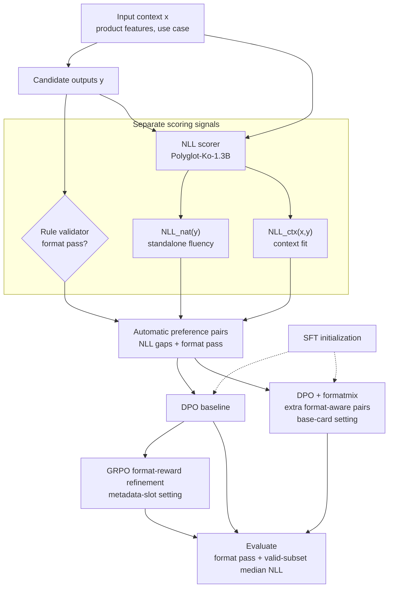

구조화된 추천 카드 문구는 자연스럽고 입력 조건에 맞아야 하며, `reason`, `title`, `subtitle`의 길이·어미와 메타 슬롯 규칙도 지켜야 한다. 이 글은 **형식 통과 가능성과 언어 품질 학습 신호를 분리**해, 자동 선호 쌍 구성과 후속 정렬에 연결한다(Figure 1).

평가 질문은 NLL 기반 선호 학습이 형식 통과율과 언어 품질 프록시에 어떤 변화를 만드는지, 그리고 형식 인지 데이터와 보상 보정이 그 절충을 얼마나 완화하는지다. 두 한국어 추천 카드 과제에서 학습 시점 제어를 비교했다.

> **NLL<sub>nat</sub>**는 출력 문자열 자체가 참조 언어모델에서 얼마나 자연스럽게 설명되는지를 보는 프록시다.
>
> **NLL<sub>ctx</sub>**는 입력 문맥이 주어졌을 때 출력이 얼마나 잘 설명되는지를 보는 프록시다.
>
> 여기서 NLL(음의 로그우도)은 출력 토큰당 평균값이며, 낮을수록 참조 모델이 토큰에 높은 확률을 부여한다. 두 값을 자동 선호 쌍 구성과 설정 비교의 프록시로 사용한다. 같은 참조 모델의 신호가 학습 데이터 선택과 평가에 모두 쓰이므로, NLL 하락 자체는 독립적인 인간 품질 개선의 증거가 아니다.

## 요약

- Gemma3-4B 계열에서 3 문구 기본 카드와 `season/time/place` 슬롯을 추가한 메타 슬롯 확장 카드를 비교했다. 형식 검증과 NLL을 분리하고, 인간 선호 주석이나 LLM judge 점수 없이 선호 쌍을 구성했다.
- 3 문구 기본 카드에서 DPO는 SFT 대비 형식 통과 출력의 중앙값 NLL<sub>nat</sub>/NLL<sub>ctx</sub>를 낮췄지만 형식 통과율을 `0.867 -> 0.628`로 떨어뜨렸다. 형식 인지 선호 쌍을 섞는 `formatmix 0.25`는 통과율을 `0.760`까지 회복하면서 NLL<sub>nat</sub>를 유지했다.
- 메타 슬롯 확장 카드에서 DPO는 형식 통과율을 `0.764 -> 0.376`으로 크게 떨어뜨렸다. 검증 세트에서 선택한 GRPO 형식 보상 보정은 형식 통과율을 `0.623`까지 회복했고, 형식 전용 DPO보다 중앙값 NLL을 덜 악화시켰다.
- `formatmix 0.25`와 SFT가 모두 형식을 통과하고 출력이 다른 200개 항목에서, 2명 평가자의 동률 제외 합산 선호율은 formatmix 기준 자연스러움 `67.4%`, 문맥 적합성 `60.9%`였다. 문맥 적합성의 평가자 간 일치도는 낮았다.
- 별도 사람 점수 비교에서 NLL의 순위 상관은 약했다(Kendall tau-b `0.1449`). NLL은 선호 데이터 구성에 활용할 수 있는 신호이며, 인간 선호나 UI 품질 전체를 대표하지는 않는다.

## 관련 연구

Rafailov et al.의 DPO(Direct Preference Optimization)는 별도 보상 모델 없이 선호 쌍으로 정책을 학습한다 <a class="citation-ref" href="#ref-dpo" aria-label="Reference 3">[3]</a>. Shao et al.의 GRPO(Group Relative Policy Optimization)는 같은 입력의 생성 그룹 내 상대 보상을 사용한다 <a class="citation-ref" href="#ref-grpo" aria-label="Reference 4">[4]</a>. 여기서는 지도 미세조정(SFT) 이후 DPO를 적용하고, GRPO로 형식 보상 보정을 수행한다.

Yuan et al.의 BARTScore는 BART의 조건부 생성 확률을 <a class="citation-ref" href="#ref-bartscore" aria-label="Reference 5">[5]</a>, Ke et al.의 CTRLEval은 여러 빈칸 복원 과제의 생성 확률을 평가에 사용한다 <a class="citation-ref" href="#ref-ctrleval" aria-label="Reference 6">[6]</a>. 본문은 한국어 자기회귀 언어모델의 출력 단독·입력 조건부 NLL로 선호 쌍을 구성한다.

Liu et al.의 G-Eval은 평가 추론(CoT)과 정해진 채점 양식을 사용하고 <a class="citation-ref" href="#ref-geval" aria-label="Reference 7">[7]</a>, Zheng et al.은 MT-Bench/Chatbot Arena에서 judge와 인간 선호의 정합성을 비교했다 <a class="citation-ref" href="#ref-llm-judge" aria-label="Reference 8">[8]</a>. 본문의 judge 비교에는 한국어 카드의 NAT/CTX 평가를 사용한다.

Scholak et al.의 PICARD는 증분 파싱으로 허용되지 않는 토큰을 배제하고 <a class="citation-ref" href="#ref-picard" aria-label="Reference 11">[11]</a>, Geng et al.은 문법 제약 디코딩을 여러 구조화 과제에 적용했다 <a class="citation-ref" href="#ref-grammar-constrained" aria-label="Reference 12">[12]</a>. 이는 본문의 학습 시점 형식 제어와 구분되는 추론 시점 제어다.

## 문제 설정

각 예시는 입력 문맥 $x$와 구조화된 출력 $y$로 구성된다. 여기서 입력 문맥은 상품 상세 페이지의 원문 전체가 아니라, 상품 특징, 사용법, 사용 상황 등을 구조화해 정리한 상품 상세 요약이다. 따라서 이 글에서 말하는 문맥 적합성은 생성 문구가 이 구조화된 상품 정보와 얼마나 잘 맞는지를 뜻한다. 3 문구 기본 카드 과제에서 출력은 세 필드다.

```text
reason: 아기 피부를 생각한다면
title: 순한 효소로 부드럽게 씻어내듯
subtitle: 피부에 수분을 공급하는 데 도움을 줘요
```

메타 슬롯 확장 카드 과제는 같은 카드 문구에 추가 슬롯을 붙인다.

```text
reason: 땀 때문에 신경 쓰이는 날
title: 하루 종일 뽀송함을 위해
subtitle: 땀과 땀자국 걱정을 덜어줘요
season: [여름]
time: [아침, 점심, 저녁]
place: [사무실, 학교, 운동]
```

본문의 예시는 실제 데이터가 아니라 데이터 구조와 평가 조건을 설명하기 위해 재구성한 샘플이다.

Figure 2에서 두 과제의 출력 구조를 비교한다. 3 문구 기본 카드는 필드별 길이·어미 규칙이 중심이며, 메타 슬롯 확장 카드에는 슬롯 값의 범주 허용성, 빈 값, 구조적 일관성 제약이 추가된다.

<figure class="media-figure media-figure--ui-schema">
  
  <figcaption><strong>Figure 2.</strong> 평가 과제의 출력 단위다. 3 문구 기본 카드는 UI에 직접 노출되는 <code>reason</code>, <code>title</code>, <code>subtitle</code>를 생성하고, 메타 슬롯 확장 카드는 같은 문구에 <code>season</code>, <code>time</code>, <code>place</code> 같은 구조화 슬롯을 추가한다.</figcaption>
</figure>

## 실험 설계

Figure 3에서 `formatmix`는 DPO 학습에 쓰는 선호 데이터의 구성 변형이고, GRPO는 DPO 이후의 보정 단계다.

<figure class="media-figure" markdown="1">


```mermaid
flowchart TB
  A["Input context x<br/>product features, use case"]
  B["Candidate outputs y"]

  subgraph S["Separate scoring signals"]
    direction TB
    C{"Rule validator<br/>format pass?"}
    D["NLL scorer<br/>Polyglot-Ko-1.3B"]
    E["NLL_nat(y)<br/>standalone fluency"]
    F["NLL_ctx(x,y)<br/>context fit"]
  end

  G["Automatic preference pairs<br/>NLL gaps + format pass"]
  H["DPO baseline"]
  I["SFT initialization"]
  J["DPO + formatmix<br/>extra format-aware pairs<br/>base-card setting"]
  K["GRPO format-reward refinement<br/>metadata-slot setting"]
  L["Evaluate<br/>format pass + valid-subset median NLL"]

  A --> B
  A --> D
  B --> C
  B --> D
  D --> E
  D --> F
  C --> G
  E --> G
  F --> G
  G --> H
  G --> J
  I -.-> H
  I -.-> J
  H --> K
  H --> L
  J --> L
  K --> L
```

  <figcaption><strong>Figure 3.</strong> 선호 데이터 구성과 학습 단계다. DPO 기준선과 <code>formatmix</code> 변형은 각각 SFT에서 시작하며, 메타 슬롯 과제의 GRPO는 DPO 체크포인트를 이어받는다.</figcaption>
</figure>

### 방법

형식은 자연스러움이나 문맥 적합성 같은 언어 품질 점수와 분리해, UI 배치 가능성을 가르는 이진 검증기로 둔다. 과제별 형식 검증기는 필수 필드 존재, 길이 제한, 허용 어미, 슬롯 범주, 빈 값 등을 검사하고 실패 사유를 반환한다. 본문에서 형식 통과율은 전체 생성 출력 중 이 검증기를 통과한 비율이다.

언어 품질 프록시는 참조 언어모델 `EleutherAI/polyglot-ko-1.3b`의 NLL로 계산한다 <a class="citation-ref" href="#ref-polyglot-ko" aria-label="Reference 2">[2]</a>. $x$는 입력 문맥, $y$는 생성된 구조화 출력, $p_{ref}$는 참조 언어모델의 확률, $\lvert y \rvert$는 점수화 대상 출력 토큰 수다.

$$
NLL_{\mathrm{nat}}(y) = -\frac{1}{|y|} \log p_{ref}(y)
$$

$$
NLL_{\mathrm{ctx}}(x, y) = -\frac{1}{|y|} \log p_{ref}(y \mid x)
$$

주요 선호 쌍 구성과 정량 보고는 NLL<sub>nat</sub>와 NLL<sub>ctx</sub>를 중심으로 한다. 조건부 점수 계산에서는 입력 토큰을 loss에서 제외하고 출력 토큰만 점수화했다.

입력별 후보 여러 개를 생성하고 형식 검증 결과와 NLL을 기록했다. 기본 DPO는 형식 통과 후보 중 검증 세트에서 고정한 NLL 상한과 후보 간 NLL 차이(gap) 조건을 만족하는 쌍을 선택한다. 두 과제의 대표 기준선은 `CTX p50 / NAT p50`(중앙값 분위수) 필터를 사용했다. 이 조건 안에서 gap 기반 best-pair 규칙으로 선호·비선호(chosen/rejected)를 정하고, 입력당 한 쌍만 유지했다.

기본 카드의 `formatmix`는 NLL 기준 DPO 데이터에 형식 인지 합성 선호 쌍을 추가하는 방식이며, `0.25`는 혼합 비율 설정값이다. 현재 보고된 정보에는 이 비율의 분모가 기본 선호 쌍 수인지 최종 혼합 쌍 수인지 명시되어 있지 않아, 최종 데이터의 25%라고 해석하지 않는다. 합성 쌍의 형식 위반 출력은 rejected 쪽에서만 허용한다. 메타 슬롯 카드에서는 DPO 이후 형식 검증기 통과 여부를 중심으로 보상을 구성한 GRPO 보정을 비교했다.

### 평가 설정

두 과제의 기준 모델은 `google/gemma-3-4b-it`에 과제별 SFT adapter를 붙인 모델이다 <a class="citation-ref" href="#ref-gemma-3" aria-label="Reference 1">[1]</a>. DPO 기준선과 DPO 계열 변형은 이 SFT adapter를 시작점으로 학습했고, 메타 슬롯 확장 카드의 GRPO 형식 보상 보정은 선택된 DPO 기준선을 이어받은 후속 단계다. 평가 지표는 세 가지다.

- **형식 통과율**: 과제별 형식 검증기를 만족한 출력 비율이다. 높을수록 좋다.
- **중앙값 NLL<sub>nat</sub> / NLL<sub>ctx</sub>**: 형식 검증을 통과한 출력 부분집합에서 계산한다. 낮을수록 좋다.
- **실패 사유 분포**: 형식 실패가 어떤 필드와 규칙 위반에 집중되는지 본다.

Held-out test는 기존 train/validation과 상품 ID가 겹치는 항목을 제거한 뒤, 두 과제의 텍스트가 모두 존재하는 1,026개 프롬프트로 구성했다. 상품 ID는 분리했지만 상품군·카테고리의 중복까지 제거한 평가는 아니다. 데이터 규모와 출력 구조는 Table 1에 요약한다.

<figure class="table-figure table-figure--comparison table-figure--compact-metrics">
  <div class="table-shell">
    <table class="comparison-table metrics-table metrics-table--numeric-columns">
      <thead>
        <tr>
          <th>항목</th>
          <th>3 문구 기본 카드</th>
          <th>메타 슬롯 확장 카드</th>
        </tr>
      </thead>
      <tbody>
        <tr>
          <td>데이터 규모</td>
          <td>train 약 1.3만<br><span class="table-note-inline">validation 약 3천, test 약 1천</span></td>
          <td>train 약 1.0만<br><span class="table-note-inline">validation 약 3천, test 약 1천</span></td>
        </tr>
        <tr>
          <td>주요 출력 구조</td>
          <td><code>reason/title/subtitle</code></td>
          <td><code>reason/title/subtitle</code><br><span class="table-note-inline"><code>season/time/place</code> 슬롯 포함</span></td>
        </tr>
        <tr>
          <td>대표 형식 제어</td>
          <td>DPO +<br><span class="table-note-inline">formatmix 0.25</span></td>
          <td>DPO 이후<br><span class="table-note-inline">GRPO 형식 보상 보정</span></td>
        </tr>
      </tbody>
    </table>
  </div>
  <figcaption><strong>Table 1.</strong> 두 과제의 평가 범위다. 두 과제는 같은 추천 카드 문구를 만들지만, 메타 슬롯 확장 카드는 추가 슬롯과 범주 제약 때문에 구조적 타당성 유지가 더 어렵다.</figcaption>
</figure>

### 대표 설정 선택

대표 설정은 검증 세트에서 고정한 뒤 held-out test에서 평가했다. 형식 통과율의 회복과 낮은 중앙값 NLL 유지 사이의 절충을 기준으로, 기본 카드의 `formatmix 0.25`와 메타 슬롯 카드의 GRPO 보정 설정을 선택했다.

## 결과

### 주요 결과

Table 2와 Figure 4는 held-out test의 형식-NLL 절충을 요약한다. 두 과제 모두 DPO 이후 중앙값 NLL과 형식 통과율이 함께 낮아졌다. **NLL은 각 모델의 형식 통과 출력에서 계산하므로, 모델 간 차이에는 통과 집합의 구성 변화도 포함된다.**

<figure class="table-figure table-figure--comparison table-figure--metrics">
  <div class="table-shell">
    <table class="comparison-table metrics-table metrics-table--numeric-columns">
      <thead>
        <tr>
          <th>과제</th>
          <th>모델</th>
          <th class="align-right">형식 통과율</th>
          <th class="align-right">중앙값 NLL<sub>nat</sub></th>
          <th class="align-right">중앙값 NLL<sub>ctx</sub></th>
        </tr>
      </thead>
      <tbody>
        <tr>
          <td rowspan="3">3 문구 기본 카드</td>
          <td>SFT</td>
          <td class="align-right"><code>0.867</code><br><span class="table-note-inline">[0.852, 0.884]</span></td>
          <td class="align-right"><code>3.672</code><br><span class="table-note-inline">[3.641, 3.703]</span></td>
          <td class="align-right"><code>3.127</code><br><span class="table-note-inline">[3.098, 3.152]</span></td>
        </tr>
        <tr>
          <td>DPO<br><span class="table-note-inline">CTX p50 / NAT p50</span></td>
          <td class="align-right"><code>0.628</code><br><span class="table-note-inline">[0.606, 0.648]</span></td>
          <td class="align-right"><code>3.096</code><br><span class="table-note-inline">[3.074, 3.137]</span></td>
          <td class="align-right"><code>2.715</code><br><span class="table-note-inline">[2.686, 2.734]</span></td>
        </tr>
        <tr>
          <td>DPO +<br><span class="table-note-inline">formatmix 0.25</span></td>
          <td class="align-right"><code>0.760</code><br><span class="table-note-inline">[0.740, 0.778]</span></td>
          <td class="align-right"><code>3.096</code><br><span class="table-note-inline">[3.069, 3.127]</span></td>
          <td class="align-right"><code>2.738</code><br><span class="table-note-inline">[2.717, 2.765]</span></td>
        </tr>
        <tr>
          <td rowspan="3">메타 슬롯 확장 카드</td>
          <td>SFT</td>
          <td class="align-right"><code>0.764</code><br><span class="table-note-inline">[0.737, 0.789]</span></td>
          <td class="align-right"><code>3.344</code><br><span class="table-note-inline">[3.322, 3.383]</span></td>
          <td class="align-right"><code>2.904</code><br><span class="table-note-inline">[2.871, 2.938]</span></td>
        </tr>
        <tr>
          <td>DPO<br><span class="table-note-inline">CTX p50 / NAT p50</span></td>
          <td class="align-right"><code>0.376</code><br><span class="table-note-inline">[0.350, 0.402]</span></td>
          <td class="align-right"><code>2.871</code><br><span class="table-note-inline">[2.836, 2.904]</span></td>
          <td class="align-right"><code>2.621</code><br><span class="table-note-inline">[2.586, 2.652]</span></td>
        </tr>
        <tr>
          <td>GRPO 형식 보상 보정</td>
          <td class="align-right"><code>0.623</code><br><span class="table-note-inline">[0.598, 0.648]</span></td>
          <td class="align-right"><code>3.011</code><br><span class="table-note-inline">[2.982, 3.049]</span></td>
          <td class="align-right"><code>2.594</code><br><span class="table-note-inline">[2.569, 2.620]</span></td>
        </tr>
      </tbody>
    </table>
  </div>
  <figcaption><strong>Table 2.</strong> Held-out test 대표 결과다. 형식 통과율은 출력 단위로 계산했고, NLL 값은 형식 통과 출력 부분집합의 중앙값이다. 대괄호 안은 95% bootstrap CI(B=2000)다. 형식 통과율은 높을수록, NLL 중앙값은 낮을수록 좋은 값으로 해석한다.</figcaption>
</figure>

<figure class="media-figure media-figure--wide-visual">
  
  <figcaption><strong>Figure 4.</strong> Held-out test 대표 결과의 형식-NLL 절충이다. A는 출력 단독 지표인 NLL<sub>nat</sub>, B는 입력 조건부 지표인 NLL<sub>ctx</sub>를 사용한다. 오른쪽으로 갈수록 형식 통과율이 높고, 아래로 갈수록 NLL이 낮다. 각 점의 숫자는 <code>형식 통과율 / 해당 패널의 중앙값 NLL</code>을 뜻한다.</figcaption>
</figure>

3 문구 기본 카드의 `formatmix 0.25`는 DPO 대비 형식 통과율을 `0.628 -> 0.760`으로 회복했다(Table 3). 중앙값 NLL<sub>nat</sub>는 `3.096`으로 같았고, NLL<sub>ctx</sub>는 `2.715 -> 2.738`로 소폭 상승했다.

`formatmix 0.50`은 형식 통과율을 더 올렸지만 NLL 상승도 커졌다. 형식 인지 신호와 선호 쌍 수 증가의 효과는 이 비교에서 분리하지 않았다.

<figure class="table-figure table-figure--comparison table-figure--compact-metrics">
  <div class="table-shell">
    <table class="comparison-table metrics-table metrics-table--numeric-columns">
      <thead>
        <tr>
          <th>3 문구 기본 카드 설정</th>
          <th class="align-right">형식 통과율</th>
          <th class="align-right">중앙값 NLL<sub>nat</sub></th>
          <th class="align-right">중앙값 NLL<sub>ctx</sub></th>
        </tr>
      </thead>
      <tbody>
        <tr>
          <td>DPO 기준선</td>
          <td class="align-right"><code>0.628</code></td>
          <td class="align-right"><code>3.096</code></td>
          <td class="align-right"><code>2.715</code></td>
        </tr>
        <tr>
          <td>formatmix 0.20</td>
          <td class="align-right"><code>0.708</code></td>
          <td class="align-right"><code>3.121</code></td>
          <td class="align-right"><code>2.752</code></td>
        </tr>
        <tr>
          <td>formatmix 0.25</td>
          <td class="align-right"><code>0.760</code></td>
          <td class="align-right"><code>3.096</code></td>
          <td class="align-right"><code>2.738</code></td>
        </tr>
        <tr>
          <td>formatmix 0.50</td>
          <td class="align-right"><code>0.828</code></td>
          <td class="align-right"><code>3.151</code></td>
          <td class="align-right"><code>2.787</code></td>
        </tr>
      </tbody>
    </table>
  </div>
  <figcaption><strong>Table 3.</strong> 기본 카드의 formatmix 비율 비교다. <code>0.25</code>는 DPO의 중앙값 NLL<sub>nat</sub>를 유지한 절충점이며, <code>0.50</code>은 형식 통과율과 NLL이 모두 더 높다.</figcaption>
</figure>

메타 슬롯 확장 카드에서는 더 강한 형식 선호 쌍 증강만으로 절충이 충분히 개선되지 않았다. DPO 기준선은 형식 통과 부분집합의 NLL을 낮췄지만 형식 통과율이 `0.376`까지 떨어졌다. 형식 전용 DPO는 형식 통과율을 회복했지만, 형식 통과 출력의 중앙값 NLL을 크게 악화시켰다.

GRPO 형식 보상 보정은 형식 전용 DPO와 비슷한 통과율에서 더 낮은 NLL을 보였다(Table 4). DPO 대비 통과율은 `0.376 -> 0.623`, 중앙값 NLL<sub>nat</sub>는 `2.871 -> 3.011`, NLL<sub>ctx</sub>는 `2.621 -> 2.594`로 변했다.

이 GRPO 형식 보정이 실제 형식 회복인지, 공개 검증기 기준의 구조 부산물을 함께 만든 것인지는 후속 글인 [한국어 UI 문구 생성에서 GRPO 형식 보정의 구조 아티팩트 분석](/technical-reports/korean-ui-grpo-validator-artifact-evaluation/)에서 별도로 분석했다.

<figure class="table-figure table-figure--comparison table-figure--compact-metrics">
  <div class="table-shell">
    <table class="comparison-table metrics-table metrics-table--numeric-columns">
      <thead>
        <tr>
          <th>메타 슬롯 확장 카드 설정</th>
          <th class="align-right">형식 통과율</th>
          <th class="align-right">중앙값 NLL<sub>nat</sub></th>
          <th class="align-right">중앙값 NLL<sub>ctx</sub></th>
        </tr>
      </thead>
      <tbody>
        <tr>
          <td>DPO 기준선</td>
          <td class="align-right"><code>0.376</code></td>
          <td class="align-right"><code>2.871</code></td>
          <td class="align-right"><code>2.621</code></td>
        </tr>
        <tr>
          <td>형식 전용 DPO 대조군</td>
          <td class="align-right"><code>0.615</code></td>
          <td class="align-right"><code>3.355</code></td>
          <td class="align-right"><code>2.922</code></td>
        </tr>
        <tr>
          <td>GRPO 형식 보상 보정</td>
          <td class="align-right"><code>0.623</code></td>
          <td class="align-right"><code>3.011</code></td>
          <td class="align-right"><code>2.594</code></td>
        </tr>
      </tbody>
    </table>
  </div>
  <figcaption><strong>Table 4.</strong> 메타 슬롯 확장 카드의 DPO 이후 보정 비교다. 형식 전용 DPO는 형식을 일부 회복하지만 NLL 손실이 크고, GRPO 형식 보상 보정은 형식 전용 DPO와 비슷한 형식 통과율에서 더 낮은 NLL 손실을 보였다.</figcaption>
</figure>

### 실패 양상

Table 5는 형식 실패 출력에서 각 규칙 위반이 차지하는 비율을 비교한다.

3 문구 기본 카드에서 SFT의 주된 실패는 `title`과 `reason`의 허용 어미 위반이었다. DPO 기준선으로 가면 `subtitle` 길이 초과가 가장 큰 실패가 되었고, `formatmix 0.25`는 이 쏠림을 일부 줄였다. 메타 슬롯 확장 카드에서는 형식 전용 DPO 대조군이 `place` 빈 값 실패를 크게 늘렸고, GRPO 형식 보상 보정은 실패를 다시 `title` 허용 어미와 `subtitle/reason` 길이 위반 중심으로 되돌렸다.

<figure class="table-figure table-figure--comparison">
  <div class="table-shell">
    <table class="comparison-table metrics-table">
      <thead>
        <tr>
          <th>과제/모델</th>
          <th>대표 실패 유형</th>
          <th class="align-right">실패 출력 내 비율</th>
          <th>해석</th>
        </tr>
      </thead>
      <tbody>
        <tr>
          <td>3 문구 DPO</td>
          <td><code>subtitle</code> / 길이 초과</td>
          <td class="align-right"><code>0.534</code></td>
          <td>DPO 이후 긴 문구 쪽 실패가 커짐</td>
        </tr>
        <tr>
          <td>3 문구 formatmix 0.25</td>
          <td><code>subtitle</code> / 길이 초과</td>
          <td class="align-right"><code>0.351</code></td>
          <td>같은 실패가 남지만 쏠림이 완화됨</td>
        </tr>
        <tr>
          <td>메타 형식 전용 DPO</td>
          <td><code>place</code> / 빈 값</td>
          <td class="align-right"><code>0.493</code></td>
          <td>형식 압력이 빈 슬롯 실패를 만들 수 있음</td>
        </tr>
        <tr>
          <td>메타 GRPO 형식 보상 보정</td>
          <td><code>title</code> / 허용 어미 아님</td>
          <td class="align-right"><code>0.503</code></td>
          <td>빈 슬롯 붕괴보다 국소 문구 제약 실패로 이동</td>
        </tr>
      </tbody>
    </table>
  </div>
  <figcaption><strong>Table 5.</strong> Held-out test의 대표 실패 양상이다. 비율은 형식 실패 출력만을 분모로 계산했으며, 하나의 출력이 여러 위반 유형을 가질 수 있다. 따라서 행별 비율은 전체 형식 실패율과 직접 합산하지 않는다.</figcaption>
</figure>

이 결과는 형식 제어 강도와 구조 회복 사이의 관계가 비단조적인 양상을 보인다는 점을 시사한다. 특히 메타 슬롯 확장 카드에서는 형식 오류를 더 강하게 주입하는 DPO 계열 증강만으로 구조 회복이 안정적으로 개선되지 않았다.

### 보조 인간 평가와 Judge 비교

NLL과 사람 판단의 정합성은 형식 통과 출력의 `1,997`개 유효 평가 행에서 비교했다. 두 과제와 두 평가축(NAT/CTX)을 조합한 네 조건을 사용했다. NAT는 출력만 보고 자연스러움을, CTX는 입력과 출력을 함께 보고 문맥 적합성을 0/1/2 척도로 평가했다. 모델명과 설정을 가린 단일 평가자가 채점했으며, 같은 표본과 평가축으로 Gemini 2.5 Flash/Pro와 GPT-OSS-120B judge를 실행했다 <a class="citation-ref" href="#ref-gemini-25" aria-label="Reference 9">[9]</a> <a class="citation-ref" href="#ref-gpt-oss-120b" aria-label="Reference 10">[10]</a>.

Table 6은 NLL 기반 점수 및 judge 점수와 사람 점수의 Kendall tau-b, 그리고 1점 항목을 제외한 AUROC(0 vs 2)를 기존 집계대로 보고한다. 다만 사람 척도에서 0·2의 좋고 나쁨 방향, NLL의 부호 반전 여부, AUROC의 양성 클래스가 명시되어 있지 않다. 따라서 양의 tau-b를 원래 NLL과 높은 인간 품질의 양의 상관으로 읽거나, AUROC만으로 품질 판별 방향을 확정할 수는 없다.

<figure class="table-figure table-figure--comparison table-figure--compact-metrics">
  <div class="table-shell">
    <table class="comparison-table metrics-table metrics-table--numeric-columns">
      <thead>
        <tr>
          <th>방법</th>
          <th class="align-right">Kendall tau-b</th>
          <th class="align-right">AUROC(0 vs 2)</th>
        </tr>
      </thead>
      <tbody>
        <tr>
          <td>NLL<br><span class="table-note-inline">Polyglot-Ko-1.3B</span></td>
          <td class="align-right"><code>0.1449</code><br><span class="table-note-inline">[0.110, 0.179]</span></td>
          <td class="align-right"><code>0.6939</code><br><span class="table-note-inline">[0.650, 0.737]</span></td>
        </tr>
        <tr>
          <td>Gemini 2.5 Flash</td>
          <td class="align-right"><code>0.1392</code><br><span class="table-note-inline">[0.098, 0.181]</span></td>
          <td class="align-right"><code>0.5824</code><br><span class="table-note-inline">[0.550, 0.618]</span></td>
        </tr>
        <tr>
          <td>Gemini 2.5 Pro</td>
          <td class="align-right"><code>0.1105</code><br><span class="table-note-inline">[0.069, 0.151]</span></td>
          <td class="align-right"><code>0.5993</code><br><span class="table-note-inline">[0.556, 0.644]</span></td>
        </tr>
        <tr>
          <td>GPT-OSS-120B</td>
          <td class="align-right"><code>0.0968</code><br><span class="table-note-inline">[0.055, 0.138]</span></td>
          <td class="align-right"><code>0.5644</code><br><span class="table-note-inline">[0.526, 0.603]</span></td>
        </tr>
      </tbody>
    </table>
  </div>
  <figcaption><strong>Table 6.</strong> NLL 및 judge 점수와 사람 점수의 정합성이다. 값은 두 과제 × NAT/CTX 네 조건의 지표를 단순 평균한 결과이며, 대괄호는 95% bootstrap CI(B=2000)다.</figcaption>
</figure>

보고된 NLL 기반 AUROC 평균은 `0.6939`로 비교한 judge보다 높았지만, 방향 명세가 확인되기 전에는 이 순위를 품질 판별 우위로 확정하지 않는다. Kendall tau-b는 `0.1449`로 약했고, Gemini Flash의 `0.1392`와 점추정 차이가 작았다. 일부 NAT 조건에서는 Gemini judge의 순위 정합성이 더 높았다.

별도로 기본 카드의 `formatmix 0.25`와 SFT를 동일 프롬프트에서 직접 비교했다(Table 7). 두 모델이 모두 형식을 통과하고 출력이 다른 200개 항목을 2명이 평가했다. 동률 제외 선호율은 formatmix 선택표를 양쪽 모델의 선택표 합으로 나눈 값이다.

<figure class="table-figure table-figure--comparison table-figure--compact-metrics">
  <div class="table-shell">
    <table class="comparison-table metrics-table metrics-table--numeric-columns">
      <thead>
        <tr>
          <th>평가축</th>
          <th class="align-right">formatmix 선호</th>
          <th class="align-right">SFT 선호</th>
          <th class="align-right">동률</th>
          <th class="align-right">formatmix 선호율<br><span class="table-note-inline">동률 제외</span></th>
        </tr>
      </thead>
      <tbody>
        <tr>
          <td>NAT</td>
          <td class="align-right"><code>223</code></td>
          <td class="align-right"><code>108</code></td>
          <td class="align-right"><code>69</code></td>
          <td class="align-right"><code>0.674</code></td>
        </tr>
        <tr>
          <td>CTX</td>
          <td class="align-right"><code>195</code></td>
          <td class="align-right"><code>125</code></td>
          <td class="align-right"><code>80</code></td>
          <td class="align-right"><code>0.609</code></td>
        </tr>
      </tbody>
    </table>
  </div>
  <figcaption><strong>Table 7.</strong> 기본 카드의 formatmix–SFT 선호 비교다. 200개 항목 × 2명으로 평가축별 400표를 합산했다. NAT/CTX의 평가자 간 항목별 일치율은 <code>0.520</code>/<code>0.425</code>, Cohen's kappa는 <code>0.183</code>/<code>0.102</code>였다.</figcaption>
</figure>

합산 선호는 NAT와 CTX 모두 `formatmix 0.25` 쪽으로 기울었다. 다만 CTX는 평가자 간 일치도가 더 낮고 평가자별 차이가 컸다. 평가축별 400표는 같은 200개 항목을 두 번 평가한 결과로, 독립 항목 400개가 아니다. 이 결과는 공통 형식 통과 부분집합의 문구 선호를 보여주며, 전체 출력의 형식 손실까지 상쇄한다는 뜻은 아니다.

## 결론 및 해석

두 과제에서 DPO 이후 형식 통과 출력의 NLL은 낮아졌지만, 전체 형식 통과율도 하락했다. 형식 인지 선호 쌍과 후속 보상은 이 손실을 일부 회복했다. 기본 카드의 `formatmix 0.25`는 낮은 NLL<sub>nat</sub>를 유지했고, 메타 슬롯 카드의 GRPO는 형식 전용 DPO와 비슷한 통과율에서 더 낮은 NLL을 보였다. 두 대표 보정 모두 SFT의 형식 통과율에는 미치지 못했다.

기본 카드의 인간 평가는 공통 형식 통과 출력에서 formatmix를 선호하는 경향을 보였다. 한편 형식 증강 비율을 높이면 NLL 비용이 커지거나 실패 유형이 이동했다. 이 결과는 형식 통과율, 통과 출력의 NLL, 인간 선호를 함께 보고 정렬 데이터와 보정 설정을 선택할 필요성을 보여준다.

## 한계

- 선호 쌍 구성과 결과 보고에 같은 NLL 프록시를 사용한다. 참조 모델이 선호하는 출력에 맞춰진 효과와 인간 품질 개선을 구분해야 하며, 형식 통과 부분집합의 변화도 NLL 비교에 영향을 준다.
- formatmix의 정확한 혼합 분모와 본문·Appendix 생성 설정의 대응이 명시되어 있지 않다. 보고된 수치로 절충을 비교할 수 있지만 동일 학습·생성 조건의 재현에는 추가 명세가 필요하다.
- 사람 점수 비교는 단일 평가자, 직접 선호 비교는 기본 카드 200개 항목·2명 평가자에 한정된다. 전체 출력이나 메타 슬롯 과제의 인간 선호 개선은 확인하지 않았다.
- 추론 시점 제어와 학습 기준선의 예산을 맞춘 비교는 포함하지 않았다.
- 실증 범위는 Gemma3-4B 계열의 한국어 추천 카드다. 다른 모델·언어·출력 길이로의 일반화와 참조 모델 교체 후 선호 쌍의 안정성은 확인하지 않았다.

## Appendix: 보조 집계와 민감도

Appendix Table 1은 각 프롬프트에서 생성한 같은 후보 5개에 서로 다른 선택 규칙을 적용한 결과다. 단일 생성은 첫 출력, `retry@5`는 첫 형식 통과 출력, `rerank@5`는 형식 통과 후보의 NLL 재순위화를 사용한다. Table 2의 단일 추론 대표 결과와는 별도 집계다. 예를 들어 기본 카드 SFT의 본문 값(통과율 `0.867`, NLL<sub>nat</sub> `3.672`)과 이 표의 단일 생성 값(`0.806`, `4.324`)은 다르다. 두 집계의 정확한 체크포인트·생성 설정 대응이 명시되어 있지 않으므로, 이 차이를 재시도 효과로 연결하지 않는다. 후보 선택 효과는 Appendix Table 1 안에서 비교한다.

<figure class="table-figure table-figure--comparison">
  <div class="table-shell">
    <table class="comparison-table metrics-table metrics-table--numeric-columns">
      <thead>
        <tr>
          <th>과제</th>
          <th>설정</th>
          <th class="align-right">형식 통과율</th>
          <th class="align-right">중앙값 NLL<sub>nat</sub></th>
          <th class="align-right">중앙값 NLL<sub>ctx</sub></th>
        </tr>
      </thead>
      <tbody>
        <tr>
          <td rowspan="3">3 문구 기본 카드</td>
          <td>단일 생성 기준선</td>
          <td class="align-right"><code>0.806</code></td>
          <td class="align-right"><code>4.324</code></td>
          <td class="align-right"><code>4.062</code></td>
        </tr>
        <tr>
          <td>retry@5</td>
          <td class="align-right"><code>0.999</code></td>
          <td class="align-right"><code>4.332</code></td>
          <td class="align-right"><code>4.070</code></td>
        </tr>
        <tr>
          <td>rerank@5</td>
          <td class="align-right"><code>0.999</code></td>
          <td class="align-right"><code>3.723</code></td>
          <td class="align-right"><code>3.490</code></td>
        </tr>
        <tr>
          <td rowspan="3">메타 슬롯 확장 카드</td>
          <td>단일 생성 기준선</td>
          <td class="align-right"><code>0.604</code></td>
          <td class="align-right"><code>4.059</code></td>
          <td class="align-right"><code>3.861</code></td>
        </tr>
        <tr>
          <td>retry@5</td>
          <td class="align-right"><code>0.981</code></td>
          <td class="align-right"><code>4.055</code></td>
          <td class="align-right"><code>3.855</code></td>
        </tr>
        <tr>
          <td>rerank@5</td>
          <td class="align-right"><code>0.981</code></td>
          <td class="align-right"><code>3.602</code></td>
          <td class="align-right"><code>3.395</code></td>
        </tr>
      </tbody>
    </table>
  </div>
  <figcaption><strong>Appendix Table 1.</strong> Held-out test의 후보 선택 규칙 비교다. 재시도와 재순위화는 같은 형식 통과율을 보이며, NLL 재순위화는 선택된 통과 출력의 중앙값 NLL을 낮춘다.</figcaption>
</figure>

Polyglot-Ko-1.3B와 Qwen2.5 기반 점수화 모델의 상관은 Pearson `0.345-0.396`, Spearman `0.338-0.377`이었다(Appendix Table 2) <a class="citation-ref" href="#ref-qwen25" aria-label="Reference 13">[13]</a>. 참조 모델을 바꾸면 절대 NLL뿐 아니라 후보 순위도 달라질 수 있으므로, 임계값 보정과 함께 선호 쌍 선택의 안정성을 다시 확인해야 한다.

<figure class="table-figure table-figure--comparison table-figure--compact-metrics">
  <div class="table-shell">
    <table class="comparison-table metrics-table metrics-table--numeric-columns">
      <thead>
        <tr>
          <th>과제</th>
          <th>축</th>
          <th class="align-right">Pearson</th>
          <th class="align-right">Spearman</th>
        </tr>
      </thead>
      <tbody>
        <tr>
          <td>3 문구 기본 카드</td>
          <td>NAT</td>
          <td class="align-right"><code>0.396</code></td>
          <td class="align-right"><code>0.377</code></td>
        </tr>
        <tr>
          <td>3 문구 기본 카드</td>
          <td>CTX</td>
          <td class="align-right"><code>0.369</code></td>
          <td class="align-right"><code>0.338</code></td>
        </tr>
        <tr>
          <td>메타 슬롯 확장 카드</td>
          <td>NAT</td>
          <td class="align-right"><code>0.352</code></td>
          <td class="align-right"><code>0.347</code></td>
        </tr>
        <tr>
          <td>메타 슬롯 확장 카드</td>
          <td>CTX</td>
          <td class="align-right"><code>0.345</code></td>
          <td class="align-right"><code>0.338</code></td>
        </tr>
      </tbody>
    </table>
  </div>
  <figcaption><strong>Appendix Table 2.</strong> 참조 모델 간 NLL 상관이다. 두 과제 × NAT/CTX 네 조건에서, 사람 점수 비교에 사용한 동일 표본으로 계산했다.</figcaption>
</figure>

## References

<div class="reference-list" markdown="1">

1. <span id="ref-gemma-3"></span>Google DeepMind. [Gemma 3 4B IT model card](https://huggingface.co/google/gemma-3-4b-it). 2025.
2. <span id="ref-polyglot-ko"></span>Hyunwoong Ko et al. [A Technical Report for Polyglot-Ko: Open-Source Large-Scale Korean Language Models](https://arxiv.org/abs/2306.02254). arXiv:2306.02254, 2023. [Polyglot-Ko-1.3B model card](https://huggingface.co/EleutherAI/polyglot-ko-1.3b).
3. <span id="ref-dpo"></span>Rafael Rafailov et al. [Direct Preference Optimization: Your Language Model is Secretly a Reward Model](https://proceedings.neurips.cc/paper_files/paper/2023/hash/a85b405ed65c6477a4fe8302b5e06ce7-Abstract-Conference.html). NeurIPS 2023.
4. <span id="ref-grpo"></span>Zhihong Shao et al. [DeepSeekMath: Pushing the Limits of Mathematical Reasoning in Open Language Models](https://arxiv.org/abs/2402.03300). arXiv:2402.03300, 2024.
5. <span id="ref-bartscore"></span>Weizhe Yuan, Graham Neubig, and Pengfei Liu. [BARTScore: Evaluating Generated Text as Text Generation](https://papers.nips.cc/paper/2021/hash/e4d2b6e6fdeca3e60e0f1a62fee3d9dd-Abstract.html). NeurIPS 2021.
6. <span id="ref-ctrleval"></span>Pei Ke et al. [CTRLEval: An Unsupervised Reference-Free Metric for Evaluating Controlled Text Generation](https://aclanthology.org/2022.acl-long.164/). ACL 2022.
7. <span id="ref-geval"></span>Yang Liu et al. [G-Eval: NLG Evaluation using GPT-4 with Better Human Alignment](https://aclanthology.org/2023.emnlp-main.153/). EMNLP 2023.
8. <span id="ref-llm-judge"></span>Lianmin Zheng et al. [Judging LLM-as-a-Judge with MT-Bench and Chatbot Arena](https://proceedings.neurips.cc/paper_files/paper/2023/hash/91f18a1287b398d378ef22505bf41832-Abstract-Datasets_and_Benchmarks.html). NeurIPS 2023.
9. <span id="ref-gemini-25"></span>Gheorghe Comanici et al. [Gemini 2.5: Pushing the Frontier with Advanced Reasoning, Multimodality, Long Context, and Next Generation Agentic Capabilities](https://arxiv.org/abs/2507.06261). arXiv:2507.06261, 2025.
10. <span id="ref-gpt-oss-120b"></span>OpenAI. [gpt-oss-120b model card](https://huggingface.co/openai/gpt-oss-120b). 2025.
11. <span id="ref-picard"></span>Torsten Scholak, Nathan Schucher, and Dzmitry Bahdanau. [PICARD: Parsing Incrementally for Constrained Auto-Regressive Decoding from Language Models](https://aclanthology.org/2021.emnlp-main.779/). EMNLP 2021.
12. <span id="ref-grammar-constrained"></span>Saibo Geng et al. [Grammar-Constrained Decoding for Structured NLP Tasks without Finetuning](https://aclanthology.org/2023.emnlp-main.674/). EMNLP 2023.
13. <span id="ref-qwen25"></span>Qwen Team. [Qwen2.5 Technical Report](https://arxiv.org/abs/2412.15115). arXiv:2412.15115, 2024.

</div>

## Citation

Text citation:

```text
Ahn, I. (2026). 구조화된 한국어 UI 콘텐츠 생성을 위한 LLM 정렬과 NLL 프록시. Technical report.
```

BibTeX:

```bibtex
@techreport{ahn2026koreanuinllproxyalignment,
  title = {구조화된 한국어 UI 콘텐츠 생성을 위한 LLM 정렬과 NLL 프록시},
  author = {Ahn, Ilho},
  year = {2026},
  institution = {Independent},
  type = {Technical report},
  url = {https://muted-color.github.io/technical-reports/korean-ui-nll-proxy-alignment/}
}
```
